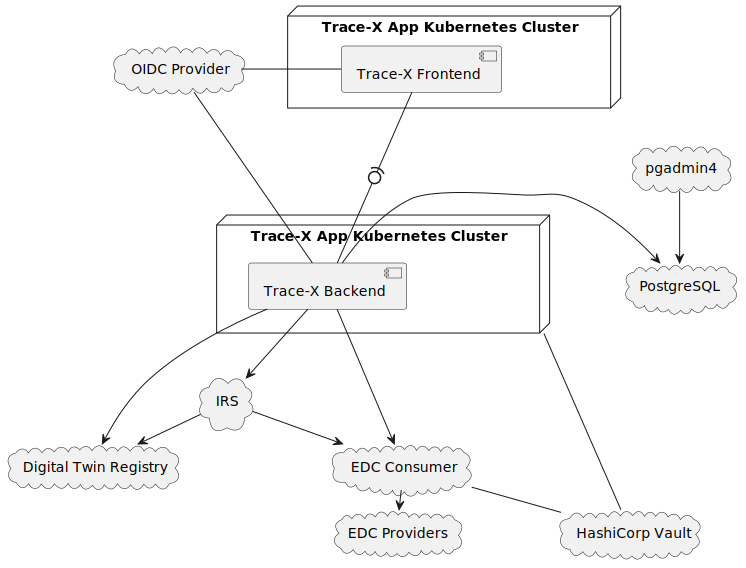

Administration Guide
====================

Table of Contents

-   [System Overview](#system-overview)
-   [Installation](#installation)
    -   [Deployment using Helm](#deployment-using-helm)
    -   [Dependent values](#dependent-values)
    -   [Deployment using ArgoCD](#deployment-using-argocd)
-   [Configuration](#configuration)
    -   [Frontend Configuration](#frontend-configuration)
    -   [Backend Configuration](#backend-configuration)
-   [Troubleshooting](#troubleshooting)

System Overview
---------------

The deployment contains the components required to connect Trace-X to an existing Catena-X network. This includes:

-   Trace-X Frontend

-   Trace-X Backend

Optionally these components can be installed using the Trace-X backend Helm chart as well:

-   PostgreSQL for Trace-X Backend

-   pgadmin4

-   IRS

-   EDC Consumer

Everything else needs to be provided externally.

Installation
------------

The Trace-X Helm repository can be found here:

<a href="https://eclipse-tractusx.github.io/traceability-foss/index.yaml" class="bare">https://eclipse-tractusx.github.io/traceability-foss/index.yaml</a>

Use the latest release of the "trace-x-helm" chart.
It contains all required dependencies.

Supply the required configuration properties (see chapter [Configuration](#configuration)) in a values.yaml file or override the settings directly.

### Deployment using Helm

Add the Trace-X Helm repository:

    $ helm repo add traceability-foss https://eclipse-tractusx.github.io/traceability-foss

Then install the Helm chart into your cluster:

    $ helm install -f your-values.yaml traceability-foss traceability-foss/traceability-foss

### Dependent values

Following values needs to match in order for application to start and have valid PostgreSQL connection:

    datasource:
        password: # database password

    postgresql:
        auth:
            password: # database password

### Deployment using ArgoCD

Create a new Helm chart and use Trace-X as a dependency.

    dependencies:
      - name: traceability-foss
        alias: traceability-foss
        version: x.x.x
        repository: "https://eclipse-tractusx.github.io/traceability-foss/"

Then provide your configuration as the values.yaml of that chart.

Create a new application in ArgoCD and point it to your repository / Helm chart folder.

Configuration
-------------

### Frontend Configuration

Take the following template and adjust the configuration parameters (&lt;placeholders&gt; mark the relevant spots).
You can define the URLs as well as most of the secrets yourself.

The OAuth2, Vault configuration / secrets depend on your setup and might need to be provided externally.

#### Helm configuration Trace-X Frontend (values.yaml)

values.yaml <a href="https://github.com/eclipse-tractusx/traceability-foss/blob/main/charts/traceability-foss/values.yaml" class="bare">https://github.com/eclipse-tractusx/traceability-foss/blob/main/charts/traceability-foss/values.yaml</a>

##### Values explained

###### &lt;ingress.enabled&gt;

Enables &lt;true&gt; or disables &lt;false&gt; the ingress proxy for the frontend app.

###### &lt;ingress.className&gt;

The class name of the ingress proxy. E.g. `nginx`

###### &lt;ingress.annotations&gt;

Annotation for the ingress. E.g. `cert-manager.io/cluster-issuer: letsencrypt-prod`

###### &lt;ingress.hosts&gt;

The hostname of the app.

###### &lt;ingress.tls&gt;

The tls settings of the app.

###### &lt;livenessProbe&gt;

Following Tractus-X Helm Best Practices <a href="https://eclipse-tractusx.github.io/docs/release/" class="bare">https://eclipse-tractusx.github.io/docs/release/</a>

###### &lt;readinessProbe&gt;

Following Tractus-X Helm Best Practices <a href="https://eclipse-tractusx.github.io/docs/release/" class="bare">https://eclipse-tractusx.github.io/docs/release/</a>

### Backend Configuration

Take the following template and adjust the configuration parameters (&lt;placeholders&gt; mark the relevant spots).
You can define the URLs as well as most of the secrets yourself.

The OAuth2, Vault configuration / secrets depend on your setup and might need to be provided externally.

#### Helm configuration Trace-X Backend (values.yaml)

                    - key: app.kubernetes.io/name
                      operator: DoesNotExist
                topologyKey: kubernetes.io/hostname

      ingress:
        enabled: false
        className: ""
        annotations: {}
        hosts: []
        tls: []

      # Following Catena-X Helm Best Practices @url: https://catenax-ng.github.io/docs/kubernetes-basics/helm
      # @url: https://github.com/helm/charts/blob/master/stable/nginx-ingress/values.yaml#L210
      livenessProbe:
        failureThreshold: 3
        initialDelaySeconds: 60
        periodSeconds: 10
        successThreshold: 1
        timeoutSeconds: 1
      readinessProbe:
        failureThreshold: 3
        initialDelaySeconds: 60
        periodSeconds: 10
        successThreshold: 1
        timeoutSeconds: 1

    #########################
    # Backend Chart Values configuration     #
    #########################
    backend:
      # Default values for k8s-helm-example.
      # This is a YAML-formatted file.
      # Declare variables to be passed into your templates.

      replicaCount: 1

      image:
        repository: ghcr.io/catenax-ng/tx-traceability-foss
        pullPolicy: Always

      ##
      ## Image pull secret to create to obtain the container image
      ## Note: 'imagePullSecret.dockerconfigjson' takes precedence if configured together with 'imagePullSecrets'
      ##
      imagePullSecret:
        dockerconfigjson: ""

      ##
      ## Existing image pull secret to use to obtain the container image
      ##
      imagePullSecrets: []

      serviceAccount:
        ##
        ## Specifies whether a service account should be created per release
        ##
        create: true
        ##
        ## Annotations to add to the service account
        ##
        annotations: {}
        ##
        ## The name of the service account to use.
        ## If not set and create is true, a name is generated using the fullname template
        ##
        name: ""

      podAnnotations: { }

      springprofile: dev #will be set as dev

      nameOverride: "traceability-foss-backend"
      fullnameOverride: "traceability-foss-backend"

      podSecurityContext:
        runAsUser: 10001
        seccompProfile:
          type: RuntimeDefault

      # Following Catena-X Helm Best Practices @url: https://catenax-ng.github.io/docs/kubernetes-basics/helm
      # @url: https://kubernetes.io/docs/tasks/configure-pod-container/security-context/#set-the-security-context-for-a-pod
      securityContext:
        allowPrivilegeEscalation: false
        runAsNonRoot: true
        runAsUser: 10001
        runAsGroup: 3000
        capabilities:
          drop:
            - ALL
        readOnlyRootFilesystem: false

      service:
        type: ClusterIP
        port: 8080

      autoscaling:
        enabled: false

      # Following Catena-X Helm Best Practices @url: https://catenax-ng.github.io/docs/kubernetes-basics/helm
      # @url: https://cloud.google.com/blog/products/containers-kubernetes/kubernetes-best-practices-resource-requests-and-limits
      resources:
        limits:
          cpu: 500m
          memory: 512Mi
        requests:
          cpu: 500m
          memory: 512Mi

      nodeSelector: {}

      tolerations: []

      # Following Catena-X Helm Best Practices @url: https://catenax-ng.github.io/docs/kubernetes-basics/helm
      # @url: https://kubernetes.io/docs/concepts/scheduling-eviction/assign-pod-node/#affinity-and-anti-affinity
      affinity:
        podAntiAffinity:
          preferredDuringSchedulingIgnoredDuringExecution:
            - weight: 100
              podAffinityTerm:
                labelSelector:
                  matchExpressions:
                    - key: app.kubernetes.io/name
                      operator: DoesNotExist
                topologyKey: kubernetes.io/hostname

      # Following Catena-X Helm Best Practices @url: https://catenax-ng.github.io/docs/kubernetes-basics/helm
      # @url: https://github.com/helm/charts/blob/master/stable/nginx-ingress/values.yaml#L210
      livenessProbe:
        failureThreshold: 3
        initialDelaySeconds: 80
        periodSeconds: 10
        successThreshold: 1
        timeoutSeconds: 1
      readinessProbe:
        failureThreshold: 3
        initialDelaySeconds: 80
        periodSeconds: 10
        successThreshold: 1
        timeoutSeconds: 1

      ingress:
        enabled: false
        className: ""
        annotations: {}
        hosts: []
        tls: []

      healthCheck:
        enabled: true #<healthCheck.enabled>

      traceability:
        bpn: "CHANGEME" #<traceability.bpn>
        url: "" #<traceability.url>

      datasource:
        url: jdbc:postgresql://tracex-backend-postgresql:5432/trace
        username: trace
        password: "CHANGEME" #<datasource.password>

      oauth2:
        clientId: "CHANGEME" #<oauth2.clientId>
        clientSecret: "CHANGEME" #<oauth2.clientSecret>
        clientTokenUri: "https://changeme.com" #<oauth2.clientTokenUri>
        jwkSetUri: "https://changeme.com" #<oauth2.jwkSetUri>
        resourceClient: "CHANGEME" #<oauth2.resourceClient>

      edc:
        apiKey: "" #<edc.apiKey>
        providerUrl: "" #<edc.providerUrl>

    #########################
    # PG Admin configuration     #
    #########################
    pgadmin4:
      enabled: false #<pgadmin4.enabled>
      ingress:
        enabled: false  #<pgadmin4.ingress.enabled>

    #########################
    # Postgres configuration     #
    #########################
    postgresql:
      enabled: true

      nameOverride: "tracex-backend-postgresql"
      fullnameOverride: "tracex-backend-postgresql"

      auth:
        postgresPassword: "CHANGEME" #<postgresql.auth.postgresPassword>
        password: "CHANGEME" #postgresql.auth.password>
        database: "trace"
        username: "trace"

    #########################
    # IRS configuration     #
    #########################
    irs-helm:
      enabled: false #<irs-helm.enabled>

    ###################################
    # IRS EDC Consumer configuration  #
    ###################################
    irs-edc-consumer:
      enabled: false #<irs-edc-consumer.enabled>

##### Values explained

###### &lt;springprofile&gt;

The different profiles for the different supported environments to bootstrap the resources which are required for the respective environment.

<table>
<colgroup>
<col style="width: 50%" />
<col style="width: 50%" />
</colgroup>
<thead>
<tr class="header">
<th>Springprofile</th>
<th>Description</th>
</tr>
</thead>
<tbody>
<tr class="odd">
<td>

dev

</td>
<td>

Development environment

</td>
</tr>
<tr class="even">
<td>

int

</td>
<td>

Integration environment

</td>
</tr>
</tbody>
</table>

###### &lt;healthCheck.enabled&gt;

Enables &lt;true&gt; or disables &lt;false&gt; [livenessProbe](https://cloud.google.com/blog/products/containers-kubernetes/kubernetes-best-practices-setting-up-health-checks-with-readiness-and-liveness-probes)
and [readinessProbe](https://cloud.google.com/blog/products/containers-kubernetes/kubernetes-best-practices-setting-up-health-checks-with-readiness-and-liveness-probes)

###### &lt;traceability.bpn&gt;

BPN (Business Partner Number) for the traceability app used to identify the partner in the network.

###### &lt;datasource.url&gt;

The jdbc connection string to the database. jdbc:postgresql://${url}:${port}/trace

###### &lt;datasource.username&gt;

The username of the datasource e.g. "trace"

###### &lt;datasource.password&gt;

The password of the datasource or the path to the vault which contains the secret. &lt;path:../data/int/database\#tracePassword&gt;

###### &lt;oauth2.clientId&gt;

Client ID for OAuth2 (KeyCloak). Request this from your Keycloak operator.

###### &lt;oauth2.clientSecret&gt;

Client secret for OAuth2. Request this from your OAuth2 operator.

###### &lt;oauth2.clientTokenUri&gt;

The URL of the Keycloak token API. Used by Trace-X for token creation to authenticate with other services.

###### &lt;oauth2.jwkSetUri&gt;

The URL of the Keycloak JWK Set. Used by Trace-X to validate tokens when Trace-X API is called.

###### &lt;oauth2.resourceClient&gt;

The client which is used to authenticate the backend.

###### &lt;edc.apiKey&gt;

The EDC api key or the path to the secret inside a vault. e.g. &lt;path:../data/int/edc/controlplane\#edc.api.control.auth.apikey.value&gt;

##### &lt;postgresql.enabled&gt;

Enables &lt;true&gt; or disables &lt;false&gt; PostgresSQL database.

##### &lt;postgresql.auth.postgresPassword&gt;

Database password for the **postgres** user or the path to the secret inside a vault. &lt;path:…​/data/int/database\#password&gt;

##### &lt;postgresql.auth.password&gt;

Database password for the application user of the path to the secret inside a vault. &lt;path:…​/data/int/database\#password&gt;

##### &lt;postgresql.auth.database&gt;

The name of the database instance.

##### &lt;postgresql.auth.username&gt;

The user for the database instance.

##### &lt;global.enablePrometheus&gt;

Enables &lt;true&gt; or disables &lt;false&gt; the prometheus instance.

##### &lt;global.enableGrafana&gt;

Enables &lt;true&gt; or disables &lt;false&gt; the grafana instance used for resource and application monitoring.

##### &lt;irs-helm.enabled&gt;

Enables &lt;true&gt; or disables &lt;false&gt; irs helm charts.

##### &lt;pgadmin4.enabled&gt;

Enables &lt;true&gt; or disables &lt;false&gt; pgadmin4 console for the PostgreSQL database instance

##### &lt;pgadmin4.ingress.enabled&gt;

Enables &lt;true&gt; or disables &lt;false&gt; a K8S Ingress for the pgadmin4 console

Troubleshooting
---------------

Coming soon…​

Last updated 2023-04-04 11:50:36 UTC
