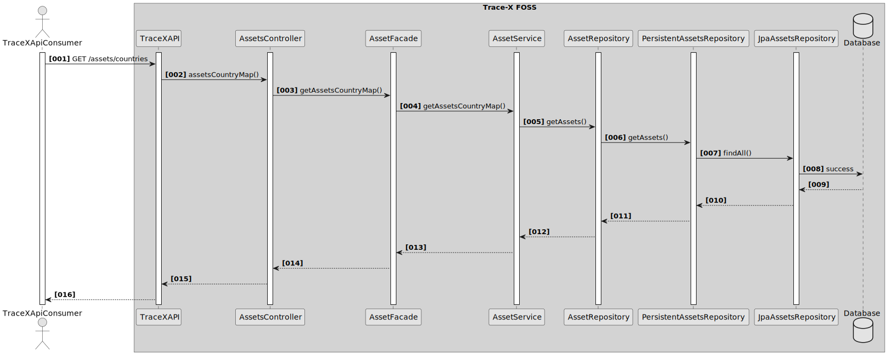
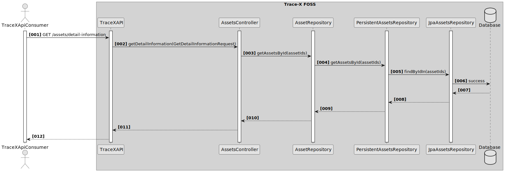

Architecture documentation (arc42)
==================================

Table of Contents

-   [Introduction and goals](#introduction-and-goals)
    -   [Requirements overview](#requirements-overview)
    -   [Quality goals](#quality-goals)
    -   [Stakeholder](#stakeholder)
-   [Architecture Constraints](#architecture-constraints)
    -   [Technical Constraints](#technical-constraints)
    -   [Organizational Constraints](#organizational-constraints)
    -   [Political Constraints](#political-constraints)
    -   [Development Conventions](#development-conventions)
-   [System scope and context](#system-scope-and-context)
    -   [Business context](#business-context)
    -   [Technical context](#technical-context)
-   [Solution strategy](#solution-strategy)
    -   [Introduction](#introduction)
    -   [Technology](#technology)
    -   [Structure](#structure)
-   [Building block view](#building-block-view)
    -   [Whitebox overall system](#whitebox-overall-system)
    -   [Level 1](#level-1)
-   [Runtime view](#runtime-view)
    -   [Overall](#overall)
    -   [Scenario 1: Return all Assets](#scenario-1-return-all-assets)
    -   [Scenario 2: Return specific Assets](#scenario-2-return-specific-assets)
    -   [Scenario 3: Get country information for assets](#scenario-3-get-country-information-for-assets)
    -   [Scenario 4: Get specific information for assets](#scenario-4-get-specific-information-for-assets)
-   [Deployment view](#deployment-view)
-   [Cross-cutting concepts](#cross-cutting-concepts)
    -   [Domain concepts](#domain-concepts)
    -   [Safety and security concepts](#safety-and-security-concepts)
    -   [Architecture and design patterns](#architecture-and-design-patterns)
    -   ["Under-the-hood" concepts](#under-the-hood-concepts)
    -   [Development concepts](#development-concepts)
    -   [Operational concepts](#operational-concepts)
-   [Quality requirements](#quality-requirements)
    -   [Quality tree](#quality-tree)
    -   [Quality scenarios](#quality-scenarios)
-   [Glossary](#glossary)

Introduction and goals
----------------------

This chapter gives you an overview about the goals of the service,
in which context the service runs and which stakeholders are involved.

### Requirements overview

#### What is the purpose of the Trace-X application

-   Empower all companies from SMEs to large OEMs to participate in parts traceability with an Open-Source solution to easily take part in Catena-X Traceability Use Case.

-   It is a standalone application which can be self-hosted.

-   Display the relations of the automotive value chain based on a standardized IT model.

-   Overview and transparency across the supplier network enable faster intervention based on recorded events in the supply chain.

-   Notifications/Messages regarding quality-related incidents and a tool for inspecting the supply chain.

#### Essential features

-   List and view manufactured parts based on BoM AsBuild

-   Show detailed information on manufactured parts from AAS description assets and Aspects

-   Uses Submodels SerialPartTypization, AssemblyPartRelationship and Batch

-   List and view Supplier parts (AssemblyPartRelationship) based on BoM AsBuild lifecycle

-   View parts and parts relations in a visualized parts tree

-   Send and receive top-down notifications (quality investigations) along the supply chain

-   Compliance with Catena-X Guidelines

### Quality goals

The following table entries define overall Trace-X quality goals. The order of topics does not imply a priority of the quality goals.

<table>
<colgroup>
<col style="width: 50%" />
<col style="width: 50%" />
</colgroup>
<thead>
<tr class="header">
<th>Quality goal</th>
<th>Motivation and description</th>
</tr>
</thead>
<tbody>
<tr class="odd">
<td>
Running reference application for Catena-X Traceability
</td>
<td>
Consume traceability data, visualize it in a state-of-the-art frontend to the user and enable the exchange of notifications.
</td>
</tr>
<tr class="even">
<td>
Accessible and easy to use
</td>
<td>
Enable SMEs to large enterprises.
</td>
</tr>
<tr class="odd">
<td>
Cloud agnostic solution
</td>
<td>
Trace-X is built as reference architecture and able to be run on different cloud solutions. It uses Helm, i.e. Helm charts, so that it can easily be deployed on different systems.
</td>
</tr>
<tr class="even">
<td>
Trustworthy application
</td>
<td>
Use the Catena-X standards as a basis to fulfill the interoperability (with commercial as well as other solutions) and data sovereignty requirements.
</td>
</tr>
<tr class="odd">
<td>
Application reliability
</td>
<td>
The Trace-X architecture is set up so that provided part tree structures are consumed, aggregated and utilized to enable quality related actions such as notifications along the supply chain on which the costumers can rely.
</td>
</tr>
<tr class="even">
<td>
Usability and user experience
</td>
<td>
Trace-X is aligned with the overarching UUX guidelines. This ensures ease of use for the user as well as a good user experience.
</td>
</tr>
<tr class="odd">
<td>
Security
</td>
<td>
Static Application Security Testing (SAST) and Dynamic Application Security Testing (DAST) are executed automatically and regularly. Findings are recorded and mitigated.
</td>
</tr>
</tbody>
</table>

### Stakeholder

The following table presents the stakeholders of Trace-X and their respective intentions.

<table>
<colgroup>
<col style="width: 50%" />
<col style="width: 50%" />
</colgroup>
<thead>
<tr class="header">
<th>Who</th>
<th>Matters and concern</th>
</tr>
</thead>
<tbody>
<tr class="odd">
<td>

Software Developer

</td>
<td>

<ul>
<li>
Make an impact on Catena-X by participating in open-source software.
</li>
<li>
Example implementation for own use cases and applications.
</li>
</ul>

</td>
</tr>
<tr class="even">
<td>

Operating Environments

</td>
<td>

<ul>
<li>
Use Trace-X as a basis for industrialization.
</li>
<li>
Example implementation for own business applications, further features and fast ramp up.
</li>
</ul>

</td>
</tr>
<tr class="odd">
<td>
Catena-X Partners
</td>
<td>

<ul>
<li>
Take part in Traceability Use Case.
</li>
<li>
See relationships in the value chain.
</li>
<li>
React on quality issues with standardized actions and notifications.
</li>
</ul>

</td>
</tr>
<tr class="even">
<td>
Larger OEMs / Tiers
</td>
<td>

<ul>
<li>
Want to use this implementation for further development and integration into their system landscape.
</li>
</ul>

</td>
</tr>
<tr class="odd">
<td>
SMEs
</td>
<td>

<ul>
<li>
Need a solution to view data provided into the Catena-X network.
</li>
<li>
Act in a standardized way with partners within CX.
</li>
</ul>

</td>
</tr>
</tbody>
</table>

Architecture Constraints
------------------------

### Technical Constraints

<table>
<colgroup>
<col style="width: 50%" />
<col style="width: 50%" />
</colgroup>
<thead>
<tr class="header">
<th>Name</th>
<th>Description</th>
</tr>
</thead>
<tbody>
<tr class="odd">
<td>
Interoperability
</td>
<td>
Trace-X must use EDC together with Catena-X approved data models to guarantee interoperability between participants.
</td>
</tr>
<tr class="even">
<td>
Data Sovereignty
</td>
<td>
Data owners and data consumers have to use usage policies for offering, consuming and therefore transferring data.
</td>
</tr>
<tr class="odd">
<td>
Kubernetes for Container Orchestration
</td>
<td>
Catena-X requires the application to run in a Kubernetes environment, deployed via Helm Charts.
</td>
</tr>
<tr class="even">
<td>
Catena-X UUX Guidance (CX Style Guide)
</td>
<td>
Frontend follows Catena-X wide UUX consistency according to CX Style Guide
</td>
</tr>
</tbody>
</table>

### Organizational Constraints

<table>
<colgroup>
<col style="width: 50%" />
<col style="width: 50%" />
</colgroup>
<thead>
<tr class="header">
<th>Name</th>
<th>Description</th>
</tr>
</thead>
<tbody>
<tr class="odd">
<td>
Schedule
</td>
<td>
Start of development in July 2022. Further development in alignment with the Foundation of the Catena-X Automotive Network e.V. requirements and timeline.
</td>
</tr>
<tr class="even">
<td>
Process model
</td>
<td>
Iterative and incremental. SAFe Framework is used to align with Catena-X services, prerequisites, components and requirements to be Catena-X compatible.
</td>
</tr>
<tr class="odd">
<td>
Catena-X services / requirements
</td>
<td>
Trace-X needs to be Catena-X compliant and the application has to follow the CX standards as well as interact with the core services and components.
</td>
</tr>
<tr class="even">
<td>
Release as Open Source
</td>
<td>
The source code, at least parts of it, are made available as open source and can be found in Github Catena-X ng as well as in Eclipse Tractus-X.
</td>
</tr>
<tr class="odd">
<td>
Technology Readiness Level (TRL) for Products developed within the CX Consortia
</td>
<td>
As Trace-X is a reference implementation, the Technology Readiness Level (TRL) must not be above TRL 8.
</td>
</tr>
</tbody>
</table>

### Political Constraints

<table>
<colgroup>
<col style="width: 50%" />
<col style="width: 50%" />
</colgroup>
<thead>
<tr class="header">
<th>Name</th>
<th>Description</th>
</tr>
</thead>
<tbody>
<tr class="odd">
<td>
Open Source
</td>
<td>
FOSS licenses approved be the Eclipse foundation have to be used.
</td>
</tr>
</tbody>
</table>

### Development Conventions

<table>
<colgroup>
<col style="width: 50%" />
<col style="width: 50%" />
</colgroup>
<thead>
<tr class="header">
<th>Name</th>
<th>Description</th>
</tr>
</thead>
<tbody>
<tr class="odd">
<td>
Architecture documentation
</td>
<td>
Architectural documentation of Trace-X reference application in arc42-Template terminology and structure.
</td>
</tr>
<tr class="even">
<td>
Language
</td>
<td>
The project language is English to ensure the best possible accessibility for all participants. Therefore, classes, methods etc. are named in English and the documentation is written in English.
</td>
</tr>
<tr class="odd">
<td>
Code Coverage
</td>
<td>
More than 80% test coverage of the complete source code
</td>
</tr>
</tbody>
</table>

System scope and context
------------------------

Trace-X is an end user application to visualize and utilize data provided to the Catena-X network. This includes the traceability of manufactured parts and batches as well as the shipped and supplied components. To utilize the CX open ecosystem it is necessary to exchange information on serialized parts and batches with supply chain partners in a standardized, data sovereign and interoperable way. This section describes the environment of Trace-X, its intended users and which systems and components it interacts with.

### Business context

Trace-X exchanges data with any other Traceability applications within the CX ecosystem. This is implemented by integrating the service into the CX network and the usage of required central components and services provided by CX.

#### User

Trace-X can be deployed, hosted and run by every party that is part of the Catena-X network. They need to be registered, have a BPN, technical user as well as provide valid credentials. An end-user in Trace-X can have roles provided by the CX Portal (User, Supervisor, Admin). As a prerequisite for Trace-X, valid data must already be provided to CX network since Trace-X only consumes data but has no import interface or data provisioning functionality.

#### IRS

Item Relationship Service is the component that is used by Trace-X to fetch the data chains from Catena-X network. Data that is provided by IRS gets extracted, aggregated, transformed and is used for further actions in Trace-X. Further information can be found in the [IRS architecture documentation (arc42)](https://eclipse-tractusx.github.io/item-relationship-service/docs/arc42/).

#### Catena-X network

Trace-X and IRS are retrieving necessary information and data from the Catena-X network (Users, digital twins, aspects, submodels, Business Partner information). If CX services are unavailable, Trace-X will not be able to perform most of its work.

#### Any other Traceability App

Trace-X interacts with any other Traceability app using the CX standards. This enables sovereign data exchange as well as receiving and sending notifications to interact between different parties.

### Technical context

#### Component overview

##### Trace-X API

We provide a REST API that is consumed by Trace-X frontend in order to deliver Trace-X related features such as quality-investigations or assets chain visibility.
Since Trace-X component is a very last component in the Catena-X ecosystem we are mostly depend on the other services and theirs APIs in other to deliver desired functionalities. The development of the services is not a part of the Trace-X application and each of the system that we utilize exposes REST API that we consume and interact directly.

Trace-X is a Spring Boot based application and is secured with the OpenID connector provider Keycloak and the OAuth2. This means for the company that utilize Trace-X component
it is required to obtain technical user in order to be authorized to get access to the external components within Catena-X ecosystem.

In order to use Trace-X frontend with Trace-X backend, users need to authenticate themselves in order to be authorized to get access to the Trace-X.
By the frontend UI users provide valid credentials and the system generates a bearer token that it gets from Keycloak and attaches it to the HTTP header parameter Authorization.
Then once a user is authorized and has proper role within Trace-X backend, the backend delegates HTTP calls to specific service in their behalf as technical user in order to fulfill specific functionality.

##### Registry API

The Trace-X acts as a consumer of the Asset Administration Shell Registry component. The Trace-X contains a Restful client (REST template) that build a REST call to the mentioned Digital Twin Registry API based on its known URL (the AAS registry URL is configurable in the Trace-X).
Requests contain "assetIds" provided by the component during assets synchronization. Like described in the above section, the security aspect is required in order to achieve a REST call against the AAS Registry. As a response, the Trace-X gets the corresponding shells and shell descriptors utilized then later for assets synchronization. The HTTP(s) transport protocol is used for the REST call communication.

##### IRS API

The Trace-X acts as a consumer of the IRS component. The Trace-X contains a Restful client (REST template) that build a REST call to the mentioned IRS API based on its known URL (the IRS URL is configurable in the Trace-X).
Request contains details required to start IRS fetch job provided by the component during assets synchronization. Like described in the above section, the security aspect is required in order to achieve a REST call against the IRS. As a response, the Trace-X gets the created job id and periodically pulls for the job details that contains assets that will be uploaded to the system. And as mentioned above, the transport protocol HTTP(S) is used for the REST call communication.

##### Portal API

The Trace-X acts as a consumer of the Portal component. The Trace-X contains a Restful client (REST template) that build a REST call to the mentioned Portal API based on its known URL (the Portal URL is configurable in the Trace-X).
Request contains "bpns" provided by the component during sending notifications. Like described in the above section, the security aspect is required in order to achieve a REST call against the Portal. As a response, the Trace-X gets the corresponding BPN mappings to EDC urls where a notification should be send over. And as mentioned above, the transport protocol HTTP(S) is used for the REST call communication.

##### EDC API

The Trace-X acts as a consumer of the EDC component. In Trace-X we communicate with EDC directly only for the sake of fulfilling quality-investigation functionality. Specific use cases can be viewed in [Runtime view](../runtime-view/index.html) section. For this purposes the integrated EDC clients in the Trace-X are responsible for creating restful requests to the EDC component. And as mentioned above, the transport protocol HTTP(S) is used for the REST call communication.

Solution strategy
-----------------

This section contains summarized architectural overview. A comparison of the most important goals and the corresponding solution approaches.

### Introduction

Following table describes the quality goals of Trace-X (see chapter quality goals) and their matching solution approaches.

<table>
<colgroup>
<col style="width: 50%" />
<col style="width: 50%" />
</colgroup>
<thead>
<tr class="header">
<th>Quality goal</th>
<th>Matching approaches in the solution</th>
</tr>
</thead>
<tbody>
<tr class="odd">
<td>
Running reference application for Catena-X Traceability
</td>
<td>

<ul>
<li>
Published open source, Trace-X application can be used as a reference by anyone.
</li>
</ul>

</td>
</tr>
<tr class="even">
<td>
Accessible and easy to use
</td>
<td>

<ul>
<li>
Established programming languages are used.
</li>
<li>
Backend written in Java
</li>
<li>
Frontend written in Typescript based on the Angular framework.
</li>
</ul>

</td>
</tr>
<tr class="odd">
<td>
Cloud agnostic solution
</td>
<td>

<ul>
<li>
Helm charts to support the deployment of the application in a Kubernetes environment
</li>
</ul>

</td>
</tr>
<tr class="even">
<td>
Application reliability
</td>
<td>

<ul>
<li>
Data source is the Catena-X notwork. Data is fetched with IRS directly from the data owner and the Digital Twin Registry of CX.
</li>
<li>
Trace-X can be hosted decentralized since it is an open source reference implementation.
</li>
</ul>

</td>
</tr>
<tr class="odd">
<td>
Security
</td>
<td>

<ul>
<li>
Static Application Security Testing (SAST) and Dynamic Application Security Testing (DAST) are executed automatically and regularly with tools as part of the pipeline.
</li>
</ul>

</td>
</tr>
</tbody>
</table>

### Technology

Trace-X is developed using Java and the Spring Boot framework for the Backend and Typescript based on the Angular framework for the Frontend. This decision was taken due to the support of the frameworks as well as technical knowledge of the team members.

The application can be hosted using Docker and Kubernetes. This is commonly used and widespread. With this the application has no vendor lock in regarding the hosting provider.

The communication between Frontend and Backend is done using REST APIs. This is the standard method in the Catena-X landscape and makes the application components easy to use for any third party client.

As the database to store parts information etc. PostgreSQL Database is used.

### Structure

Trace-X is divided into two components: Frontend and Backend.
It roughly can be broken down into the following parts:

-   Asset controller to get the asset information

-   Dashboard controller to get dashboard related summed up information

-   Registry controller to fetch assets from the Digital Twin Registry

-   Registry lookup metrics controller to set parameters to the Registry lookup

The backend does a request to the Digital Twin Registry utilizing the Registry controller and Registry lookup metrics. Extracted data from the response is made available through the Asset controller and the Dashboard controller to the Frontend.

Building block view
-------------------

### Whitebox overall system

#### Component diagram

#### Component description

|Components |Description
|IRS
|The IRS consumes relationship information across the CX-Network and builds the graph view. Within this Documentation, the focus lies on the IRS

|EDC Consumer
|The EDC Consumer Component is there to fulfill the GAIA-X and IDSA-data sovereignty principles. The EDC Consumer consists out of a control plane and a data plane.

|EDC Provider
|The EDC Provider Component connects with EDC Consumer component and  forms the end point for the actual exchange of data. It handles automatic contract negotiation and the subsequent exchange of data assets for connected applications.

|Submodel Server
|The Submodel Server offers endpoints for requesting the Submodel aspects.

|IAM/DAPS
|DAPS as central Identity Provider

### Level 1

#### Component diagram

#### Component description

<table>
<colgroup>
<col style="width: 50%" />
<col style="width: 50%" />
</colgroup>
<thead>
<tr class="header">
<th>Components</th>
<th>Description</th>
</tr>
</thead>
<tbody>
<tr class="odd">
<td>
<strong>Trace-X</strong>
</td>
<td>
Trace-X is a system allowing the user to review the parts/assets catalogue, start a quality investigations and receive quality alerts
</td>
</tr>
<tr class="even">
<td>
<strong>Trace-X API</strong>
</td>
<td>
The <strong>Trace-X API</strong> is the Interface over which the Data Consumer is communicating.
</td>
</tr>
<tr class="odd">
<td>
<strong>AssetsController</strong>
</td>
<td>
The <strong>AssetsController</strong> provides a REST Interface for retrieving the parts/assets information.
</td>
</tr>
<tr class="even">
<td>
<strong>DashboardController</strong>
</td>
<td>
The <strong>DashboardController</strong> provides a REST Interface for retrieving overall statistics displayed on a dashboard screen.
</td>
</tr>
<tr class="odd">
<td>
<strong>RegistryController</strong>
</td>
<td>
The <strong>RegistryController</strong> provides a REST Interface for retrieving the data from parts registry.
</td>
</tr>
<tr class="even">
<td>
<strong>AssetRepository</strong>
</td>
<td>
The <strong>AssetRepository</strong> is a component responsible for storing and getting assets from database.
</td>
</tr>
<tr class="odd">
<td>
<strong>BPNRepository</strong>
</td>
<td>
The <strong>BPNRepository</strong> is a component which stores BPN → company name mappings.
</td>
</tr>
<tr class="even">
<td>
<strong>NotificationsRepository</strong>
</td>
<td>
The <strong>NotificationsRepository</strong> is a component responsible for storing and holding status of sent/received notifications
</td>
</tr>
<tr class="odd">
<td>
<strong>Database</strong>
</td>
<td>
Place for storing assets, relations as well as sent/received notifications
</td>
</tr>
</tbody>
</table>

Runtime view
------------

### Overall

This section describes the overall flow of the TraceX-FOSS application

### Scenario 1: Return all Assets

This section describes what happens when user lists all stored assets.

###### Overview

When a user requests all stored assets, TraceX-FOSS checks if the user has an adequate role ('ROLE\_ADMIN', 'ROLE\_SUPERVISOR', 'ROLE\_USER'). If yes, then the endpoint returns a pageable result of assets.

The returned pageable result can be empty if no suitable asset has been found.

### Scenario 2: Return specific Assets

This section describes what happens when user searches for a specific asset.

###### Overview

When a user requests a specific asset, TraceX-FOSS checks if the user has an adequate role ('ROLE\_ADMIN', 'ROLE\_SUPERVISOR', 'ROLE\_USER'). If yes, then the endpoint returns a precise Asset for the given assetId, if it is found.

If no asset has been found for the given ID, an AssetNotFoundException is thrown.

### Scenario 3: Get country information for assets

This section describes what happens when user lists the map of assets.

###### Overview

When a user requests the map of assets, TraceX-FOSS checks if the user has an adequate role ('ROLE\_ADMIN', 'ROLE\_SUPERVISOR', 'ROLE\_USER'). If yes, then the endpoint returns a JAVA map containing a country names as keys and the number of assets stored for each country and for the given assetId, if they are found.

If no asset has been found, an empty JAVA map will be returned.

### Scenario 4: Get specific information for assets

This section describes what happens when user lists detailed information for assets.

###### Overview

When a user requests detailed information for assets, TraceX-FOSS checks if the user has an adequate role ('ROLE\_ADMIN', 'ROLE\_SUPERVISOR', 'ROLE\_USER'). If yes, then the endpoint returns a list containing all the stored information for the given assetId, if they are found.

If no asset has been found, an empty list will be returned.

This information for an asset can contain the name of the manufacturer, the manufacturer part ID, the manufacturer name, the manufacturing country, etc.

Deployment view
---------------

Cross-cutting concepts
----------------------

### Domain concepts

### Safety and security concepts

### Architecture and design patterns

### "Under-the-hood" concepts

### Development concepts

### Operational concepts

#### Administration

Quality requirements
--------------------

This section includes concrete quality scenarios to better capture the key quality objectives but also other required quality attributes.

### Quality tree

The tree structure provides an overview for a sometimes large number of quality requirements.

### Quality scenarios

The initial letters of the scenario identifiers (IDs) in the following table each stand for the higher-level quality characteristic. For example M for maintainability. These identifiers are also used in the quality tree. The scenarios cannot always be clearly assigned to a characteristic. Therefore, they sometimes appear more than once in the quality tree.

<table>
<colgroup>
<col style="width: 50%" />
<col style="width: 50%" />
</colgroup>
<thead>
<tr class="header">
<th>ID</th>
<th>Scenario</th>
</tr>
</thead>
<tbody>
<tr class="odd">
<td>
M01
</td>
<td>
A developer with basic knowledge of the Traceability Use Case looks for an introduction to the Traceability architecture. He or she gets the idea of essential design very fast.
</td>
</tr>
<tr class="even">
<td>
M02
</td>
<td>
A senior developer looks for a reference implementation of the Traceability Use case functionalities. He or she gets it within the source code.
</td>
</tr>
<tr class="odd">
<td>
M03
</td>
<td>
A developer wants to implement new features. He or she is able to add it to the source code easily.
</td>
</tr>
<tr class="even">
<td>
M04
</td>
<td>
A developer wants to implement a new Frontend or change some components. The efforts can be reduced by using the standardized API endpoints to do so.
</td>
</tr>
<tr class="odd">
<td>
I01
</td>
<td>
An user wants to switch from FOSS application to a COTS application or the other way round. This is possible since the application is interoperable with other applications within the CX network.
</td>
</tr>
<tr class="even">
<td>
F01
</td>
<td>
The application uses the Catena-X standards to ensure the correct interoperability and exchange with other participants.
</td>
</tr>
<tr class="odd">
<td>
F02
</td>
<td>
An OEM or Tier n supplier needs more information regarding specific parts. He can mark the parts in question and send a top-down notification (Quality Investigation) to the next entity / the partner.
</td>
</tr>
<tr class="even">
<td>
F03
</td>
<td>
A company wants to have more transparency and a visualized status of the supply / value chain. By using the application they are enabled to work with the structures and enable new features / functionalities.
</td>
</tr>
<tr class="odd">
<td>
F04
</td>
<td>
Notifications are sent using the EDC to ensure interoperability and reliability to the CX network.
</td>
</tr>
<tr class="even">
<td>
E01
</td>
<td>
Notifications between traceability apps need to be send out and received within a specified timeframe to minimize the negative impact of e.g. recalled serialized products/batches on the value chain.
</td>
</tr>
</tbody>
</table>

Glossary
--------

<table>
<colgroup>
<col style="width: 50%" />
<col style="width: 50%" />
</colgroup>
<thead>
<tr class="header">
<th>Term</th>
<th>Description</th>
</tr>
</thead>
<tbody>
<tr class="odd">
<td>
Aspect
</td>
<td>
Collection of various aspects from the Digital Twin. An aspect can, for example, bundle all information about a specific part.
</td>
</tr>
<tr class="even">
<td>
AAS
</td>
<td>
<strong>A</strong>sset <strong>A</strong>dministration <strong>S</strong>hell (Industry 4.0). Is the implementation of the digital twin for Industry 4.0 and enables interoperability between different companies.
</td>
</tr>
<tr class="odd">
<td>
BoM
</td>
<td>
<strong>B</strong>ill <strong>o</strong>f <strong>M</strong>aterial. BoM is a list of parts and materials that a product contains. Without them, manufacturing would not be possible.
</td>
</tr>
<tr class="even">
<td>
BoM AsBuilt
</td>
<td>
Bill of material lifecycle of the built entity
</td>
</tr>
<tr class="odd">
<td>
BPN
</td>
<td>
<strong>B</strong>usiness <strong>P</strong>artner <strong>N</strong>umber. A BPN is used to identify a partner in the Catena-X network
</td>
</tr>
<tr class="even">
<td>
CX
</td>
<td>
Abbreviation for Catena-X
</td>
</tr>
<tr class="odd">
<td>
Data Sovereignty
</td>
<td>
Ability to keep control over own data, that is shared with other participants
</td>
</tr>
<tr class="even">
<td>
EDC
</td>
<td>
<strong>E</strong>clipse <strong>D</strong>ataspace <strong>C</strong>onnector. The connector version used in Catena-X
</td>
</tr>
<tr class="odd">
<td>
FOSS
</td>
<td>
<strong>F</strong>ree and <strong>O</strong>pen <strong>S</strong>ource <strong>S</strong>oftware
</td>
</tr>
<tr class="even">
<td>
Interoperability
</td>
<td>
Communication and interaction with other components or Catena-X partners/players
</td>
</tr>
<tr class="odd">
<td>
IRS
</td>
<td>
<strong>I</strong>tem <strong>R</strong>elationship <strong>S</strong>ervice. Component to provide data chains. <a href="https://eclipse-tractusx.github.io/item-relationship-service/docs/arc42/">IRS architecture documentation (arc42)</a>
</td>
</tr>
<tr class="even">
<td>
SME
</td>
<td>
<strong>S</strong>mall / <strong>M</strong>edium <strong>E</strong>nterprise
</td>
</tr>
<tr class="odd">
<td>
Trace-X
</td>
<td>
Proper name of open-source software application of Catena-X Use Case Traceability
</td>
</tr>
<tr class="even">
<td>
UI
</td>
<td>
<strong>U</strong>ser <strong>I</strong>nterface
</td>
</tr>
</tbody>
</table>

Last updated 2023-04-21 09:51:10 UTC
