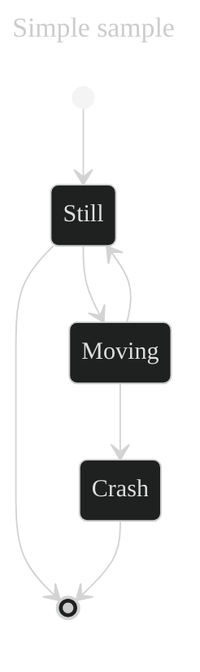

# Overview
# Problem Statement
# Specification
# Glossary
# Requirements
# Non functional requirements
# Concept
## Diagram/UML/ Key Visual/BPMN

```mermaid
---
title: Simple sample
---
%%{init: { 'fontFamily': 'Architects daughter', 'theme': 'dark' , 'curve' : 'linear'} }%%
stateDiagram-v2
[*] --> Still
Still --> [*]

    Still --> Moving
    Moving --> Still
    Moving --> Crash
    Crash --> [*]

```

# LOP
# Decision

