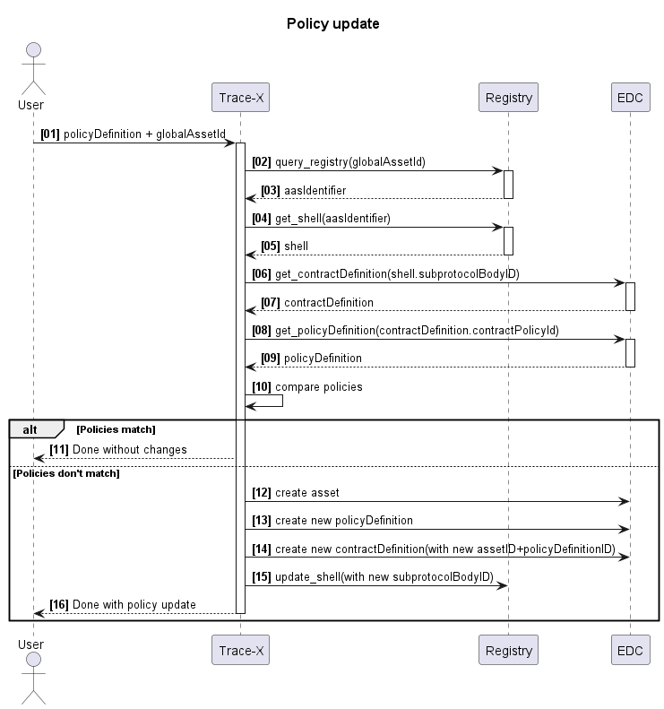

# \[Concept\] \[#1108\] Policy management enhancement

| Key           | Value                                                                     |
|---------------|---------------------------------------------------------------------------|
| Author        | @ds-crehm                                                                 |
| Creation date | 02.07.2024                                                                |
| Ticket Id     | [#849](https://github.com/eclipse-tractusx/traceability-foss/issues/1108) |
| State         | DRAFT                                                                     |

# Table of Contents
1. [Overview](#overview)
2. [Requirements](#requirements)
3. [Concept](#concept)
4. [Additional Details](#additional-details)


# Overview
It must be possible for users to change policies used for asset provisioning and notifications in the frontend of Trace-X.

# Requirements
- [ ] Parts can be republished
  - [ ] A policy must be selected (chosen from the existing policies)
  - [ ] Part will be synchronized automatically afterwards
- [ ] Policy updates trigger an update and synchronization of all related parts
- [ ] Policies can be set as active for notifications
  - [ ] When sending notifications, active policies for the respective BPN are used for contract negotiation
- [ ] Data model is adapted to accommodate contract agreement history

# Concept

## When to update policies for parts
A part can be republished with a different policy -> in this case the policy must be updated with the chosen policy and then republished.
For this the policy update process below must be used and then the existing publish-process can be used to republish and synchronize the part.

When a policy is updated, all parts that used this policy must be updated and republished with the new policy.
In this case, all parts using that policy must be updated. For this Trace-X must iterate through all parts and check if they use the changed policy.
Then the affected parts must have their policies updated.

## Policy update process for parts


1. **policyDefinition + globalAssetId**

The globalAssetId for which the policy must be changed must be provided. And the new policy that should be used must be provided as well.

2. **query_registry(globalAssetId)**

The globalAssetId is used to retrieve the aasIdentifier from the registry:

GET ***registryURL***/semantics/registry/api/v3/lookup/shells?assetIds=eyJuYW1lIjoiZ2xvYmFsQXNzZXRJZCIsInZhbHVlIjoidXJuOnV1aWQ6NmIyMjk2YmItMjZjMC00ZjM4LThhMjItMDkyMzM4YzM2ZTIyIn0%3D

Header: "Edc-Bpn" = "***BPN***"

The assetId attached to the URL is the following **base64-encoded**:

{"name":"globalAssetId","value":"***globalAssetId***"}

3. **aasIdentifier**

The registry returns the aasIdentifier as JSON result like this:
```json
{
	"paging_metadata": {},
	"result": [
		"urn:uuid:635a8242-4a89-4882-8a6a-3a78b3492f54"
	]
}
```
The aasIdentifier must be cached for future requests.

4. **get_shell(aasIdentifier)**

The aasIdentifier is used to retrieve the shell from the registry:

GET ***registryURL***/semantics/registry/api/v3/shell-descriptors/dXJuOnV1aWQ6NjM1YTgyNDItNGE4OS00ODgyLThhNmEtM2E3OGIzNDkyZjU0

Header: "Edc-Bpn" = "***BPN***"

The ID attached to the URL is the aasIdentifier **base64-encoded**: urn:uuid:635a8242-4a89-4882-8a6a-3a78b3492f54 -> dXJuOnV1aWQ6NjM1YTgyNDItNGE4OS00ODgyLThhNmEtM2E3OGIzNDkyZjU0

5. **shell**

The shell is returned as JSON result like this:
```json
{
    "description": [],
    "displayName": [],
    "globalAssetId": "urn:uuid:6b2296cc-26c0-4f38-8a22-092338c36e22",
    "idShort": "a/devVehicleHybrid-9d2ca28d8896407bbdc9a8f65c381cab",
    "id": "urn:uuid:7e29e7e6-71a9-4f81-afc9-8b8434da4b0d",
    "specificAssetIds": [
        {
            "supplementalSemanticIds": [],
            "name": "van",
            "value": "OMAOYGBDTSRCMYSCX",
            "externalSubjectId": {
                "type": "ExternalReference",
                "keys": [
                    {
                        "type": "GlobalReference",
                        "value": "BPNL00000003CNKC"
                    }
                ]
            }
        },
        {
            "supplementalSemanticIds": [],
            "name": "partInstanceId",
            "value": "OMAOYGBDTSRCMYSCX",
            "externalSubjectId": {
                "type": "ExternalReference",
                "keys": [
                    {
                        "type": "GlobalReference",
                        "value": "BPNL00000003CNKC"
                    }
                ]
            }
        },
        {
            "supplementalSemanticIds": [],
            "name": "manufacturerId",
            "value": "BPNL00000003CML1",
            "externalSubjectId": {
                "type": "ExternalReference",
                "keys": [
                    {
                        "type": "GlobalReference",
                        "value": "BPNL00000003CNKC"
                    }
                ]
            }
        }
    ],
    "submodelDescriptors": [
        {
            "endpoints": [
                {
                    "interface": "SUBMODEL-3.0",
                    "protocolInformation": {
                        "href": "https://trace-x-edc-e2e-a-dataplane.dev.demo.catena-x.net/api/public/urn:uuid:cc3d983e-63f3-46be-8b75-74efe2783d11",
                        "endpointProtocol": "HTTP",
                        "endpointProtocolVersion": [
                            "1.1"
                        ],
                        "subprotocol": "DSP",
                        "subprotocolBody": "id=urn:uuid:fe4f0797-a650-451b-a17e-09ce79c13892;dspEndpoint=https://trace-x-edc-e2e-a.dev.demo.catena-x.net",
                        "subprotocolBodyEncoding": "plain",
                        "securityAttributes": [
                            {
                                "type": "NONE",
                                "key": "NONE",
                                "value": "NONE"
                            }
                        ]
                    }
                }
            ],
            "idShort": "urn:samm:io.catenax.serial_part:3.0.0#SerialPart",
            "id": "urn:uuid:cc3d983e-63f3-46be-8b75-74efe2783d11",
            "semanticId": {
                "type": "ExternalReference",
                "keys": [
                    {
                        "type": "GlobalReference",
                        "value": "urn:samm:io.catenax.serial_part:3.0.0#SerialPart"
                    }
                ]
            },
            "supplementalSemanticId": [],
            "description": [],
            "displayName": []
        },
        {
            "endpoints": [
                {
                    "interface": "SUBMODEL-3.0",
                    "protocolInformation": {
                        "href": "https://trace-x-edc-e2e-a-dataplane.dev.demo.catena-x.net/api/public/urn:uuid:e16f7eaa-21f9-42ef-a38e-32f62a1d5efd",
                        "endpointProtocol": "HTTP",
                        "endpointProtocolVersion": [
                            "1.1"
                        ],
                        "subprotocol": "DSP",
                        "subprotocolBody": "id=urn:uuid:fe4f0797-a650-451b-a17e-09ce79c13892;dspEndpoint=https://trace-x-edc-e2e-a.dev.demo.catena-x.net",
                        "subprotocolBodyEncoding": "plain",
                        "securityAttributes": [
                            {
                                "type": "NONE",
                                "key": "NONE",
                                "value": "NONE"
                            }
                        ]
                    }
                }
            ],
            "idShort": "urn:samm:io.catenax.single_level_bom_as_built:3.0.0#SingleLevelBomAsBuilt",
            "id": "urn:uuid:e16f7eaa-21f9-42ef-a38e-32f62a1d5efd",
            "semanticId": {
                "type": "ExternalReference",
                "keys": [
                    {
                        "type": "GlobalReference",
                        "value": "urn:samm:io.catenax.single_level_bom_as_built:3.0.0#SingleLevelBomAsBuilt"
                    }
                ]
            },
            "supplementalSemanticId": [],
            "description": [],
            "displayName": []
        }
    ]
}
```

The shell must be cached for future requests.

6. **get_contractDefinition(shell.subprotocolBodyID)**

The contractDefinition is retrieved from the EDC using the subprotocolBodyID.
The subprotocolBodyID is taken from the string contained in submodelDescriptors.endpoints.protocolInformation.subprotocolBody.
The ID should be the same for every submodel, so it can be taken from any of them.
In the best case, it should be taken from the submodel of type SerialPart, since that is the default used in every asset.

POST ***EDC-providerURL***/management/v2/contractdefinitions/request

JSON body:
```json
{
	"@context": {
		"@vocab": "https://w3id.org/edc/v0.0.1/ns/"
	},
	"filterExpression": {
		"operandLeft": "assetsSelector.operandRight",
		"operator": "=",
		"operandRight": "<<<subprotocolBodyID>>>"
	}
}
```

7. **contractDefinition**

The contractDefinition is returned as JSON result like this:
```json
[
	{
		"@id": "0f410a5c-b51b-4546-bae2-eacc20483e15",
		"@type": "ContractDefinition",
		"accessPolicyId": "traceability-core",
		"contractPolicyId": "traceability-core",
		"assetsSelector": {
			"@type": "Criterion",
			"operandLeft": "https://w3id.org/edc/v0.0.1/ns/id",
			"operator": "=",
			"operandRight": "urn:uuid:fe4f0797-a650-451b-a17e-09ce79c13892"
		},
		"@context": {
			"@vocab": "https://w3id.org/edc/v0.0.1/ns/",
			"edc": "https://w3id.org/edc/v0.0.1/ns/",
			"tx": "https://w3id.org/tractusx/v0.0.1/ns/",
			"tx-auth": "https://w3id.org/tractusx/auth/",
			"cx-policy": "https://w3id.org/catenax/policy/",
			"odrl": "http://www.w3.org/ns/odrl/2/"
		}
	}
]
```

Only the accessPolicyId or the contractPolicyId is needed for the next request.
Since both are always identical at the time of writing, it doesn't matter which one is used.
I decided to use the contractPolicyId.

8. **get_policyDefinition(contractDefinition.contractPolicyId)**

The policyDefinition is retrieved from the EDC using the contractPolicyId:

GET ***EDC-providerURL***/management/v2/policydefinitions/***contractPolicyId***

9. **policyDefinition**

The policyDefinition is returned as JSON result like this:
```json
{
	"@id": "traceability-core",
	"@type": "PolicyDefinition",
	"createdAt": 1719845712993,
	"policy": {
		"@id": "c71b6886-b0fa-4348-8006-38d669d61dbc",
		"@type": "odrl:Set",
		"odrl:permission": {
			"odrl:action": {
				"odrl:type": "use"
			},
			"odrl:constraint": {
				"odrl:and": [
					{
						"odrl:leftOperand": "cx-policy:FrameworkAgreement",
						"odrl:operator": {
							"@id": "odrl:eq"
						},
						"odrl:rightOperand": "traceability:1.0"
					},
					{
						"odrl:leftOperand": "cx-policy:UsagePurpose",
						"odrl:operator": {
							"@id": "odrl:eq"
						},
						"odrl:rightOperand": "cx.core.industrycore:1"
					}
				]
			}
		},
		"odrl:prohibition": [],
		"odrl:obligation": []
	},
	"@context": {
		"@vocab": "https://w3id.org/edc/v0.0.1/ns/",
		"edc": "https://w3id.org/edc/v0.0.1/ns/",
		"tx": "https://w3id.org/tractusx/v0.0.1/ns/",
		"tx-auth": "https://w3id.org/tractusx/auth/",
		"cx-policy": "https://w3id.org/catenax/policy/",
		"odrl": "http://www.w3.org/ns/odrl/2/"
	}
}
```

10. **compare policies**

The policy retrieved from the last step and the policy initially provided by the user (Step 1) must be compared.

If the compared policies in step 10 are identical, nothing must be changed and the process can be finalized (**step 11**).
If the compared policies in step 10 are **not** identical, continue with **step 12**.

12. **create asset**

A new policy asset must be created in the EDC:

POST ***EDC-providerURL***/management/v3/assets

JSON body:
```json
{
    "@context": {
        "@vocab": "https://w3id.org/edc/v0.0.1/ns/"
    },
    "@id": "<<<asset-id>>>",
    "properties": {
        "description": "<<<asset-description>>>"
    },
    "dataAddress": {
        "proxyPath": "true",
        "type": "HttpData",
        "proxyMethod": "false",
        "proxyQueryParams": "false",
        "proxyBody": "false",
        "baseUrl": "<<<base-url>>>"
    }
}
```

The policy description may be omitted as well:

```json
{
  "@context": {
    "@vocab": "https://w3id.org/edc/v0.0.1/ns/"
  },
  "@id": "<<<asset-id>>>",
  "properties": {
  },
  "dataAddress": {
		"proxyPath": "true",
		"type": "HttpData",
		"proxyMethod": "false",
		"proxyQueryParams": "false",
		"proxyBody": "false",
		"baseUrl": "https://traceability-e2e-a.dev.demo.catena-x.net"
  }
}
```

The baseURL must be taken from the currently used instance and environment configuration.
The ID must be cached for the last two requests.

13. **create new policyDefinition**

A new policy with the provided data must be created in the EDC:

POST ***EDC-providerURL***/management/v2/policydefinitions

JSON body:
```json
{
    "@context": {
        "odrl": "http://www.w3.org/ns/odrl/2/"
    },
    "@id": "<<<policy-id>>>",
    "policy": {
        "@type": "odrl:Set",
        "odrl:permission": {
            "odrl:action": {
                "odrl:type": "use"
            },
            "odrl:constraint": {
                "odrl:and": [
                    {
                        "odrl:leftOperand": "cx-policy:FrameworkAgreement",
                        "odrl:operator": {
                            "@id": "odrl:eq"
                        },
                        "odrl:rightOperand": "traceability:1.0"
                    },
                    {
                        "odrl:leftOperand": "cx-policy:UsagePurpose",
                        "odrl:operator": {
                            "@id": "odrl:eq"
                        },
                        "odrl:rightOperand": "cx.core.industrycore:1"
                    }
                ]
            }
        }
    }
}
```

The newly created policyDefinition must be taken from the provided policyDefinition (step 1).
The ID must be cached for the next request.

14. **create new contractDefinition(with new assetID+policyDefinitionID)**

A new contractDefinition must be created in the EDC using the previously created asset and policyDefinition:

POST ***EDC-providerURL***/management/v2/contractdefinitions

JSON body:
```json
{
    "@context": {
        "edc": "https://w3id.org/edc/v0.0.1/ns/"
    },
    "@id": "<<<contractdefinition-id>>>",
    "accessPolicyId": "<<<policy-id>>>",
    "contractPolicyId": "<<<policy-id>>>",
    "assetsSelector": {
        "operandLeft": "https://w3id.org/edc/v0.0.1/ns/id",
        "operator": "=",
        "operandRight": "<<<asset-id>>>"
    }
}
```

15. **update shell(with new subprotocolBodyID)**

The final step is to update the shell with the newly created asset, which is set to be a contractDefinition that uses the provided policy:

PUT ***registryURL***/semantics/registry/api/v3/shell-descriptors/dXJuOnV1aWQ6NjM1YTgyNDItNGE4OS00ODgyLThhNmEtM2E3OGIzNDkyZjU0

Header: "Edc-Bpn" = "***BPN***"

JSON body:
```json
{
    "description": [],
    "displayName": [],
    "globalAssetId": "urn:uuid:6b2296cc-26c0-4f38-8a22-092338c36e22",
    "idShort": "a/devVehicleHybrid-7f4198785bb64374b984839201f61cd2",
    "id": "urn:uuid:635a8242-4a89-4882-8a6a-3a78b3492f54",
    "specificAssetIds": [
        {
            "name": "van",
            "value": "OMAOYGBDTSRCMYSCX",
            "externalSubjectId": {
                "type": "ExternalReference",
                "keys": [
                    {
                        "type": "GlobalReference",
                        "value": "BPNL00000003CNKC"
                    }
                ]
            }
        },
        {
            "name": "manufacturerId",
            "value": "BPNL00000003CML1",
            "externalSubjectId": {
                "type": "ExternalReference",
                "keys": [
                    {
                        "type": "GlobalReference",
                        "value": "BPNL00000003CNKC"
                    }
                ]
            }
        },
        {
            "name": "partInstanceId",
            "value": "OMAOYGBDTSRCMYSCX",
            "externalSubjectId": {
                "type": "ExternalReference",
                "keys": [
                    {
                        "type": "GlobalReference",
                        "value": "BPNL00000003CNKC"
                    }
                ]
            }
        }
    ],
    "submodelDescriptors": [
        {
            "endpoints": [
                {
                    "interface": "SUBMODEL-3.0",
                    "protocolInformation": {
                        "href": "https://trace-x-edc-e2e-a-dataplane.dev.demo.catena-x.net/api/public/urn:uuid:8e1ecd87-fef6-4351-a2d1-4b916ed2d4da",
                        "endpointProtocol": "HTTP",
                        "endpointProtocolVersion": [
                            "1.1"
                        ],
                        "subprotocol": "DSP",
                        "subprotocolBody": "id=<<<asset-id>>>;dspEndpoint=https://trace-x-edc-e2e-a.dev.demo.catena-x.net",
                        "subprotocolBodyEncoding": "plain",
                        "securityAttributes": [
                            {
                                "type": "NONE",
                                "key": "NONE",
                                "value": "NONE"
                            }
                        ]
                    }
                }
            ],
            "idShort": "urn:samm:io.catenax.serial_part:3.0.0#SerialPart",
            "id": "urn:uuid:8e1ecd87-fef6-4351-a2d1-4b916ed2d4da",
            "semanticId": {
                "type": "ExternalReference",
                "keys": [
                    {
                        "type": "GlobalReference",
                        "value": "urn:samm:io.catenax.serial_part:3.0.0#SerialPart"
                    }
                ]
            },
            "description": [],
            "displayName": []
        },
        {
            "endpoints": [
                {
                    "interface": "SUBMODEL-3.0",
                    "protocolInformation": {
                        "href": "https://trace-x-edc-e2e-a-dataplane.dev.demo.catena-x.net/api/public/urn:uuid:877c79ef-6279-49f2-9d2b-bcc7e1f5f28e",
                        "endpointProtocol": "HTTP",
                        "endpointProtocolVersion": [
                            "1.1"
                        ],
                        "subprotocol": "DSP",
                        "subprotocolBody": "id=<<<asset-id>>>;dspEndpoint=https://trace-x-edc-e2e-a.dev.demo.catena-x.net",
                        "subprotocolBodyEncoding": "plain",
                        "securityAttributes": [
                            {
                                "type": "NONE",
                                "key": "NONE",
                                "value": "NONE"
                            }
                        ]
                    }
                }
            ],
            "idShort": "urn:samm:io.catenax.single_level_bom_as_built:3.0.0#SingleLevelBomAsBuilt",
            "id": "urn:uuid:877c79ef-6279-49f2-9d2b-bcc7e1f5f28e",
            "semanticId": {
                "type": "ExternalReference",
                "keys": [
                    {
                        "type": "GlobalReference",
                        "value": "urn:samm:io.catenax.single_level_bom_as_built:3.0.0#SingleLevelBomAsBuilt"
                    }
                ]
            },
            "description": [],
            "displayName": []
        }
    ]
}
```

The ID attached to the URL is the aasIdentifier **base64-encoded**: urn:uuid:635a8242-4a89-4882-8a6a-3a78b3492f54 -> dXJuOnV1aWQ6NjM1YTgyNDItNGE4OS00ODgyLThhNmEtM2E3OGIzNDkyZjU0
The JSON body is the shell taken from **step 5** with the subprotocolBodyID of all submodelDescriptor endpoints replaced with the assetID from **step 12**.
Additionally, all empty instances of "supplementalSemanticId" must be removed for the request to work.

An Insomnia collection is provided with the respective requests. (policy-update.json)

## Policies used for notification process
To change the policy used for sending notifications a frontend switch must be possible in the policy management view:

In the backend the contract negotiation already happens with the default policy.
During this step the backend must instead fetch all configured and active (validUntil > currentTime) notification policies for the receiver BPN.
If there are multiple active ones, the contract negotiation will take place with all of them.
When the policy matches, the negotiation is successful.

## Data model changes
In order to make the contract agreement history transparent for parts, the contractAgreementId field must be changed to an array:
```diff
{
    "id": "urn:uuid:7c7d5aec-b15d-491c-8fbd-c61c6c02c69a",
    "idShort": "VehicleHybrid-df9f9360279548a68a5757c3d4513f8e",
    "semanticModelId": "OMAZRXWWMSPTQUEKI",
    "businessPartner": "BPNL00000003CML1",
    "manufacturerName": null,
    "nameAtManufacturer": "Vehicle Hybrid",
    "manufacturerPartId": "5519583-63",
    "owner": "OWN",
    "childRelations": [],
    "parentRelations": [],
    "qualityType": "Ok",
    "van": "OMAZRXWWMSPTQUEKI",
    "semanticDataModel": "SERIALPART",
    "classification": null,
    "detailAspectModels": [
        {
            "type": "AS_BUILT",
            "data": {
                "partId": "5519583-63",
                "customerPartId": "",
                "nameAtCustomer": "",
                "manufacturingCountry": "DEU",
                "manufacturingDate": "2015-02-04T14:48:54Z"
            }
        }
    ],
    "sentQualityAlertIdsInStatusActive": [
        1,
        2,
        3
    ],
    "receivedQualityAlertIdsInStatusActive": [],
    "sentQualityInvestigationIdsInStatusActive": [],
    "receivedQualityInvestigationIdsInStatusActive": [],
    "importState": "PERSISTENT",
    "importNote": "Asset created/updated successfully in persistent state.",
    "tombstone": null,
--- "contractAgreementId": "15fbb395-6d40-4299-a433-c61954afb8d9"
+++ "contractAgreementId": ["15fbb395-6d40-4299-a433-c61954afb8d9","28cdd395-1234-4321-55aa-c61954afb8d9"]
}
```

# Additional Details
Given the dynamic nature of ongoing development, there might be variations between the conceptualization and the current implementation. For the latest status, refer to the documentation.
