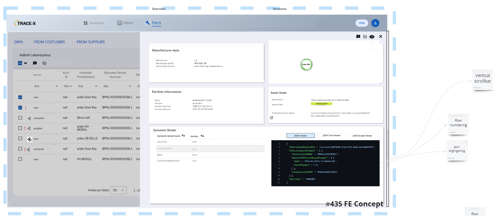

# #435 Display-Aspect-Models-connected-to-twin-generic

| Key           | Value                                                                  |
|---------------|------------------------------------------------------------------------|
| Autor         | @ds-mkanal                                                             |
| Creation date | 28.02.2024                                                             |
| Ticket Id     | [#435](https://github.com/eclipse-tractusx/traceability-foss/issues/435) |
| State         | DRAFT                                                        |

# Table of Contents
1. [Overview](#overview)
2. [Summary](#summary)
3. [Problem Statement](#problem-statement)
4. [Requirements](#requirements)
5. [NFR](#nfr)
6. [Out of scope](#out-of-scope)
7. [Assumptions](#assumptions)
8. [Concept](#concept)
9. [Glossary](#glossary)
10. [References](#references)
11. [Additional Details](#additional-details)

# Overview
Trace-X is an application in which quality issues can be processed. For the processing of these quality issues, both for the correct addressing of the quality incident and for a more in-depth search, a large number of semantic models must be accessed depending on the application. The information gained should not be regulated for Quality Expert working with Trace-X Busines App. All semantic models linked to a digital twin should be available for processing,

# Summary
Trace-X can currently display a defined number of semantic models of the BOMLifecyles asPlanned and asBuilt.
In the future, it can be assumed that further as yet unspecified semantic models will be developed which will also be represented in Trace-X.
Trace-X will be developed to generically handle different existing and planned semantic models.

# Problem Statement
- Trace-X can currently display a fixed number of semantic models.
- This involves the well-known semantic models of BOMLifecyle asPlanned and asBuilt (SerialPart, SingleLevelUsage*, SingleLevelBOM, PartAsPlanned, PartSiteInformationAsPlanned, JustInSequence)
- In addition, there is a further set of semantic models which are not currently part of the Trace-X domain model and therefore cannot be displayed at present.
- To avoid having to map every available semantic model in the domain model, there is a requirement to display other semantic models in a more generic form.

# Requirements
- [ ] All semantic models connected to a digital twin can be viewed by a Trace-X user
- [ ] Display of digital twin connected semantic models raw payload in Trace-X FE
- [ ] Display of digital twin connected semantic models payload as graph view in Trace-X FE
- [ ] Display of digital twin connected semantic models payload as tree view in Trace-X FE
- [ ] Semantic Model is displayed with version of semantic model
- [ ] Line numbering for raw and tree viewer

# NFR
- [ ]

# Out of scope
-

# Assumptions
-

# Concept

## UI Mocks
### Changes in DetailView Overlay

- Detail View must  be scrollable with vertical scrollbar
- New Panel "Semantic Models" is added to Detail View (de: Semantische Modelle)
- Panel "Semantic Models" contains table
- Table contains all "Semantic Models" for selected asset
- Table contains columns "Semantic Model Name" (de: refer to current translation
- Table contains columns "Version" of semantic model (de:Version)

Source: https://miro.com/app/board/uXjVO5JVoho=/?moveToWidget=3458764572353049533&cot=14

# Glossary

| Abbreviation | Name | Description   |
|--------------|------|---------------|
|              |      |               |
|              |      |               |

# References

# Additional Details
Given the dynamic nature of ongoing development, there might be variations between the conceptualization and the current implementation. For the latest status, refer to the documentation.
