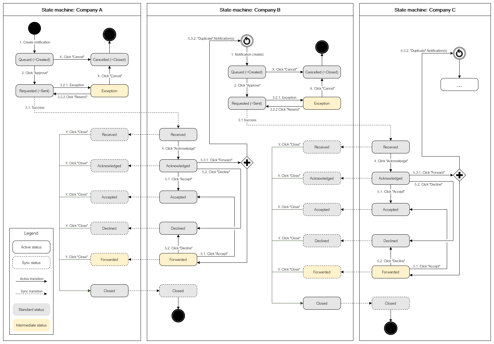

# #436 intermediate status transitions in Trace-X

| Key           | Value                                                                    |
|---------------|--------------------------------------------------------------------------|
| Author        | @ds-crehm                                                                |
| Creation date | 13.02.2024                                                               |
| Ticket Id     | [#436](https://github.com/eclipse-tractusx/traceability-foss/issues/436) |
| State         | WIP                                                                      |

# Table of Contents
1. [Overview](#overview)
2. [Requirements](#requirements)
3. [Out of scope](#out-of-scope)
4. [Concept](#concept)
5. [Glossary](#glossary)
6. [References](#references)

# Overview
The standard notification status flow must be used by all applications in the Catena-X network.
For the Trace-X application there is a need to display more information to the user that cannot be conveyed using only the standard status flow.
The frontend must be able to display more nuanced status information, while the actual status of the notification remains unchanged.

# Requirements
- [ ] Intermediate statuses for notifications can be stored in Trace-X without affecting the standard notification flow
- [ ] Intermediate statuses for notifications can be shown in Trace-X
- [ ] After an exception has occurred during the sending of notifications, the status is updated to "Exception"
- [ ] After an exception has occurred a message is shown in the message history of the notification with exception details
- [ ] When the notification is in status "Exception", the user must be able to "Resend" the notification
- [ ] Status flow is implemented. The transitions between statuses work.
- [ ] User manual is updated

# Out of scope
"Forwarded" status is not yet confirmed. Concept will be adjusted depending on the decisions in https://github.com/eclipse-tractusx/sig-release/issues/385

# Concept
State machine:

| Step   | Description                                                                                                                                                                                                                                                                                                                                                                                                            | Resulting status shown to the user | Resulting internal status | Transition                                                                                                  |
|--------|------------------------------------------------------------------------------------------------------------------------------------------------------------------------------------------------------------------------------------------------------------------------------------------------------------------------------------------------------------------------------------------------------------------------|------------------------------------|---------------------------|-------------------------------------------------------------------------------------------------------------|
| 1      | Notification is created. This can be done by the User directly or by forwarding/duplicating an existing notification.                                                                                                                                                                                                                                                                                                  | Queued                             | Created                   | **Manually:** Sender created a new notification or **Automatically:** Notification is automatically created |
| 2      | Notification is approved.                                                                                                                                                                                                                                                                                                                                                                                              | Requested                          | Sent                      | **Manually:** Sender approves notification                                                                  |
| X      | Sending of notification is cancelled. The notification is **not** synchronized with the receiver. Can be done by the sender at any time before the notification was successfully synchronized with the receiver.                                                                                                                                                                                                       | Cancelled                          | Closed                    | **Manually:** Sender cancels the notification before it is successfully synchronized with the receiver      |
| 3.1    | Notification successfully sent. The notification is synchronized with the receiver.                                                                                                                                                                                                                                                                                                                                    | Received                           | Received                  | **Automatically:** After the notification is sent and Trace-X received a 201 success response               |
| 3.2.1  | There was an exception during the send process. The notification is **not** synchronized with the receiver.                                                                                                                                                                                                                                                                                                            | Exception                          | Received                  | **Automatically:** After the notification is sent and there was any exception                               |
| 3.2.2  | Notification is resent.                                                                                                                                                                                                                                                                                                                                                                                                | Requested                          | Sent                      | **Manually:** Sender resends notification                                                                   |
| 4      | Notification is acknowledged. Status update will be sent to the sender.                                                                                                                                                                                                                                                                                                                                                | Acknowledged                       | Acknowledged              | **Manually:** Receiver acknowledges notification                                                            |
| 5.1    | Notification is accepted. Status update will be sent to the sender.                                                                                                                                                                                                                                                                                                                                                    | Accepted                           | Accepted                  | **Manually:** Receiver accepts notification                                                                 |
| 5.2    | Notification is declined. Status update will be sent to the sender.                                                                                                                                                                                                                                                                                                                                                    | Declined                           | Declined                  | **Manually:** Receiver declines notification                                                                |
| 5.3.1* | Notification is forwarded. Status update will be sent to the sender. From this status the notification can be accepted or declined at any time.                                                                                                                                                                                                                                                                        | Forwarded                          | Acknowledged              | **Manually:** Receiver forwards notification                                                                |
| 5.3.2* | The notification is duplicated. The duplicate is forwarded to a new receiver. The forwarded notification will use the same state machine. The receiver becomes sender for the forwarded notification and there is a new receiver. One notification can be forwarded to multiple receivers. It can be forwarded further by any receiver. The forwarded notification(s) is/are independent of the original notification. | Forwarded                          | Acknowledged              | **Automatically:** After the notification was duplicated                                                    |
| Y      | Notification is closed. Status update will be sent to the receiver. The sender can close the notification at any time after the notification was synchronized with the receiver.                                                                                                                                                                                                                                       | Closed                             | Closed                    | **Manually:** Sender closes notification                                                                    |

\* Shall not be implemented yet. See [Out of scope](#out-of-scope)

The states must always be synchronized between sender and receiver. The transitions between synchronized states can skip one or multiple states.
This means the order of synchronized states must **not** be enforced. The message history must display enough information for both sender and receiver to understand why the status changes took place. (-> https://github.com/eclipse-tractusx/traceability-foss/issues/423)

Example A: The receiver acknowledges a notification. The status is synchronized. The notification has the state "Acknowledged" on both sides.
Now the sender closes the notification and synchronizes the state again. For the receiver the notification never had a state "Accepted"/"Declined"/"Forwarded".

Example B: The synchronization of the acknowledgement (step 4) failed. In this case the state of the notification at the sender's side will remain as "Received", while the notification is saved as "Acknowledged" in the receiver's system.
Now the receiver accepts the notification and the status switches to "Accepted". If the synchronization is then successful, the sender will receive the message that the state has changed to "Accepted". For the sender the notification was never in the state "Acknowledged" but instead skipped to the state "Accepted" directly.

# Glossary

| Abbreviation | Name | Description |
|--------------|------|-------------|
|              |      |             |
|              |      |             |

# References
