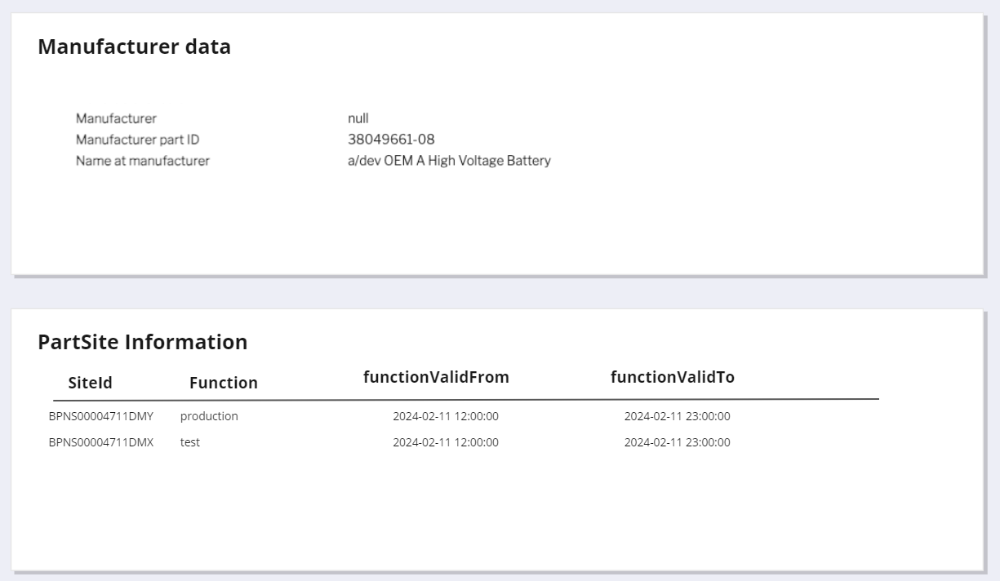

# IndustryCore Changes #437

| Key           | Value                                                                                                                                                      |
|---------------|------------------------------------------------------------------------------------------------------------------------------------------------------------|
| Autor         | @ds-mkanal                                                                                                                                                 |
| Creation date | 26.01.2024                                                                                                                                                 |
| Ticket Id     | [#437](https://github.com/eclipse-tractusx/traceability-foss/issues/437) [#357](https://github.com/eclipse-tractusx/item-relationship-service/issues/357)  |
| State         | WIP                                                                                                                                                        |

# Table of Contents
1. [Overview](#overview)
2. [Problem Statement](#problem-statement)
3. [Concept](#concept)
4. [Definition of the Industry Core](#definition-of-the-industry-core)
5. [Glossary](#glossary)
6. [References](#references)

# Overview

The "Industry Core" is a fundamental element in the C-X network or system architecture.
It provides essential functions for identification, traversal, data flow, configuration, and communication in a modular and
interconnected environment.
The goal is to make components identifiable and discoverable at type and instance levels.
Enable seamless traversal across different tier levels.
Facilitate the creation of data chains.
Crucial role in configuring enablement services for component-based data exchange
Notification base message exchange.

1. Identifiability and findability
2. Traversing Across multiple tier levels
3. Facilitate Data Chains
4. Configuration for Enablement Services
5. Components-Based Data Exchange
The core enables the sending of notifications, indicating that there's a mechanism for alerting or informing relevant parties about specific events or changes within the system.

# Problem Statement
The product Trace-X MUST align with the Industry Code Standard CX-126 and CX-127.

# Concept

## Version matrix

|Artefact| Version | Availability                                                 | link                                                                                                                                              |
|---|---------|--------------------------------------------------------------|---------------------------------------------------------------------------------------------------------------------------------------------------|
| AAS |         |                                                              |                                                                                                                                                   |
|PartAsPlanned | 2.0.0   | Mandatory             | [PartAsPlanned 2.0.0](https://github.com/eclipse-tractusx/sldt-semantic-models/tree/main/io.catenax.part_as_planned/2.0.0)                        |
| SingleLevelBomAsPlanned| 2.0.0   | Mandatory              | [SingleLevelBomAsPlanned 2.0.0](https://github.com/eclipse-tractusx/sldt-semantic-models/tree/main/io.catenax.single_level_bom_as_planned/2.2.0)  |
| SerialPart| 3.0.0   | Mandatory                                                    | [SerialPart 3.0.0](https://github.com/eclipse-tractusx/sldt-semantic-models/tree/main/io.catenax.serial_part/3.0.0/gen)                           |
| Batch| 3.0.0   | Mandatory                                                    | [Batch 3.0.0](https://github.com/eclipse-tractusx/sldt-semantic-models/tree/main/io.catenax.batch/3.0.0)                                          |
| JustInSequencePart| 3.0.0   | Mandatory                                                     | [JustInSequencePart 3.0.0](https://github.com/eclipse-tractusx/sldt-semantic-models/tree/main/io.catenax.just_in_sequence_part/3.0.0)             |
| SingleLevelBomAsBuilt| 2.0.0   | Mandatory                                                    | [SingleLevelBomAsBuilt 2.0.0](https://github.com/eclipse-tractusx/sldt-semantic-models/tree/main/io.catenax.single_level_bom_as_built/2.0.0)      |
| PartSiteInformationAsBuilt| 1.0.0   | Integrated in Aspects JustInSequencePart / Batch / SerialPart | https://github.com/eclipse-tractusx/sldt-semantic-models/tree/main/io.catenax.shared.part_site_information_as_built/1.0.0                         |


- JustInSequencePart:  https://github.com/eclipse-tractusx/sldt-semantic-models/pull/563
- Batch : https://github.com/eclipse-tractusx/sldt-semantic-models/pull/562
- SerialPart: https://github.com/eclipse-tractusx/sldt-semantic-models/pull/557

## Changes in AAS handling

### AAS Parameter

|Parameter | Availability version aas 3.0.0 / 3.1.0 |  Availability version aas 3.x.x |
|----|---|--|
|manufacturerId | Mandatory | Mandatory |
|manufacturerPartId | Mandatory | Mandatory |
|customerPartId | Optional | Optional  |


### Descope @Deprecated assetLifecyclePhase
For serialized parts, batches, and JIS parts this will be deprecated with new version 3.x.x of AAS.
ASS parameter assetLifecyclePhase will not be used anymore to detect BOMLifecycle. Parameter  'digitalTwinType' is used instead.

### Use parameter 'digitalTwinType' to detect  BOMLifecycle

**Parameter 'digitalTwinType'**

| Key          |Value| Description                                                                                           |
|--------------|---|-------------------------------------------------------------------------------------------------------|
| Name         | digitalTwinType | Name of paramter in AAS                                                                               |
| Availability | Mandatory | Parameter is mandatory - adjust required checks - Add exception handling in case parameter is not set |
| Values       | PartType / PartInstance | PartType= asPlanned parts / PartInstance == parts on an instance level (e.g. serialized parts, batches, and JIS parts) |

#### Detect Lifecycle in AAS

````mermaid

sequenceDiagram
    %%{init: {'theme': 'dark', 'themeVariables': { 'fontSize': '15px'}}}%%
    autonumber
    IRS ->> BOMLifecycleDetector : detectBOMLifecycleInAASBOMLifecycleDetector ->> BOMLifecycleDetector : digitalTwinType
alt aas contains 'digitalTwinType'
    alt digitalTwinType="PartType"
       BOMLifecycleDetector -->>  IRS : return asPlanned
    else digitalTwinType="PartInstance"
       BOMLifecycleDetector -->>  IRS : return asBuilt
    else digitalTwinType any other value or null
       BOMLifecycleDetector -->>  IRS : throw Exception
    end
else
   IRS -->> BOMLifecycleDetector : throw Exception (BOMLifecylce could not be detected)
   BOMLifecycleDetector -->> IRS : retrun BOMLifecyle
end

````

#### Configuration of parameter 'digitalTwinType'
Parameter is configurable for dDTR instance and has to be configured for integration test.
Setup dDTR registry on used environments. INT, DEV, PEN, STABLE

- [Values.yaml](https://github.com/eclipse-tractusx/sldt-digital-twin-registry/blob/f438fe96a7ae1f1b920e8e4fb4114fb7af32643d/charts/registry/values.yaml#L51)
- [README.md](https://github.com/eclipse-tractusx/sldt-digital-twin-registry/blob/f438fe96a7ae1f1b920e8e4fb4114fb7af32643d/charts/registry/README.md#:~:text=externalSubjectIdWildcardAllowedTypes)

values.yaml
````json
   registry.externalSubjectIdWildcardAllowedTypes = manufacturerPartId,digitalTwinType
````

### Visbility of Specific Asset IDs in the DTR
* Usage of parameter 'externalSubjectIds' which contains 'specificAssetIds'.  Parameter 'externalSubjectIds' restricts visibility exclusively to manufacturer.

## Semantic Models

### SerialPart
|Parameter | Availability |
|----|------------------|
|partInstanceId | Mandatory |
|van | Optional |

### Batch
|Parameter | Availability |
|----|------------------|
|partInstanceId | Mandatory |
|batchId | Optional |

### JiS
|Parameter | Availability |
|----|------------------|
|jisNumber | Mandatory |
|parentOrderNumber | Optional |
|jisCallDate | Optional |
|partInstanceId | Mandatory |

### Changes in Domain Model

https://github.com/catenax-ng/tx-traceability-foss/blob/5b07a12830d6ecf9f3d0141d49bb89825cc86cc3/docs/src/uml-diagrams/arc42/cross-cutting/domain-model/domain-model.puml

### Changes in Detail View



# Definition of the Industry Core

- [CX-0127-IndustryCorePartInstance#1.0.0](https://github.com/catenax-eV/product-standardization-prod/tree/CX-0127-IndustryCorePartInstance-v1.0.0/standards/CX-0127-IndustryCorePartInstance)

* Table PartSite Information

| Column            | Type | Specification                           |
|-------------------|-----|-----------------------------------------|
| SiteId            | String | BPNS business partner number site       |
| Function          | String  | production                              |
| functionValidFrom | Instance |(only for PartSiteInformationAsPlanned) |
| functionValidTo   | Instance | (only for PartSiteInformationAsPlanned) |

## Standards to be complied with

| Fulfilled | Standard                                              | Description                                                                                                              |
|-----------|-------------------------------------------------------|--------------------------------------------------------------------------------------------------------------------------|
| [x]       | CX-0001 EDC DISCOVERY API 1.0.2                       | Trace-X uses irs_edc_client library for EDC communication this uses the EDC discovery service for EDC resolution         |         |
| [x]       | CX-0002 Digital Twins in Catena-X 2.2.0               | Trace-X  notification process and consumption of assets is bases on DT standards                                         |
| [x]       | CX-0003 SAMM Aspect Meta Model 1.1.0                  | Trace-X using Semantic Models using SAMM standard                                                                        |                                                                                                                       |
| [x]       | CX-0018 Eclipse Data Space Connector (EDC) 2.1.0      | Data consumption and data provision as well as the sending and receiving of messages takes place exclusively via the EDC |
| [x]       | CX-0019 Aspect Model SerialPart                       | The semantic model SerialPart describes a submodel for a digital twin of a serialised part providing essential information about this part                                                                                                                     |
| [x]       | CX-0020 Aspect Model SingleLevelBomAsBuilt            | The Industry Core: Part Instance aims on building product genealogy information throughout the supply chain. Therefore it is required to link a produced part with its predecessor items.                                                                                                                     |
| [x]       | CX-0021 Aspect Model: Batch                           | A batch is a quantity of (semi-) finished products or (raw) material product that have been produced under the same circumstances (e.g., same production location), as specified groups or amounts, within a certain time frame.                                                                                                                      |
| [x]       | CX-0060 Triangle Traceability - Digital Twin As-Built | Digital Twin As-Built                                                                                                                     |

## Describe Part at type and instance level

| Level          | Name          | Description                                                                      | Standard             |
|----------------|---------------|----------------------------------------------------------------------------------|----------------------|
| Type Level     | CatalogueType | Type Level (part number, material number, catalog part)                          |                      |
| Instance Level | SerialPart    | Instance Level (vehicle, ECUs, serialized parts, batches, etc)                   | CX-0019 Aspect Model |
| Instance Level | Batch         | Instance Level (vehicle, ECUs, serialized parts, batches, etc)                   | CX-0021 Aspect Model                     |
| Instance Level | JiS / JustInSequencePart        | Instance Level (vehicle, ECUs, serialized parts, batches, etc)                   |                      |
|Instance Level | SingleLevelBomAsBuilt| RBuilts relationsship between parts in downwards direction (customer > supplier) |    CX-0020 Aspect Model                  |
| Instance Level | PartSiteInformationAsBuilt  | (shared aspect)                                                                  |                      |


# Changes in AAS
| Key        | Availability                             | Description                                                                                                                                                                                                                                           |
|------------|------------------------------------------|-------------------------------------------------------------------------------------------------------------------------------------------------------------------------------------------------------------------------------------------------------|
|manufacturerId | Mandatory                                | The Business Partner Number (BPNL) of the manufacturer of the part.                                                                                                                                                                                   |
|manufacturerPartId | Mandatory                                |                                                                                                                                                                                                                                                       |
|customerPartId | Optional                                 |                                                                                                                                                                                                                                                       |
|assetLifecyclePhase | asPlanned(Mandatory) / asBuilt(Optional) | @Deprecated Not used any more. For serialized parts, batches, and JIS parts, use the value AsBuilt. For catalog parts in a Digital Twin As-Planned lifecycle phase, use the value AsPlanned.                                                          |
|digitalTwinType | Mandatory                                | digitalTwinType="PartType" OR digitalTwinType="PartInstance" For parts on an instance level (e.g. serialized parts, batches, and JIS parts), use the value PartInstance. For parts on a part type level (e.g. catalog parts), use the value PartType. |                                                                                                                                                                       | |

# PartAsPlanned

- No changes
- Version 1.0.1 Mandatory

# SerialPart
| Key        | Availability                            | Description                                          |
|------------|-----------------------------------------|------------------------------------------------------|
| partInstanceId | Mandatory | The serial number of the part from the manufacturer. |
| van | Optional | Only for vehicles: The pseudonymized vehicle identification number (VIN) of the vehicle.                                                     |

# Batch
| Key        | Availability                            | Description                                         |
|------------|-----------------------------------------|-----------------------------------------------------|
| batchId | Optional | The number of the batch from the manufacturer. |
| partInstanceId | Mandatory | Also the number of the batch from the manufacturer. For the time being we also use the batch number as partInstanceId. This makes looking up digital twins for serialized parts and batches easier as a data consumer only has to specify the partInstanceId no matter if they are looking up a serialized part or a batch. Otherwise, the data consumer would need to know for what type of digital twin it is looking for or it would have to look for both until a match is found.                                                    |

### JiS
|Parameter | Availability |Description                                         |
|----|------------------|----------------------------------------------------|
|jisNumber | Mandatory | A number that is used to identify the call-off that can be assumed unique within the specific just-in-sequence process. This is typically not the sequence number, but the call-off number.|
|parentOrderNumber | Optional |A number identifying the just-in-sequence- part's destination parent part. The parent part is typically known upfront to the supplier for just-in-sequence parts.|
|jisCallDate | Optional |The date of the just-in-sequence call-off as stated on the call-off document itself.The value must be compliant to ISO 8601: YYYY-MM-DD or YYYY-MM-DDThh:mm:ss or YYYY-MM-DDThh:mm:ss±hh:mm|
|partInstanceId | Mandatory |A composition of jisNumber, parentOrderNumber (if available), jisCallDate (ifavailable). This information is typically known upfront to the supplier jisNumber, partOrderNumber and jisCallDate for just-in-sequence parts.|

## Discoverable in the network

- [ ] re-definition if the "specific asset ids"

## Enable traversing across several tier levels
- Industry Core aspect models
- DataChain KIT

## Configure the necessary enablement services
- EDC Setup (BPN-S/BPN-L, Policy Handling of the Core)

## Sending of notifications
- Header
- EDC-Assets

## Core Elements
- [CX-0002-DigitalTwinsInCatenaX](https://github.com/catenax-eV/product-standardization-prod/tree/CX-0127-IndustryCorePartInstance-v1.0.0/standards/CX-0002-DigitalTwinsInCatenaX)


# Glossary

| Abbreviation | Name                    | Description                                              |
|--------------|-------------------------|----------------------------------------------------------|
| ECU          | Electronic Control Unit | An ECU's main job is to keep the engine working smoothly |
| JIS          | Just In Sequence        | Just-in-sequence is a delivery concept where parts are delivered to the production plant at a requested time in the exact order of installation, typically for a 1:1 dependency on the manufactured product. A just-in-sequence-part is a part for which this concept and order of delivery applies and which does not have a dedicated serial number (then it would be considered a serialized part). Examples for JIS-parts are seats and bumpers.                                    |
| BPN | Business Partner Number | A BPN is the unique identifier of a partner within Catena-x. |
|  |Part Instance|A part instance is a physically produced instance (e.g. serialized part, batch, just-in-sequence-part) of a part type. |
|  |Part Type| A part type is a generic (not physically produced) part on material- or catalog-level as a representation for a designed part.|
| VAN | Vehicle Anonymised Number | A number mapped 1:1 to VIN, but pseudonomised.|

# References
- [CX-0126 Industry Core Part Type Standard 1.0.0](https://github.com/catenax-eV/product-standardization-prod/blob/CX-0126-IndustryCorePartType-v1.0.0/standards/CX-0126-IndustryCorePartType/1.0.0/CX-0126-Industry-Core-Part-Type.pdf)
- [CX-0126 Industry Core Part Instance Standard 1.0.0](https://github.com/catenax-eV/product-standardization-prod/blob/CX-0127-IndustryCorePartInstance-v1.0.0/standards/CX-0127-IndustryCorePartInstance/1.0.0/CX%20-%200127%20Industry%20Core%20Part%20Instance%201.0.0.pdf)

