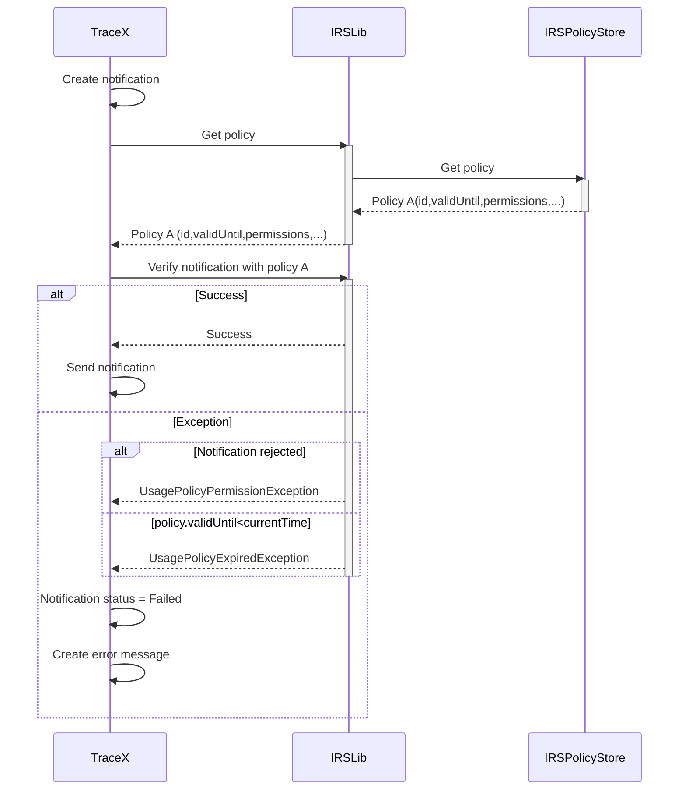

# Concept #521: Revoked notification handling

| Key           | Value                                                                 |
|---------------|-----------------------------------------------------------------------|
| Author        | ds-crehm                                                              |
| Creation date | 24.01.2024                                                            |
| Ticket Id     | #521 https://github.com/eclipse-tractusx/traceability-foss/issues/521 |
| State         | WIP                                                                   |

# Table of Contents
1. [Overview](#overview)
2. [Summary](#summary)
3. [Problem Statement](#problem-statement)
4. [Requirements](#requirements)
5. [NFR](#nfr)
6. [Out of scope](#out-of-scope)
7. [Assumptions](#assumptions)
8. [Concept](#concept)
9. [Glossary](#glossary)
10. [References](#references)
11. [Additional Details](#additional-details)

# Overview

After a notification is created and approved, relevant policies must be verified before it can be sent.
There are three possibilities:
1. The policy is valid (validUntil >= current DateTime) and the notification is permitted to be sent.
2. The policy is valid (validUntil >= current DateTime) but the notification is **not** permitted to be sent.
3. The policy is **not** valid (validUntil < current DateTime) and the notification is **not** permitted to be sent (policy details are not relevant in this case).

Policies are stored in the IRS. The IRS provides an API to fetch and verify policies.

# Summary

When the notification is not sent because of a permission issue or an invalid policy, the user must be notified properly.
The status of the notification must be updated accordingly.

# Problem Statement

# Requirements

- During policy check, throw separate Exceptions based on the type of failure.
  - If policy is not valid -> UsagePolicyExpiredException
  - If policy is valid but notification not permitted -> UsagePolicyPermissionException
- New quality investigation & alert status: "Failed"
  - Notification set to this status, when it could not be sent due to the policy exceptions
- Pop-up informing the user of the exception
- Detailed status information stored in the message history of the notification
- User must be able to resend the notification

# NFR

# Out of scope

# Assumptions

- The message history can show the current notification status persistently and accurately (https://github.com/eclipse-tractusx/traceability-foss/issues/423)
- IRS library response for verification has enough details to show the user
  - If not, Trace-X might have to add additional information to the thrown exceptions

# Concept

### Backend

Instead of only having one UsagePolicyException, there must be two different exceptions:
- UsagePolicyPermissionException (thrown when permission validation fails; contains information from the IRS policy checker response)
- UsagePolicyExpiredException (thrown when policy validUntil DateTime < current DateTime)

When either of these is thrown, the notification will be set to the new status "Failed".
A message is stored in the message history, containing information about the exception.

### Frontend

After creating and approving the notification and one of the exceptions is thrown:
1. A pop-up must be shown to the user
2. The notification status must be changed to "Failed"
3. A new message must be created and shown in the message history including the error description

UsagePolicyPermissionException:

UsagePolicyExpiredException:

# Glossary

| Abbreviation | Name | Description   |
|--------------|------|---------------|
|              |      |               |
|              |      |               |

# References

# Additional Details

Given the dynamic nature of ongoing development, there might be variations between the conceptualization and the current implementation. For the latest status, refer to the documentation.
