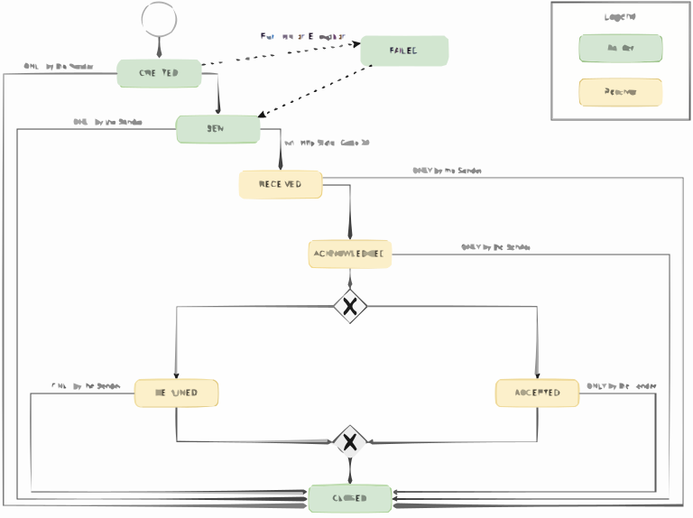
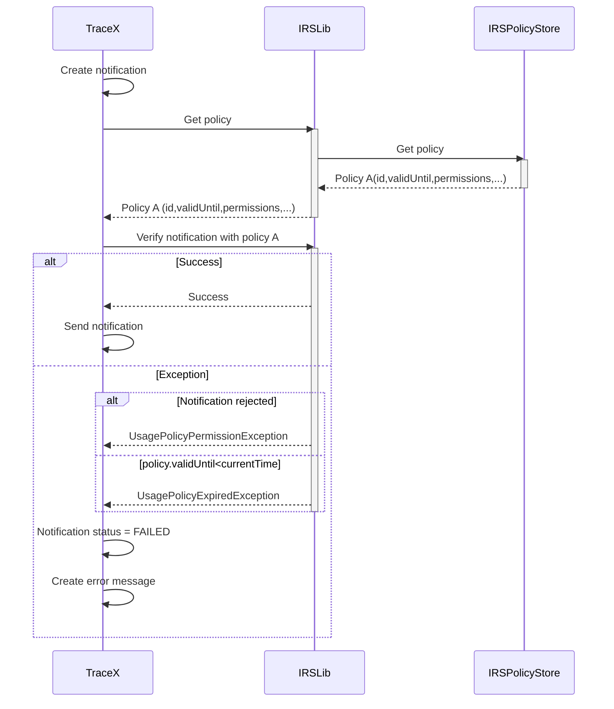
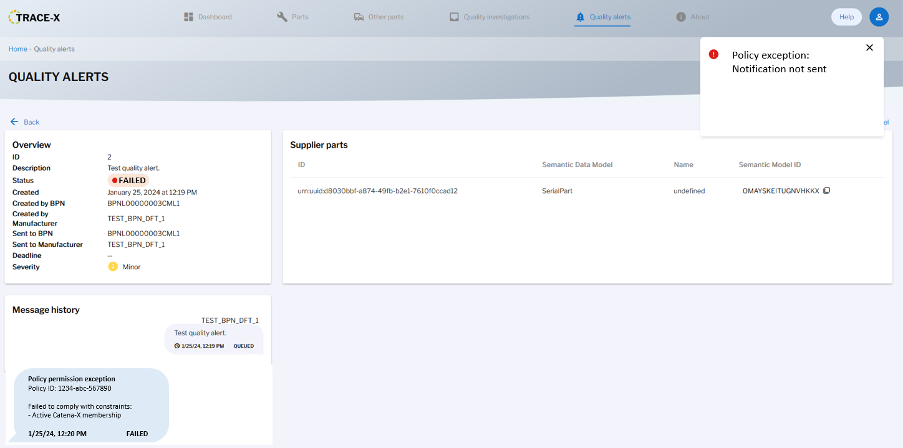
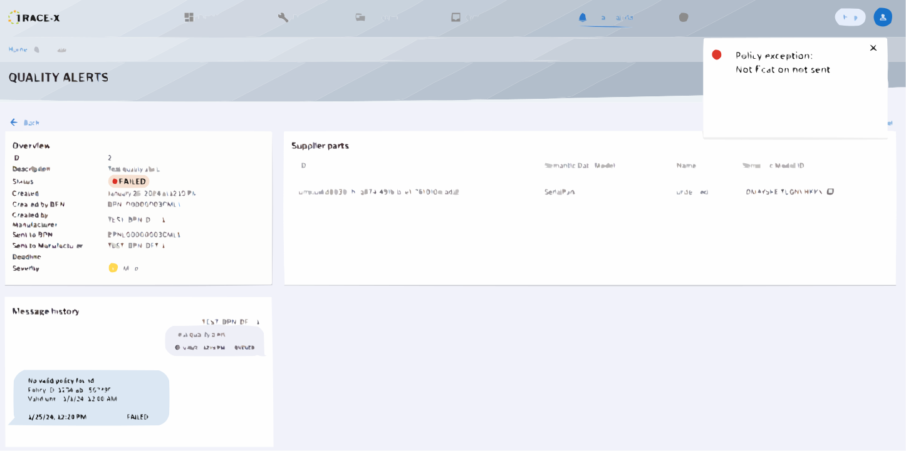

# Concept #521: Revoked notification handling

| Key           | Value                                                                 |
|---------------|-----------------------------------------------------------------------|
| Author        | ds-crehm                                                              |
| Creation date | 24.01.2024                                                            |
| Ticket Id     | #521 https://github.com/eclipse-tractusx/traceability-foss/issues/521 |
| State         | DRAFT                                                                 |

# Table of Contents
1. [Overview](#overview)
2. [Summary](#summary)
3. [Requirements](#requirements)
4. [Assumptions](#assumptions)
5. [Concept](#concept)
6. [References](#references)

# Overview

After a notification is created and approved, relevant policies must be verified before it can be sent.
There are three possibilities:
1. All constraints are fulfilled. The notification may be sent.
2. The policy is expired (validUntil DateTime < current DateTime). The notification is not permitted to be sent.
3. One or more policy-based constraints are not fulfilled. The notification is not permitted to be sent.

Policies are stored in the IRS' policy store. The IRS provides a policy store API to create, fetch and verify policies.

# Summary

If the notification may not be sent after the policy verification, the user must be notified properly.
The status of the notification must be updated accordingly.

# Requirements

- During policy check, throw separate Exceptions based on the type of failure.
  - If policy is not valid -> UsagePolicyExpiredException
  - If policy is valid but notification not permitted -> UsagePolicyPermissionException
- Transient quality investigation & alert status: "FAILED"
  - Notification set to this status, when it could not be sent due to the policy exceptions
- Error toast message informing the user of the exception
- Detailed status information stored in the message history of the notification
- User must be able to resend the notification

# Assumptions

- The message history can show the current notification status persistently and accurately (https://github.com/eclipse-tractusx/traceability-foss/issues/423)
- IRS library response for verification has enough details to show the user
  - If not, Trace-X might have to add additional information to the thrown exceptions

# Concept

### Backend

Instead of only having one UsagePolicyException, there must be two different exceptions:
- UsagePolicyPermissionException (thrown when permission validation fails; contains information from the IRS policy checker response)
- UsagePolicyExpiredException (thrown when policy validUntil DateTime < current DateTime)

When either of these is thrown, the notification will be set to the transient status "FAILED" and a message is stored in the message history, containing information about the exception.
The standard notification status flow must **not** be changed. The "FAILED" status will only extend this standard within Trace-X.
After the notification is successfully resent, the status will be set to "SENT". Alternatively, the user can cancel the notification flow, which will set the status to "CANCELLED"/"CLOSED".

Notification status flow:

Creating and sending notifications:

### Frontend

After creating and approving the notification and one of the exceptions is thrown:
1. An error toast message must be shown to the user
2. The notification status must be changed to "FAILED"
3. A new message must be created and shown in the message history including the error description

UsagePolicyPermissionException:

UsagePolicyExpiredException:

# References

- Current notification status flow: https://eclipse-tractusx.github.io/traceability-foss/docs/user/user-manual.html
