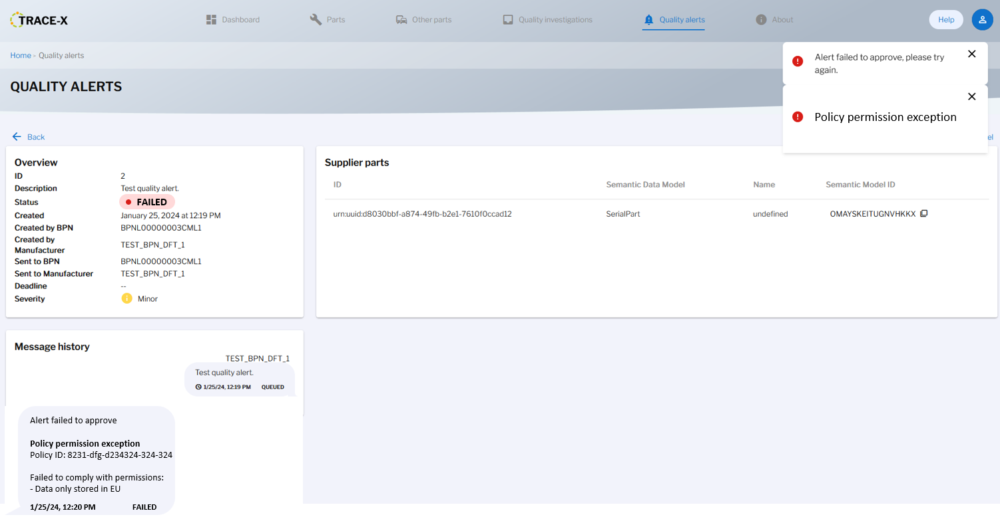
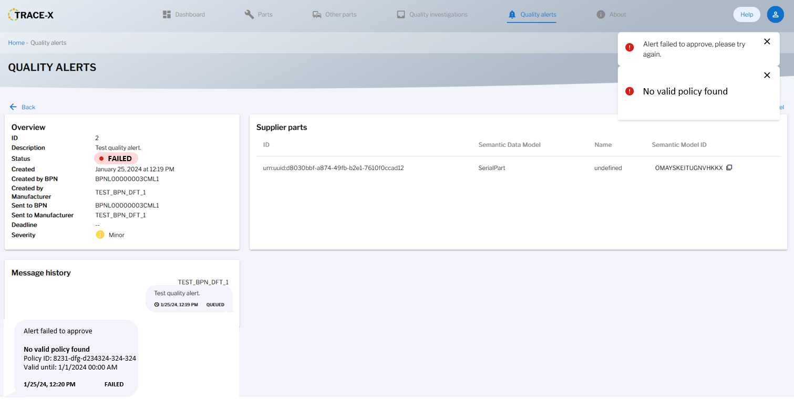

# Concept #521: Revoked notification handling

| Key           | Value                                                                 |
|---------------|-----------------------------------------------------------------------|
| Author        | ds-crehm                                                              |
| Creation date | 24.01.2024                                                            |
| Ticket Id     | #521 https://github.com/eclipse-tractusx/traceability-foss/issues/521 |
| State         | WIP                                                                   |

# Table of Contents
1. [Overview](#overview)
2. [Summary](#summary)
3. [Problem Statement](#problem-statement)
4. [Requirements](#requirements)
5. [NFR](#nfr)
6. [Out of scope](#out-of-scope)
7. [Assumptions](#assumptions)
8. [Concept](#concept)
9. [Glossary](#glossary)
10. [References](#references)
11. [Additional Details](#additional-details)

# Overview

After a notification is created and approved, a negotiation in the EDC is initiated.
Once the EDC approves access to the BPN, Trace-X fetches their usage policy.
There are three possibilities:
1. The policy is valid (validUntil >= current DateTime) and the notification is permitted to be sent.
2. The policy is valid (validUntil >= current DateTime) but the notification is **not** permitted to be sent.
3. The policy is **not** valid (validUntil < current DateTime) and the notification is **not** permitted to be sent (policy details are not relevant in this case).

# Summary

Currently, there is only one error message and no differentiation between case 2 and 3.
When the notification is not permitted, the user is only notified about the failure but not about the reason.
This must now be implemented so that the user knows about the reason behind the rejection and can act accordingly.

# Problem Statement

# Requirements

- During policy check, throw separate Exceptions based on the type of failure.
  - If policy is not valid -> UsagePolicyExpiredException
  - If policy is valid but notification not permitted -> UsagePolicyPermissionException
- New quality investigation & alert status: "Failed"
  - Notification set to this status
- Detailed status information stored in the message history of the notification
- Pop-up informing the user
- Detailed information about the reason for the rejection must be shown in the detail view of the notification
- User must be able to resend the notification

# NFR

# Out of scope

# Assumptions

# Concept

### Backend

Instead of only having one UsagePolicyException, there must be two different exceptions.

UsagePolicyException must be renamed to *UsagePolicyPermissionException* and a new *UsagePolicyExpiredException* must be created.
UsagePolicyPermissionException is thrown whenever the notification is not compliant with the permissions of the policy.
UsagePolicyExpiredException is thrown whenever
policy.validUntil < currentTime

A new notification status "Failed" must be implemented.

### Frontend

After creating and approving the notification and one of those errors is thrown:
1. A pop-up must be shown to the user
2. The notification status must be changed to "Failed"
3. A new message must be created and shown in the message history including the error description

UsagePolicyPermissionException:

UsagePolicyExpiredException:

# Glossary

| Abbreviation | Name | Description   |
|--------------|------|---------------|
|              |      |               |
|              |      |               |

# References

# LOP

- How does Trace-X check policies/permissions/constraints currently?
- When is the UsagePolicyException thrown?
- How does it look like when this exception is thrown right now?

# Additional Details

Given the dynamic nature of ongoing development, there might be variations between the conceptualization and the current implementation. For the latest status, refer to the documentation.
