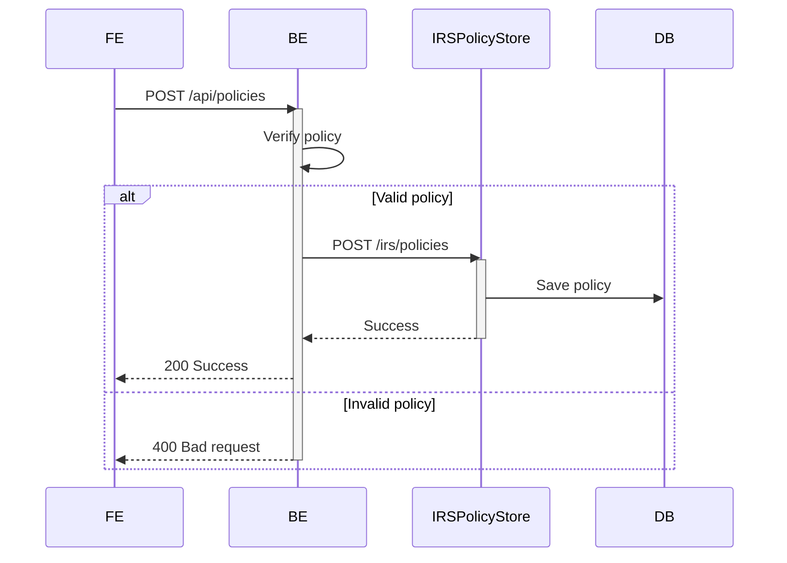
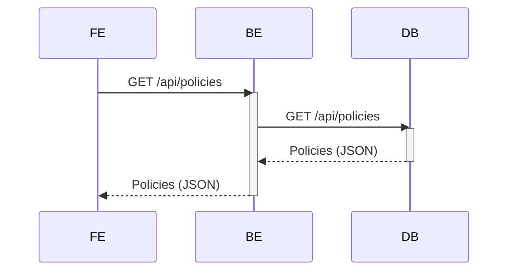
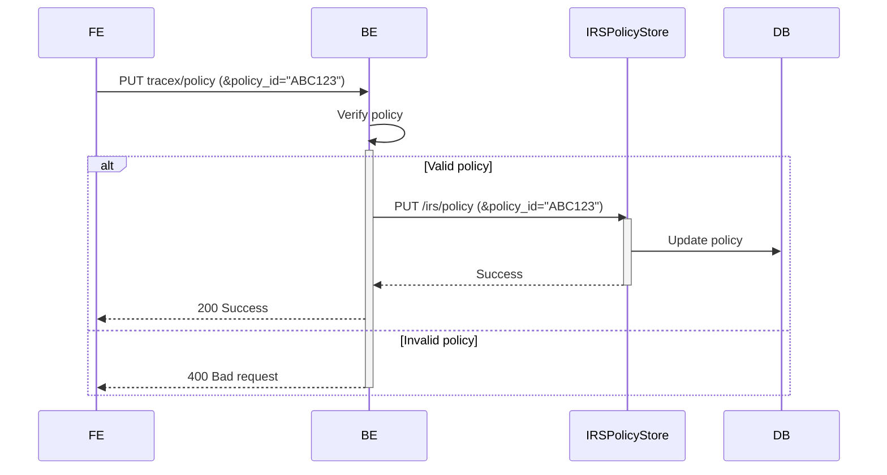
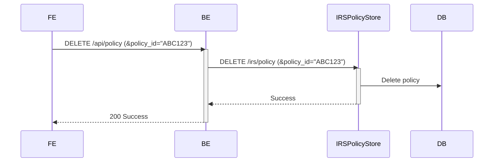

# #568 Policy management

| Key           | Value                                                                    |
|---------------|--------------------------------------------------------------------------|
| Autor         | @ds-crehm                                                                |
| Creation date | 08.02.2024                                                               |
| Ticket Id     | [#568](https://github.com/eclipse-tractusx/traceability-foss/issues/568) |
| State         | WIP                                                                      |

# Table of Contents
1. [Overview](#overview)
2. [Summary](#summary)
3. [Problem Statement](#problem-statement)
4. [Requirements](#requirements)
5. [NFR](#nfr)
6. [Out of scope](#out-of-scope)
7. [Assumptions](#assumptions)
8. [Concept](#concept)
9. [Glossary](#glossary)
10. [References](#references)
11. [Additional Details](#additional-details)


# Overview
In the Catena-X ecosystem every partner can potentially communicate to every other connected partner.
To remain in control of their own data, each partner can use policies to place conditions on the access of their data.
In order to use these policies they must first be created and attached to the assets of a partner.


# Summary
It must be possible for an Administrator of Trace-X to create, read, update and delete policies, which are then stored in the IRS policy store.

# Problem Statement

# Requirements
- [ ] Frontend UI is implemented (see https://miro.com/app/board/uXjVO5JVoho=/?moveToWidget=3458764577267183586&cot=14)
- [ ] CRUD operations for policies are implemented
- [ ] Communication to IRS policy store is implemented
- [ ] Policies are used when sending notifications

# NFR

# Out of scope
- Policies used to define which assets to be consumed over the IRS -> IRS team

# Assumptions

# Concept

## CREATE policies

|             |               |
|-------------|---------------|
| HTTP method | POST          |
| Endpoint    | /api/policies |
| Parameters  | -             |

### Request body
#### Example
```json
[
    {
        "createdOn": "2024-02-19T12:48:23.786Z",
        "permissions": [
            {
                "action": "USE",
                "constraint": {
                    "and": [
                        {
                            "leftOperand": "string",
                            "odrl:rightOperand": "string",
                            "operator": {
                                "@id": "odrl:eq"
                            }
                        }
                    ],
                    "or": [
                        {
                            "leftOperand": "string",
                            "odrl:rightOperand": "string",
                            "operator": {
                                "@id": "odrl:eq"
                            }
                        }
                    ]
                }
            }
        ],
        "policyId": "f253718e-a270-4367-901b-9d50d9bd8462",
        "validUntil": "2024-02-19T12:48:23.786Z"
    }
]
```

### Responses

| Code | Definition                                |
|------|-------------------------------------------|
| 201  | Policy created                            |
| 400  | Policy registration failed                |
| 401  | No valid authentication credentials found |
| 403  | Authorization refused by server           |

#### Examples
**201**
*No response body*

**400**
```json
{
    "error": "Bad request",
    "messages": [
        "createdOn parameter value invalid"
    ],
    "statusCode": "400 BAD_REQUEST"
}
```
___
**Creation of policies:**


## GET policies

|             |               |
|-------------|---------------|
| HTTP method | GET           |
| Endpoint    | /api/policies |
| Parameters  | -             |

### Responses

| Code | Definition                                |
|------|-------------------------------------------|
| 200  | Returns all policies                      |
| 401  | No valid authentication credentials found |
| 403  | Authorization refused by server           |

#### Examples
**200**
```json
[
    {
        "createdOn": "2024-02-19T12:48:23.786Z",
        "permissions": [
            {
                "action": "USE",
                "constraint": {
                    "and": [
                        {
                            "leftOperand": "string",
                            "odrl:rightOperand": "string",
                            "operator": {
                                "@id": "odrl:eq"
                            }
                        }
                    ],
                    "or": [
                        {
                            "leftOperand": "string",
                            "odrl:rightOperand": "string",
                            "operator": {
                                "@id": "odrl:eq"
                            }
                        }
                    ]
                }
            }
        ],
        "policyId": "f253718e-a270-4367-901b-9d50d9bd8462",
        "validUntil": "2024-02-19T12:48:23.786Z"
    }
]
```
___
**Getting policies:**


## UPDATE policies

|             |                             |
|-------------|-----------------------------|
| HTTP method | PUT                         |
| Endpoint    | /api/policies/{policy_id}   |
| Parameters  | policy_id (required string) |

### Request body
#### Example
```json
[
    {
        "createdOn": "2024-02-19T12:48:23.786Z",
        "permissions": [
            {
                "action": "USE",
                "constraint": {
                    "and": [
                        {
                            "leftOperand": "string",
                            "odrl:rightOperand": "string",
                            "operator": {
                                "@id": "odrl:eq"
                            }
                        }
                    ],
                    "or": [
                        {
                            "leftOperand": "string",
                            "odrl:rightOperand": "string",
                            "operator": {
                                "@id": "odrl:eq"
                            }
                        }
                    ]
                }
            }
        ],
        "policyId": "f253718e-a270-4367-901b-9d50d9bd8462",
        "validUntil": "2024-02-19T12:48:23.786Z"
    }
]
```

### Responses

| Code | Definition                                |
|------|-------------------------------------------|
| 200  | Policy updated                            |
| 400  | Policy update failed                      |
| 401  | No valid authentication credentials found |
| 403  | Authorization refused by server           |

#### Examples
**200**
*No response body*

**400**
```json
{
    "error": "Bad request",
    "messages": [
        "policytype parameter value invalid"
    ],
    "statusCode": "400 BAD_REQUEST"
}
```
___
**Updating policies:**


## DELETE policies

|             |                             |
|-------------|-----------------------------|
| HTTP method | DELETE                      |
| Endpoint    | /api/policies/{policy_id}   |
| Parameters  | policy_id (required string) |

### Responses

| Code | Definition                                |
|------|-------------------------------------------|
| 200  | Policy deleted                            |
| 400  | Policy deletion failed                    |
| 401  | No valid authentication credentials found |
| 403  | Authorization refused by server           |

#### Examples
**200**
*No response body*

**400**
```json
{
    "error": "Bad request",
    "messages": [
        "BadRequestException"
    ],
    "statusCode": "400 BAD_REQUEST"
}
```
___
**Deleting policies:**


## Sending notifications


# Glossary

| Abbreviation | Name | Description   |
|--------------|------|---------------|
|              |      |               |
|              |      |               |

# References
EDC policy definition: https://github.com/eclipse-tractusx/ssi-docu/blob/main/docs/architecture/cx-3-2/edc/policy.definitions.md

# Additional Details
Given the dynamic nature of ongoing development, there might be variations between the conceptualization and the current implementation. For the latest status, refer to the documentation.
