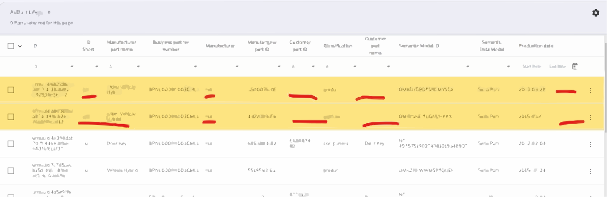
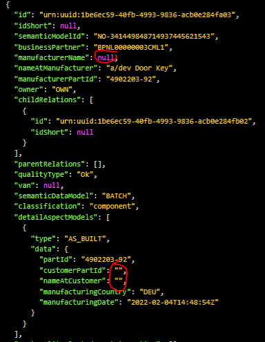
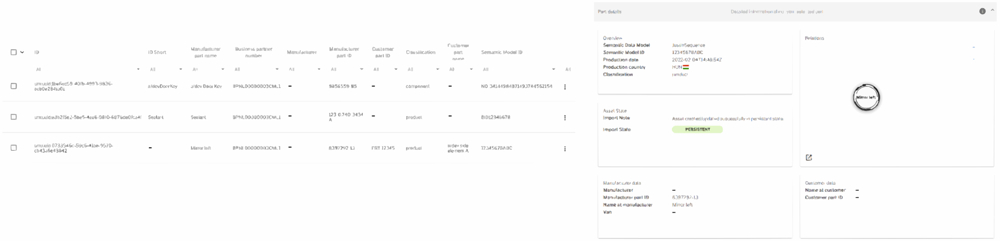
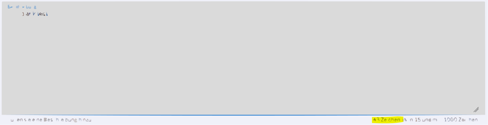
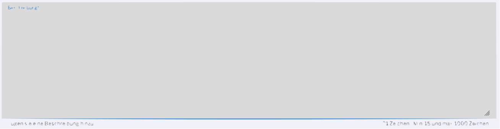

# #578 Consistent null values

| Key           | Value                                                                    |
|---------------|--------------------------------------------------------------------------|
| Author        | @ds-crehm                                                                |
| Creation date | 28.02.2024                                                               |
| Ticket Id     | [#578](https://github.com/eclipse-tractusx/traceability-foss/issues/578) |
| State         | Draft                                                                    |

# Table of Contents
1. [Overview](#overview)
2. [Requirements](#requirements)
3. [Out of scope](#out-of-scope)
4. [Concept](#concept)
5. [References](#references)
6. [Additional Details](#additional-details)

# Overview
In the frontend there are multiple versions of 'empty' values:

In the backend those values are as follows:

These should be consistent throughout Trace-X.

# Requirements
- Whenever a string value is saved or updated in the database and during data consumption from IRS:
    - [ ] Leading and trailing whitespace characters are trimmed.
    - [ ] Empty strings ("") are all converted to null.
- [ ] Null values are shown as a dash "-" in the frontend.
- [ ] When sorting columns, null values are treated the default way of the database. (Shown at the end for ASC - shown at the beginning for DESC)
- [ ] Null values can be filtered for. They are shown as "-" when filtering for them. This option is always shown at the top of the filter/search box regardless of what the user is searching for.
- [ ] Leading and trailing whitespace characters don't count as mandatory values during user input.

# Out of scope
Any further string validation is out of scope. For example values like "-", "--", ".", "..." will not be changed and instead written into the database and shown in the frontend **unchanged**.

# Concept
### Backend
Whenever a string is saved or updated in the database and during data consumption from IRS:
1. Trim leading and whitespace character
2. Convert empty strings ("") to null
3. Save/update value in database

### Frontend
Null values should be shown in the frontend as a dash:

When sorting the values, null must be treated the default way of the database. When sorted ascending, they are at the end. When sorted descending, they are at the beginning.
Filtering for empty values must be possible. In the filter box "-" should always be shown at the top regardless of what the user is searching for.

In order to reduce the amount of whitespace characters in the database, leading and trailing whitespaces should not be counted during user input.

In this example, the amount of counted characters should be 10 ("blank" + " " + "test") instead of 43.

Here, no characters should be counted and the input should not be accepted.

# References
https://miro.com/app/board/uXjVO5JVoho=/?moveToWidget=3458764580844404410&cot=10

# Additional Details
Given the dynamic nature of ongoing development, there might be variations between the conceptualization and the current implementation. For the latest status, refer to the documentation.
