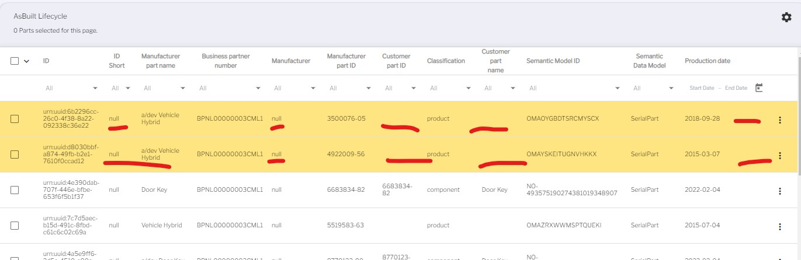
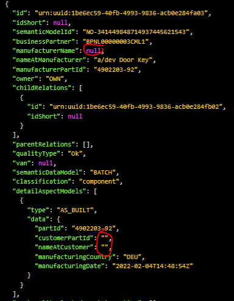
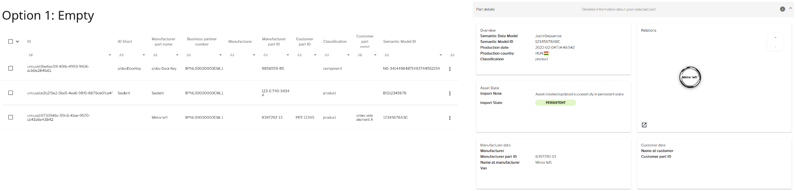
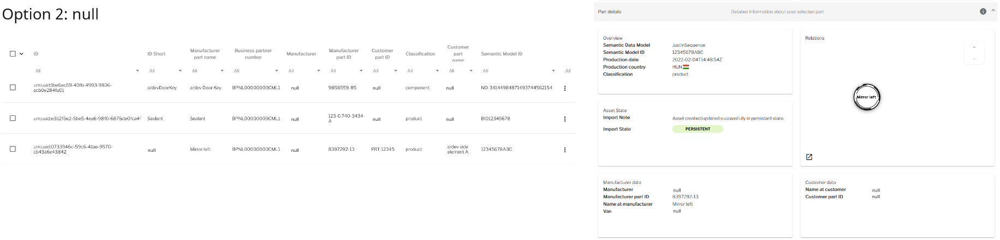
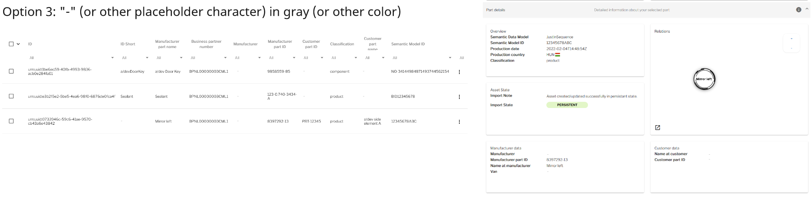

# #578 Consistent null values

| Key           | Value                                                                    |
|---------------|--------------------------------------------------------------------------|
| Author        | @ds-crehm                                                                |
| Creation date | 28.02.2024                                                               |
| Ticket Id     | [#578](https://github.com/eclipse-tractusx/traceability-foss/issues/578) |
| State         | Draft                                                                    |

# Table of Contents
1. [Overview](#overview)
2. [Requirements](#requirements)
3. [Out of scope](#out-of-scope)
4. [Concept](#concept)
5. [References](#references)
6. [Additional Details](#additional-details)

# Overview
In the frontend there are multiple versions of 'empty' values:

In the backend those values are as follows:

These should be consistent throughout Trace-X.

# Requirements
- Whenever a string value is saved or updated in the database and during data consumption from IRS:
  - [ ] Leading and trailing whitespace characters are trimmed.
  - [ ] Empty strings ("") are all converted to null.
- [ ] Decision taken on *how* to show the values & all null values are shown accordingly in the frontend.
- [ ] Leading and trailing whitespace characters don't count as mandatory values during user input.

# Out of scope
Any further string validation is out of scope. For example values like "-", "--", ".", "..." will not be changed and instead written into the database and shown in the frontend **unchanged**.

# Concept
### Backend
Whenever a string is saved or updated in the database and during data consumption from IRS:
1. Trim leading and whitespace character
2. Convert empty strings ("") to null
3. Save/update value in database

### Frontend
There are multiple options on how to show null values in the frontend.
1. Empty

2. null

3. Placeholder character (for example "-") ideally in a different color

Once an option was chosen, the display of null values must be implemented accordingly.

# References
https://miro.com/app/board/uXjVO5JVoho=/?moveToWidget=3458764580844404410&cot=10

# Additional Details
Given the dynamic nature of ongoing development, there might be variations between the conceptualization and the current implementation. For the latest status, refer to the documentation.
