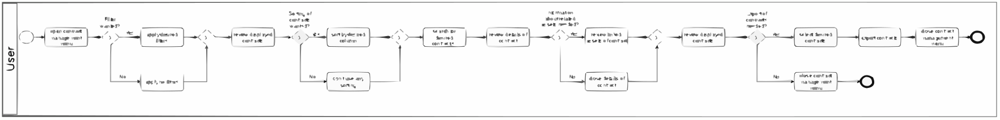
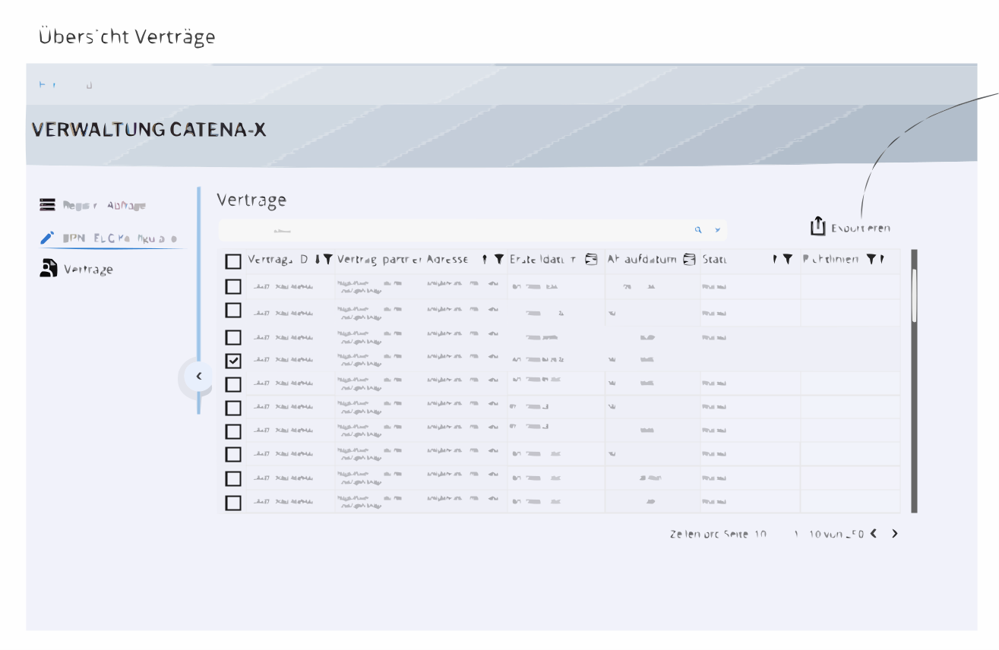
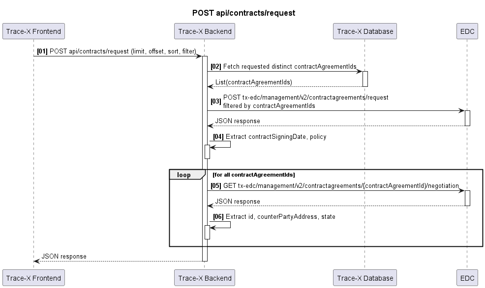
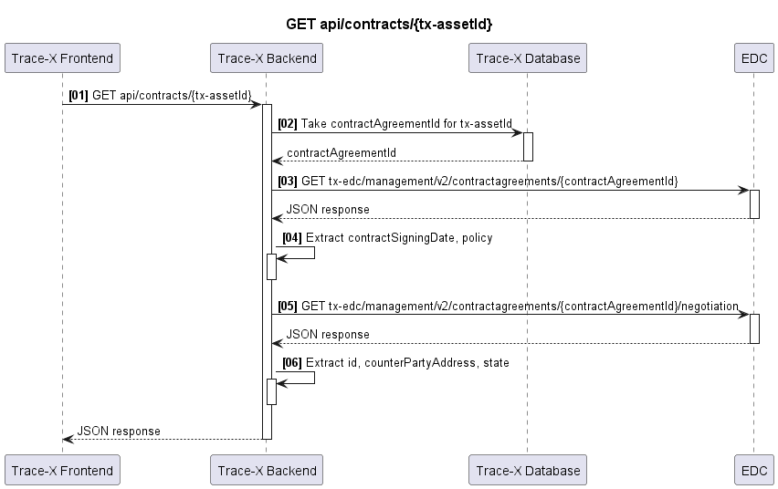

# \[Concept\] \[#638\] Contract Agreement Admin View

| Key           | Value                                                                    |
|---------------|--------------------------------------------------------------------------|
| Author        | @ds-crehm                                                                |
| Creation date | 21.02.2024                                                               |
| Ticket Id     | [#638](https://github.com/eclipse-tractusx/traceability-foss/issues/638) |
| State         | WIP                                                                      |

# Table of Contents
1. [Overview](#overview)
2. [Summary](#summary)
3. [Problem Statement](#problem-statement)
4. [Requirements](#requirements)
5. [NFR](#nfr)
6. [Out of scope](#out-of-scope)
7. [Assumptions](#assumptions)
8. [Concept](#concept)
9. [Glossary](#glossary)
10. [References](#references)
11. [Additional Details](#additional-details)

# Overview

# Summary
The concept pertains to the development of a "Contract Management" section in the admin panel of Trace-X UI. It is based on the admin panel of the "Simple Data Exchanger". The new section in Trace-X UI will allow users to manage their data contracts.

The following will be displayed:
* Contract ID
* Counterparty Address
* Creation Date
* End Date
* State

# Problem Statement
The assets behind the contracts are not available for external auditors. Furthermore, there is no overview in order to make the decision, if an asset can be deleted or if the asset is still valid.

# Requirements
* [ ] The attributes contract ID, Counterparty address, creation date, state and policy are provided
* [ ] The processed data of the management API can be accessed through a new API: GET api/contracts and GET api/contracts/{tx-assetId}
* [ ] The new API is documented
* [ ] POST api/contracts/request makes 2 requests to get attributes: POST tx-edc/management/v2/contractagreements/request & GET tx-edc/management/v2/contractagreements/{contractAgreementId}/negotiation
* [ ] GET api/contracts makes 2 requests to get attributes: GET tx-edc/management/v2/contractagreements/{contractAgreementId} & GET tx-edc/management/v2/contractagreements/{contractAgreementId}/negotiation
* [ ] Payload of the requests are mapped into a domain model
* [ ] Payload can be shown in the frontend

# NFR
* Security: Contract data must be securely stored and transmitted to ensure data confidentiality and integrity
* Usability: The user interface must be user-friendly and easy to understand
* Compliance: All applicable guidelines and legal requirements must be adhered to.
* Reliability: The system needs to be stable and reliable.
* Scalability: The performance shouldn't suffer as the number of contracts increases

# Out of scope
* Attribute EndDate: At the moment, the end date can't be taken from the edc, because the edc doesn't manage usage policies.

# Assumptions
ContractAgreementIds are stored in relation to the assets in the Trace-X database. These are regularly updated by an IRS cron job.

# Concept

## User Stories

| #  | User Story                                                                                                       | Comments                                                                                                           |
|----|------------------------------------------------------------------------------------------------------------------|--------------------------------------------------------------------------------------------------------------------|
| 1  | As a user I want to sort and filter the contract table, so I can easily find the data I need.                    | The following attributes should be filterable/sortable: Contract ID, Counterparty address, Creation date, End date |
| 2  | As an auditor I want to filter contracts by the End date so I can check if policies were adhered to.             |                                                                                                                    |
| 3  | As a user I want to filter contracts by State so I can easily find a contract I'm looking for.                   |                                                                                                                    |
| 4  | As a user I want to scroll trough the page with a scrollbar so I can have an overview of all contracts.          |                                                                                                                    |
| 5  | As a user I want to choose one contract or more so I can export my desired contracts instead of the full table.  |                                                                                                                    |
| 6  | As a user I want to filter contracts by Policies so I can easily find a contract to my related policy.           |                                                                                                                    |
| 7  | As a user I want to sort contracts by contract ID so I can easily find a contract I'm looking for.               | What's the benefit of this? except if I'm looking for a Contract ID starting with a or z                           |
| 8  | As a user I want to sort contracts by the Counter Party Address so I can easily find a contract I'm looking for. | What's the benefit of this? except if I'm looking for a Counterparty Address starting with a or z                  |
| 9  | As a user I want to sort contracts by the Creation date so I can look up the most recent contract.               |                                                                                                                    |
| 10 | As a user I want to sort contracts by the End date so I can find contracts which are expiring soon.              |                                                                                                                    |
| 11 | As an auditor I want to sort contracts by the End date so I can find contracts which are already expired.        |                                                                                                                    |
| 12 | As a user I want to sort contracts by State so I can easily find a contract I'm looking for.                     | What's the benefit of this? except if I'm looking for a State starting with a or z                                 |
| 13 | As a user I want to sort contracts by Policy so I can easily find a contract I'm looking for.                    | What's the benefit of this? except if I'm looking for a Policy starting with a or z                                |
| 14 | As a user I want to export a selection of contracts as a csv so I can use them in an Excel sheet.                |                                                                                                                    |
| 15 | As a user I want to export all contracts as a csv so I can store and view them in an Excel sheet.                |                                                                                                                    |
| 16 | As a user I want to export one contract as a csv so I can print it out for my documents.                         |                                                                                                                    |
| 17 | As a user I want to see the policies related to a contract as a JSON File so I can understand the relations.     |                                                                                                                    |
| 18 | As a user I want to see the assets related to a policy so I can understand the relations.                        |                                                                                                                    |

## User Journey

Persona:

Magnus (35), Administrator

Magnus is responsible for managing contracts and needs to have a regular overview of all current contracts. He is looking for an efficient way to accomplish this task and has therefore been looking for a solution that allows him to filter, sort and export the contracts. He would like an overview of all current contracts. He wants to be able to filter and sort the contracts to find the information more easily. He would also like to be able to see the details of a contract and export a selection of contracts to automate the process. Magnus may be frustrated if the user interface is not intuitive or if the filtering and sorting options do not work. He may also be frustrated if he does not receive the exported CSV file immediately or if the exported file does not contain the desired information.

User Journey Story:
1. Magnus wants to have a look at all current contracts. He opens the admin panel and clicks on the contact management tab.
2. Magnus finds out that the results can be filtered. He decides to filter by Creation date and sets a date range between today until one week back.
3. Magnus is now looking at an overview of all contracts in the chosen daterange. He notices that the contracts are not sorted by the creation date. He sees the sort button in the creation date column and sorts in descending order.
4. Magnus is now satisfied with the current overview of contracts. However, he is interested in the details of the first contract.
5. Magnus opens the detail view of the first contract.  He can now easily trace related policies and assets.
6. After obtaining all possible information about the contract, Magnus closes the detail view.
7. Magnus now wonders if he is able to export his selection of contracts. This way he doesn't need to go trough the whole process over and over again. He spots checkboxes in front of every contract and in the headerline. After setting the check mark, he discovers an export button.
8. Magnus clicks on the export button and exports his selected contracts as csv file.
9. Magnus has now done everything he wanted. He clicks on his profile und logs out his user.


Persona:

Mert (40), Auditor

Mert is responsible for conducting audits and needs to perform a random review of the contracts on a regular basis to ensure compliance. He is looking for an efficient way to accomplish this task and has therefore been looking for a solution that allows him to filter, sort and review the contracts.Mert would like to carry out a random check of the contracts to ensure that the guidelines are being adhered to. He would like to be able to filter and sort the contracts to find the information more easily. He would also like to be able to see the details of a contract and check whether the contracts comply with the guidelines. Mert may be frustrated if the user interface is not intuitive or if the filtering and sorting options do not work. He may also be frustrated if he does not get the details of a contract immediately or if the information is not what he wants.

User Journey Story:
1. Mert would like to perform a random check of the contracts to ensure that the guidelines are being adhered to.
2. Mert receives access to the contract management. He is particularly interested in contracts that are expired.
3. Mert is now looking at an overview of all contracts. He notices that the contracts are not sorted by the end date. He sees the sort button in the end date column and sorts in ascending order.
4. After sorting the overview, Mert is still not satisfied because he only sees contracts that have already been expired by 2 years. He wonders if he can filter by a specific date range. Next to the sorting symbol in the column, he discovers a calendar symbol. He clicks on it and finds out, that he can pick out a date range here. He decides to filter by the period between today and the last month.
5. Now he has an overview, starting with contracts which expired a month ago. He is now interested in whether the contract in the 3rd line has complied with all guidelines. He clicks on the 3rd contract and opens the detail view.
6. Mert can now easily trace related policies and check if related assets have been deleted.
7. Mert determines that everything seems to be in order with this contract. He decides to examine a few more contracts. He closes the detail view of the current contract and repeats step 5 and 6 with 4 more contracts.
8. All reviewed contracts appear to comply with the guidelines. He notes down his result and logs himself out of the contract management section.

## BPMN


## Frontend concept
https://miro.com/app/board/uXjVOGBahIA=/?moveToWidget=3458764573051687012&cot=14


Contract data is called from the backend on a page-by-page basis.

Policies are shown in plain json.

## Backend concept
Backend API of TraceX which provides the stored contract information for the frontend:

POST api/contracts/request
(paginated, sortable, filterable)

GET api/contracts/{tx-assetId}

### POST api/contracts/request sequence flow


#### 1. Frontend calls backend API to get contracts (paginated, sortable, filterable)

#### 2. Fetch contractAgreementIds from database

#### 3. Get contractAgreementId from POST tx-edc/management/v2/contractagreements/request
Request:
POST /management/v2/contractagreements/request

Request body sample:
```json
{
    "filterExpression": {
        "@type": "Criterion",
        "operandLeft": "@id",
        "operator": "IN",
        "operatorRight": [contractAgreementId[0],contractAgeementId[1],...]
    }
}
```

Response:

| output                  | type           | example                                                                                                                                                      |
|-------------------------|----------------|--------------------------------------------------------------------------------------------------------------------------------------------------------------|
| id                      | String         | ZDgzZjhjY2EtMGY2MC00OWMzLWJjNDYtMWE0OTY2MDdlMzhj:cmVnaXN0cnktYXNzZXQ=:NGM0YjM3OTgtZmU0YS00N2Q1LTg0MTctZTk3ZjdkYjgwOGQ4                                       |
| type                    | String         | edc:ContractAgreement                                                                                                                                        |
| edc:assetId             | String         | registry-asset                                                                                                                                               |
| edc:providerId          | String         | BPNL00000001CRHK                                                                                                                                             |
| edc:consumerId          | String         | BPNL00000001CRHK                                                                                                                                             |
| edc:contractSigningDate | Unix timestamp | 1700664778                                                                                                                                                   |
| edc:policy              | Object         | "@id": "68d90fc3-5d8f-4cb5-b9db-ca72c82705e5","@type": "odrl:Set","odrl:permission": {"odrl:target": "registry-asset","odrl:action": {"odrl:type": "USE" ... |

Response Sample:
```json
[
    {
        "@type": "edc:ContractAgreement",
        "@id": "ZDgzZjhjY2EtMGY2MC00OWMzLWJjNDYtMWE0OTY2MDdlMzhj:cmVnaXN0cnktYXNzZXQ=:NGM0YjM3OTgtZmU0YS00N2Q1LTg0MTctZTk3ZjdkYjgwOGQ4",
        "edc:assetId": "registry-asset",
        "edc:policy": {
            "@id": "68d90fc3-5d8f-4cb5-b9db-ca72c82705e5",
            "@type": "odrl:Set",
            "odrl:permission": {
                "odrl:target": "registry-asset",
                "odrl:action": {
                  "odrl:type": "USE"
                },
                "odrl:constraint": {
                    "odrl:or": {
                        "odrl:leftOperand": "PURPOSE",
                        "odrl:operator": {
                            "@id": "odrl:eq"
                        },
                        "odrl:rightOperand": "ID 3.0 Trace"
                    }
                }
            },
            "odrl:prohibition": [],
            "odrl:obligation": [],
            "odrl:target": "registry-asset"
        },
        "edc:contractSigningDate": 1700664778,
        "edc:consumerId": "BPNL00000001CRHK",
        "edc:providerId": "BPNL00000001CRHK",
        "@context": {
            "dct": "https://purl.org/dc/terms/",
            "tx": "https://w3id.org/tractusx/v0.0.1/ns/",
            "edc": "https://w3id.org/edc/v0.0.1/ns/",
            "dcat": "https://www.w3.org/ns/dcat/",
            "odrl": "http://www.w3.org/ns/odrl/2/",
            "dspace": "https://w3id.org/dspace/v0.8/"
        }
    }
]
```

#### 4. Extract contractSigningDate, policy

| Domain model         | Response parameter      | Example                                                                                                                                                      |
|----------------------|-------------------------|--------------------------------------------------------------------------------------------------------------------------------------------------------------|
| Contract ID          | -                       |                                                                                                                                                              |
| Counterparty address | -                       |                                                                                                                                                              |
| **Creation date**    | edc:contractSigningDate | 22.11.2023 (converted from 1700664778)                                                                                                                       |
| End date             | -                       |                                                                                                                                                              |
| State                | -                       |                                                                                                                                                              |
| **Policy**           | edc:policy              | "@id": "68d90fc3-5d8f-4cb5-b9db-ca72c82705e5","@type": "odrl:Set","odrl:permission": {"odrl:target": "registry-asset","odrl:action": {"odrl:type": "USE" ... |


#### 5. GET /management/v2/contractagreements/{contractAgreementId}/negotiation

Request:
GET /management/v2/contractagreements/{contractAgreementId}/negotiation

Response:

| output                  | type   | example                                                                                                                |
|-------------------------|--------|------------------------------------------------------------------------------------------------------------------------|
| id                      | String | 7ed070a1-85fb-4e17-bd04-1df512156ccc                                                                                   |
| type                    | String | edc:ContractNegotiation                                                                                                |
| edc:type                | String | CONSUMER                                                                                                               |
| edc:protocol            | String | dataspace-protocol-http                                                                                                |
| edc:state               | String | FINALIZED                                                                                                              |
| edc:counterPartyAddress | String | https://irs-ess-provider-controlplane.int.demo.catena-x.net/api/v1/dsp                                                 |
| edc:contractAgreementId | String | ZDgzZjhjY2EtMGY2MC00OWMzLWJjNDYtMWE0OTY2MDdlMzhj:cmVnaXN0cnktYXNzZXQ=:NGM0YjM3OTgtZmU0YS00N2Q1LTg0MTctZTk3ZjdkYjgwOGQ4 |

Response Sample:
```json
{
    "@type": "edc:ContractNegotiation",
    "@id": "7ed070a1-85fb-4e17-bd04-1df512156ccc",
    "edc:type": "CONSUMER",
    "edc:protocol": "dataspace-protocol-http",
    "edc:state": "FINALIZED",
    "edc:counterPartyId": "BPNL00000001CRHK",
    "edc:counterPartyAddress": "https://irs-ess-provider-controlplane.int.demo.catena-x.net/api/v1/dsp",
    "edc:callbackAddresses": [],
    "edc:createdAt": 1700664777339,
    "edc:contractAgreementId": "ZDgzZjhjY2EtMGY2MC00OWMzLWJjNDYtMWE0OTY2MDdlMzhj:cmVnaXN0cnktYXNzZXQ=:NGM0YjM3OTgtZmU0YS00N2Q1LTg0MTctZTk3ZjdkYjgwOGQ4",
    "@context": {
        "dct": "https://purl.org/dc/terms/",
        "tx": "https://w3id.org/tractusx/v0.0.1/ns/",
        "edc": "https://w3id.org/edc/v0.0.1/ns/",
        "dcat": "https://www.w3.org/ns/dcat/",
        "odrl": "http://www.w3.org/ns/odrl/2/",
        "dspace": "https://w3id.org/dspace/v0.8/"
    }
}
```

#### 6. Extract id, counterPartyAddress, state

| Domain model             | Response parameter      | Example                                                                                                                                                      |
|--------------------------|-------------------------|--------------------------------------------------------------------------------------------------------------------------------------------------------------|
| **Contract ID**          | id                      | 7ed070a1-85fb-4e17-bd04-1df512156ccc                                                                                                                         |
| **Counterparty address** | edc:counterPartyAddress | https://irs-ess-provider-controlplane.int.demo.catena-x.net/api/v1/dsp                                                                                       |
| Creation date            | edc:contractSigningDate | 22.11.2023 (converted from 1700664778)                                                                                                                       |
| End date                 | -                       |                                                                                                                                                              |
| **State**                | edc:state               | FINALIZED                                                                                                                                                    |
| Policy                   | edc:policy              | "@id": "68d90fc3-5d8f-4cb5-b9db-ca72c82705e5","@type": "odrl:Set","odrl:permission": {"odrl:target": "registry-asset","odrl:action": {"odrl:type": "USE" ... |

#### 7. Handle pagination in FE (if necessary repeat calls)

___

### GET api/contracts/{tx-assetId} sequence flow



#### 1. Frontend calls backend API to get contract
Input: tx-assetId

#### 2. Fetch contractAgreementIds from database
Input: tx-assetId

Output: contractAgreementId

#### 3. GET /management/v2/contractagreements/{ContractAgreementId}

Request:
GET /management/v2/contractagreements/{ContractAgreementId}

Response:

| output                  | type           | example                                                                                                                                                      |
|-------------------------|----------------|--------------------------------------------------------------------------------------------------------------------------------------------------------------|
| id                      | String         | ZDgzZjhjY2EtMGY2MC00OWMzLWJjNDYtMWE0OTY2MDdlMzhj:cmVnaXN0cnktYXNzZXQ=:NGM0YjM3OTgtZmU0YS00N2Q1LTg0MTctZTk3ZjdkYjgwOGQ4                                       |
| type                    | String         | edc:ContractAgreement                                                                                                                                        |
| edc:assetId             | String         | registry-asset                                                                                                                                               |
| edc:providerId          | String         | BPNL00000001CRHK                                                                                                                                             |
| edc:consumerId          | String         | BPNL00000001CRHK                                                                                                                                             |
| edc:contractSigningDate | Unix timestamp | 1700664778                                                                                                                                                   |
| edc:policy              | Object         | "@id": "68d90fc3-5d8f-4cb5-b9db-ca72c82705e5","@type": "odrl:Set","odrl:permission": {"odrl:target": "registry-asset","odrl:action": {"odrl:type": "USE" ... |

Response Sample:
```json
[
    {
        "@type": "edc:ContractAgreement",
        "@id": "ZDgzZjhjY2EtMGY2MC00OWMzLWJjNDYtMWE0OTY2MDdlMzhj:cmVnaXN0cnktYXNzZXQ=:NGM0YjM3OTgtZmU0YS00N2Q1LTg0MTctZTk3ZjdkYjgwOGQ4",
        "edc:assetId": "registry-asset",
        "edc:policy": {
            "@id": "68d90fc3-5d8f-4cb5-b9db-ca72c82705e5",
            "@type": "odrl:Set",
            "odrl:permission": {
                "odrl:target": "registry-asset",
                "odrl:action": {
                    "odrl:type": "USE"
                },
                "odrl:constraint": {
                    "odrl:or": {
                        "odrl:leftOperand": "PURPOSE",
                        "odrl:operator": {
                            "@id": "odrl:eq"
                        },
                        "odrl:rightOperand": "ID 3.0 Trace"
                    }
                }
            },
            "odrl:prohibition": [],
            "odrl:obligation": [],
            "odrl:target": "registry-asset"
        },
        "edc:contractSigningDate": 1700664778,
        "edc:consumerId": "BPNL00000001CRHK",
        "edc:providerId": "BPNL00000001CRHK",
        "@context": {
            "dct": "https://purl.org/dc/terms/",
            "tx": "https://w3id.org/tractusx/v0.0.1/ns/",
            "edc": "https://w3id.org/edc/v0.0.1/ns/",
            "dcat": "https://www.w3.org/ns/dcat/",
            "odrl": "http://www.w3.org/ns/odrl/2/",
            "dspace": "https://w3id.org/dspace/v0.8/"
        }
    }
]
```

#### 4. Extract contractSigningDate, policy

| Domain model         | Response parameter      | Example                                                                                                                                                      |
|----------------------|-------------------------|--------------------------------------------------------------------------------------------------------------------------------------------------------------|
| Contract ID          | -                       |                                                                                                                                                              |
| Counterparty address | -                       |                                                                                                                                                              |
| **Creation date**    | edc:contractSigningDate | 22.11.2023 (converted from 1700664778)                                                                                                                       |
| End date             | -                       |                                                                                                                                                              |
| State                | -                       |                                                                                                                                                              |
| **Policy**           | edc:policy              | "@id": "68d90fc3-5d8f-4cb5-b9db-ca72c82705e5","@type": "odrl:Set","odrl:permission": {"odrl:target": "registry-asset","odrl:action": {"odrl:type": "USE" ... |


#### 5. GET /management/v2/contractagreements/{ContractAgreementId}/negotiation

Request:
GET /management/v2/contractagreements/{ContractAgreementId}/negotiation

Response:

| output                  | type   | example                                                                                                                |
|-------------------------|--------|------------------------------------------------------------------------------------------------------------------------|
| id                      | String | 7ed070a1-85fb-4e17-bd04-1df512156ccc                                                                                   |
| type                    | String | edc:ContractNegotiation                                                                                                |
| edc:type                | String | CONSUMER                                                                                                               |
| edc:protocol            | String | dataspace-protocol-http                                                                                                |
| edc:state               | String | FINALIZED                                                                                                              |
| edc:counterPartyAddress | String | https://irs-ess-provider-controlplane.int.demo.catena-x.net/api/v1/dsp                                                 |
| edc:contractAgreementId | String | ZDgzZjhjY2EtMGY2MC00OWMzLWJjNDYtMWE0OTY2MDdlMzhj:cmVnaXN0cnktYXNzZXQ=:NGM0YjM3OTgtZmU0YS00N2Q1LTg0MTctZTk3ZjdkYjgwOGQ4 |

Response Sample:
```json
{
    "@type": "edc:ContractNegotiation",
    "@id": "7ed070a1-85fb-4e17-bd04-1df512156ccc",
    "edc:type": "CONSUMER",
    "edc:protocol": "dataspace-protocol-http",
    "edc:state": "FINALIZED",
    "edc:counterPartyId": "BPNL00000001CRHK",
    "edc:counterPartyAddress": "https://irs-ess-provider-controlplane.int.demo.catena-x.net/api/v1/dsp",
    "edc:callbackAddresses": [],
    "edc:createdAt": 1700664777339,
    "edc:contractAgreementId": "ZDgzZjhjY2EtMGY2MC00OWMzLWJjNDYtMWE0OTY2MDdlMzhj:cmVnaXN0cnktYXNzZXQ=:NGM0YjM3OTgtZmU0YS00N2Q1LTg0MTctZTk3ZjdkYjgwOGQ4",
    "@context": {
        "dct": "https://purl.org/dc/terms/",
        "tx": "https://w3id.org/tractusx/v0.0.1/ns/",
        "edc": "https://w3id.org/edc/v0.0.1/ns/",
        "dcat": "https://www.w3.org/ns/dcat/",
        "odrl": "http://www.w3.org/ns/odrl/2/",
        "dspace": "https://w3id.org/dspace/v0.8/"
    }
}
```

#### 6. Extract id, counterPartyAddress, state

| Domain model             | Response parameter      | Example                                                                                                                                                      |
|--------------------------|-------------------------|--------------------------------------------------------------------------------------------------------------------------------------------------------------|
| **Contract ID**          | id                      | 7ed070a1-85fb-4e17-bd04-1df512156ccc                                                                                                                         |
| **Counterparty address** | edc:counterPartyAddress | https://irs-ess-provider-controlplane.int.demo.catena-x.net/api/v1/dsp                                                                                       |
| Creation date            | edc:contractSigningDate | 22.11.2023 (converted from 1700664778)                                                                                                                       |
| End date                 | -                       |                                                                                                                                                              |
| **State**                | edc:state               | FINALIZED                                                                                                                                                    |
| Policy                   | edc:policy              | "@id": "68d90fc3-5d8f-4cb5-b9db-ca72c82705e5","@type": "odrl:Set","odrl:permission": {"odrl:target": "registry-asset","odrl:action": {"odrl:type": "USE" ... |

# Glossary

| German term             | English term         | Description                                                                                                                      |
|-------------------------|----------------------|----------------------------------------------------------------------------------------------------------------------------------|
| Vertrags-ID             | Contract ID          | Is used to identify an asset which is related to a contract.                                                                     |
| Vertragspartner Adresse | Counterparty address | Is the url address of the contract partner to the related contract.                                                              |
| Erstelldatum            | Creation date        | Is the date on which the contract was concluded.                                                                                 |
| Ablaufdatum             | End date             | Is the date on which the contract expires.                                                                                       |
| Status                  | State                | Describes the state of the contract                                                                                              |
| Status: Finalized       | State: Finalized     | The state Finalized is set when the contract has been concluded.                                                                 |
| Status: Terminated      | State: Terminated    | The state Terminated is set if the contract has been cancelled.                                                                  |
| Richtlinie              | Policy               | Describes the guideline of a contract which states who is allowed to access / view the data in order to register a digital twin. |

# References

# Additional Details
Given the dynamic nature of ongoing development, there might be variations between the conceptualization and the current implementation. For the latest status, refer to the documentation.
