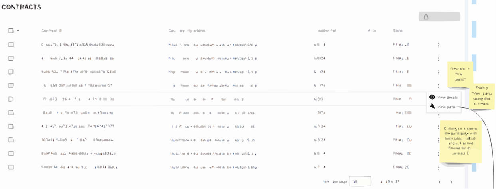
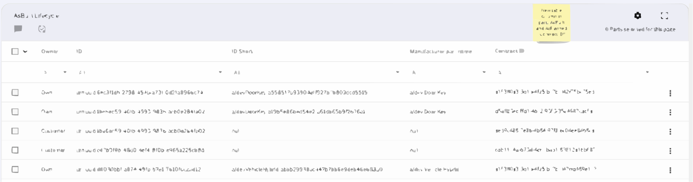
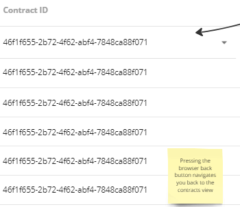

# \[Concept\] \[#737\] Contract parts link

| Key           | Value                                                                    |
|---------------|--------------------------------------------------------------------------|
| Author        | @ds-crehm                                                                |
| Creation date | 12.06.2024                                                               |
| Ticket Id     | [#737](https://github.com/eclipse-tractusx/traceability-foss/issues/737) |
| State         | DRAFT                                                                    |

# Table of Contents
1. [Overview](#overview)
2. [Requirements](#requirements)
3. [Concept](#concept)
4. [Additional Details](#additional-details)

# Overview
Administrators must be able to show parts that are related to a specific contract.

# Requirements
- [ ] Frontend implementation done
  - [ ] New action in contracts table
  - [ ] New column "Contract ID" in AsBuilt and AsPlanned tables
  - [ ] Action takes user to parts tables filtered by the specific contract
- [ ] Backend implementation done
  - [ ] GET AssetsAsBuiltFilter can filter for contractAgreementId
  - [ ] GET AssetsAsPlannedFilter can filter for contractAgreementId

# Concept
## Backend
While the contractAgreementId is already saved for each part/asset, it's not possible to filter for it.
```json
{
    "message": "Provided field name: 'contractAgreementId' is not supported. Supported fields are following [businessPartner, nameAtManufacturer, receivedQualityAlertIdsInStatusActive, sentQualityInvestigationIdsInStatusActive, manufacturingDate, manufacturerPartId, importState, receivedQualityInvestigationIdsInStatusActive, manufacturingCountry, owner, semanticModelId, idShort, sentQualityAlertIdsInStatusActive, tractionBatteryCode, manufacturerId, semanticDataModel, productType, van, manufacturerName, customerPartId, nameAtCustomer, importNote, classification, id, qualityType, alerts]"
}
```
So the API calls
GET AssetsAsBuiltFilter and GET AssetsAsPlannedFilter
must be changed to make it possible to filter for the contractAgreementId.

## Frontend
See also: https://miro.com/app/board/uXjVO5JVoho=

In the contracts table a new single-item action is added to the action menu.
The action is called "View parts" with the parts icon.
The tooltip when hovering over the action says "View parts using this contract".


The column "Contract ID" must be added to part tables AsBuilt and AsPlanned.


After clicking on the action, the user is taken to the parts table filtered for the selected contract.
Clicking back in the browser, brings the user back to the contracts table.


# Additional Details
Given the dynamic nature of ongoing development, there might be variations between the conceptualization and the current implementation. For the latest status, refer to the documentation.
