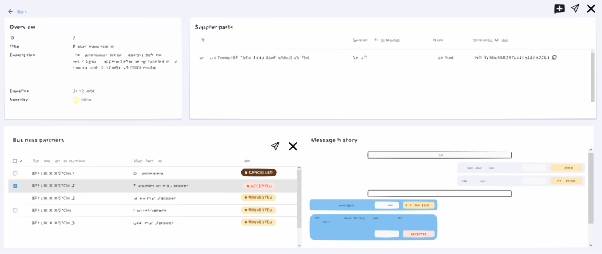
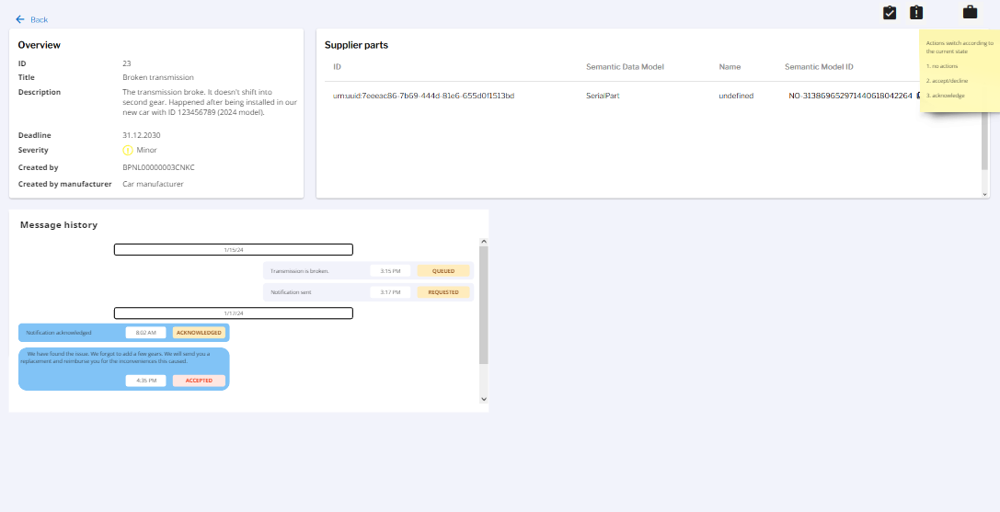

# OBSOLETE \[Concept\] \[#774\] Messages to multiple BPNs

### Concept no longer needed, as it was decided to go with a different approach (->[#774](https://github.com/eclipse-tractusx/traceability-foss/issues/774)). If needed, parts of this concept can be reused.

| Key           | Value                                                                    |
|---------------|--------------------------------------------------------------------------|
| Author        | @ds-crehm                                                                |
| Creation date | 25.03.2024                                                               |
| Ticket Id     | [#774](https://github.com/eclipse-tractusx/traceability-foss/issues/774) |
| State         | WIP                                                                      |

# Table of Contents
1. [Summary](#summary)
2. [Problem Statement](#problem-statement)
3. [Requirements](#requirements)
4. [Concept](#concept)
5. [References](#references)
6. [Additional Details](#additional-details)


# Summary
A user must be able to send notifications to multiple BPNs.
He must be able to view each of those and change their status individually.

# Problem Statement
Right now, a user can send a notification to only one BPN that he must manually type in.

# Requirements
- [ ] Notification model changed
- [ ] Notification API changed
- [ ] Implement functionality for sending to multiple BPNLs in backend
- [ ] Frontend concept implemented
  - [ ] Notification overview
  - [ ] Notification detail view
  - [ ] Create/Edit notification screens

# Concept
### Backend
The notification model must be changed:

```diff
{
    ...

-   "status": "",
-   "reason": {
-       "close": null,
-       "accept": null,
-       "decline": null
-   },
-   "sendTo": "",
-   "sendToName": "",

    ...

    "messages": [
        {
            ...

-           "severity": "",

+           "reason": {
+               "close": null,
+               "accept": null,
+               "decline": null
+           },

            ...
        }
    ]
}
```

The close/accept/decline reasons must be handled for each message individually. Same for the status.
Since the messages can be sent to multiple BPNs the "sendTo" and "sendToName" attributes are obsolete.
Instead, the attributes within the individual message will be used to identify to which BPN the message was sent.

The API call to create notifications must be adjusted to accommodate multiple receiver BPNs:

POST /api/notifications

Request body:
```diff
{
    ...
-   "bpn": "EXAMPLEBPN123"
+   "receiverBpns": [
+       "EXAMPLEBPN123",
+       "EXAMPLEBPN234",
+       "EXAMPLEBPN345"
+   ]
}
```

When sending a notification to multiple BPNs, the sender will always have all messages in his own database,
while the receiver only receives information about the high-level notification data and the specific message addressed to him.

#### Example
BPNL0A creates and approves a notification addressed to BPNL1X and BPNL2Y.

The API call request body looks like this:

```json
{
    {
        "partIds": ["urn:uuid:55555555-5555-5555-5555-555555555555"],
        "description":"Notification description",
        "title": "Notification title",
        "severity": "MINOR",
        "type": "ALERT",
        "targetDate": "2024-05-01T00:00:00Z",
        "receiverBpns": ["BPNL1X","BPNL2Y"]
    }
}
```

The following data is created in the database of BPNL0A:

```json
{
    "id": 1,
    "title": "Notification title",
    "description": "Notification description",
    "createdBy": "BPNL0A",
    "createdByName": "TEST_BPN_SENDER",
    "createdDate": "2024-04-01T00:00:00.000000Z",
    "assetIds": [
        "urn:uuid:55555555-5555-5555-5555-555555555555"
    ],
    "channel": "SENDER",
    "severity": "MINOR",
    "type": "ALERT",
    "targetDate": "2024-05-01T00:00:00Z",
    "messages": [
        {
            "id": "11111111-1111-1111-1111-111111111111",
            "createdBy": "BPNL0A",
            "createdByName": "TEST_BPN_SENDER",
            "sendTo": "BPNL1X",
            "sendToName": "TEST_BPN_RECEIVER1",
            "contractAgreementId": "88888888-8888-8888-8888-888888888888",
            "notificationReferenceId": null,
            "targetDate": 1714521600.000000000,
            "severity": "MINOR",
            "edcNotificationId": "49b450ce-6afd-4621-b76b-6e6f4d78425c",
            "created": [
                2024,
                4,
                1,
                0,
                0,
                0,
                000000000
            ],
            "updated": [
                2024,
                4,
                1,
                0,
                0,
                0,
                000000000
            ],
            "messageId": "bbab03a1-8cba-436b-a481-50bad3ffbd08",
            "status": "CREATED",
            "reason": {
                "close": null,
                "accept": null,
                "decline": null
            },
            "errorMessage": null
        },
        {
            "id": "22222222-2222-2222-2222-222222222222",
            "createdBy": "BPNL0A",
            "createdByName": "TEST_BPN_SENDER",
            "sendTo": "BPNL2Y",
            "sendToName": "TEST_BPN_RECEIVER2",
            "contractAgreementId": "88888888-8888-8888-8888-888888888888",
            "notificationReferenceId": null,
            "targetDate": 1714521600.000000000,
            "severity": "MINOR",
            "edcNotificationId": "49b450ce-6afd-4621-b76b-6e6f4d78425c",
            "created": [
                2024,
                4,
                1,
                0,
                0,
                0,
                000000000
            ],
            "updated": [
                2024,
                4,
                1,
                0,
                0,
                0,
                000000000
            ],
            "messageId": "bbab03a1-8cba-436b-a481-50bad3ffbd08",
            "status": "CREATED",
            "reason": {
                "close": null,
                "accept": null,
                "decline": null
            },
            "errorMessage": null
        }
    ]
}
```
The data sent to BPNL1X contains only the general information about the notification and the message addressed to itself. It does **NOT** contain the second message addressed to BPNL2Y.
The same happens for BPNL2Y respectively.

After the notification was successfully sent to both BPNs the status of both messages is set to "SENT"(for the sender) / "RECEIVED"(for the receivers) synchronized between all three parties.
(In case of an error, the respective message remains in the status "CREATED" and contains the errorMessage. Once it is successfully resent, the error message will be deleted.)

If BPNL1X acknowledges the notification and then accepts it, two new messages will be created for BPNL1X and synchronized with BPNL0A.
BPNL2Y will **NOT** receive any new data.

The data will look like this for BPNL1X:
```json
{
    "id": 1,
    "title": "Notification title",
    "description": "Notification description",
    "createdBy": "BPNL0A",
    "createdByName": "TEST_BPN_SENDER",
    "createdDate": "2024-04-01T00:00:00.000000Z",
    "assetIds": [
        "urn:uuid:55555555-5555-5555-5555-555555555555"
    ],
    "channel": "RECEIVER",
    "severity": "MINOR",
    "type": "ALERT",
    "targetDate": "2024-05-01T00:00:00Z",
    "messages": [
        {
            "id": "11111111-1111-1111-1111-111111111111",
            "createdBy": "BPNL0A",
            "createdByName": "TEST_BPN_SENDER",
            "sendTo": "BPNL1X",
            "sendToName": "TEST_BPN_RECEIVER1",
            "contractAgreementId": "88888888-8888-8888-8888-888888888888",
            "notificationReferenceId": null,
            "edcNotificationId": "49b450ce-6afd-4621-b76b-6e6f4d78425c",
            "created": [
                2024,
                4,
                1,
                0,
                0,
                0,
                000000000
            ],
            "updated": [
                2024,
                4,
                1,
                0,
                0,
                0,
                000000000
            ],
            "messageId": "bbab03a1-8cba-436b-a481-50bad3ffbd08",
            "status": "RECEIVED",
            "reason": {
                "close": null,
                "accept": null,
                "decline": null
            },
            "errorMessage": null
        },
        {
            "id": "11111111-1111-1111-1111-111111111112",
            "createdBy": "BPNL1X",
            "createdByName": "TEST_BPN_RECEIVER1",
            "sendTo": "BPNL0A",
            "sendToName": "TEST_BPN_SENDER",
            "contractAgreementId": "88888888-8888-8888-8888-888888888888",
            "notificationReferenceId": null,
            "edcNotificationId": "49b450ce-6afd-4621-b76b-6e6f4d78425c",
            "created": [
                2024,
                4,
                2,
                0,
                0,
                0,
                000000000
            ],
            "updated": [
                2024,
                4,
                2,
                0,
                0,
                15,
                000000000
            ],
            "messageId": "bbab03a1-8cba-436b-a481-50bad3ffbd09",
            "status": "ACKNOWLEDGED",
            "reason": {
                "close": null,
                "accept": null,
                "decline": null
            },
            "errorMessage": null
        },
        {
            "id": "11111111-1111-1111-1111-111111111113",
            "createdBy": "BPNL1X",
            "createdByName": "TEST_BPN_RECEIVER1",
            "sendTo": "BPNL0A",
            "sendToName": "TEST_BPN_SENDER",
            "contractAgreementId": "88888888-8888-8888-8888-888888888888",
            "notificationReferenceId": null,
            "edcNotificationId": "49b450ce-6afd-4621-b76b-6e6f4d78425c",
            "created": [
                2024,
                4,
                3,
                0,
                0,
                0,
                000000000
            ],
            "updated": [
                2024,
                4,
                3,
                0,
                0,
                15,
                000000000
            ],
            "messageId": "bbab03a1-8cba-436b-a481-50bad3ffbd09",
            "status": "ACCEPTED",
            "reason": {
                "close": null,
                "accept": "example acceptance message",
                "decline": null
            },
            "errorMessage": null
        }
    ]
}
```

BPNL0A will have those 3 messages and additionally the message sent to BPN2Y, while BPN2Y will only have its own message.

### Frontend

#### Notification detail view
In the notification detail view, the message history will be changed according to the frontend concept:

**Creator/Sender:**


The overview must be adapted to the backend changes.

The creator must be able to select individual BPNs, then he can view the message history for messages that were sent to/from the selected BPN.
The state on the left will always show the latest status in the message history.
The user must be able to select individual BPNLs and then send/approve or cancel the notification for the selected BPNLs.
When closing the notification for multiple BPNLs, only one reason can be given, that will be the same for all BPNLs. Closing is possible from all states.

Sending/approving multiple BPNLs will only send, where the last state was "CREATED". Other messages will not be affected.

Additionally, the user is able to edit the notification, send it or close it. (Default actions) Those actions affect **all** BPNLs.
Clicking "send" will send messages to all BPNLs, where the last state was "CREATED" all messages that are in the state "CREATED". Other

**Recipient:**


For the recipient not much changes, since a notification can only be received by a single BPNL. The overview and the message history should be aligned with the view from the sender.
The actions remain the same.

#### Create/Edit notifications
When creating or editing notifications, the user must be able to add/remove multiple BPNLs.
This should be made possible by having an autocomplete in the input text field. And showing selected BPNLs as removable chips:

(-> identical for Edit Notification)

# References
Frontend concepts:
https://miro.com/app/board/uXjVO5JVoho=/

# Additional Details
Given the dynamic nature of ongoing development, there might be variations between the conceptualization and the current implementation. For the latest status, refer to the documentation.
