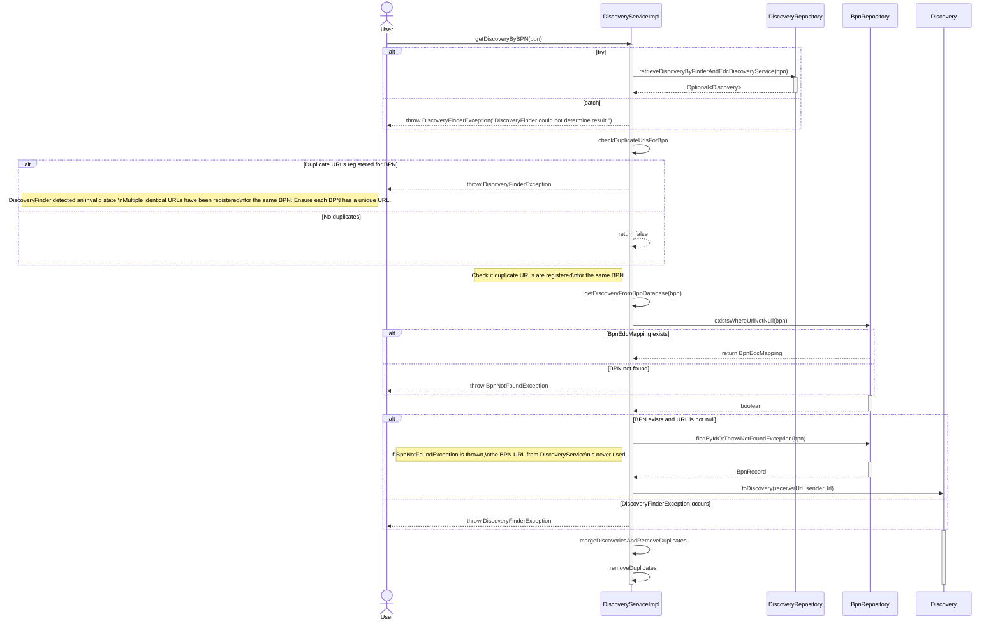

# \[Concept\] \[TRACEX-159\] Handle duplicated connector registrations

| Key           | Value      |
|---------------|------------|
| Author        | mkanal     |
| Creation date | 16.12.2024 |
| Ticket Id     | TRACEX-159 |
| State         | WIP        |

# Table of Contents
1. [Overview](#overview)
2. [Summary](#summary)
3. [Problem Statement](#problem-statement)
4. [Requirements](#requirements)
5. [NFR](#nfr)
6. [Out of scope](#out-of-scope)
7. [Assumptions](#assumptions)
8. [Concept](#concept)
9. [Glossary](#glossary)
10. [References](#references)
11. [Additional Details](#additional-details)

# Overview
Specification of the EDC Discovery Process

# Summary
To ensure reliable and consistent functionality of the EDC Discovery process,
it is essential to define a clear and robust specification.
This specification should address all critical aspects of retrieving EDC URLs from EDC discovery service and those stored database .

# Problem Statement
The current implementation of the EDC Discovery process lacks a well-defined specification,
leading to inconsistencies and operational issues.
Specifically, multiple identical URLs have been registered for the same Business Partner Number (BPN), resulting in an invalid state.

# Requirements
Currently, it is possible to register multiple EDC connectors with the same URL. This leads to an issue where Trace-X, when attempting to send notifications, considers the duplicate connectors and reports success for the same URL twice. As a result, two notifications are created and sent to the same address, which should probably not happen.

# Concept

# Additional Details
Given the dynamic nature of ongoing development, there might be variations between the conceptualization and the current implementation. For the latest status, refer to the documentation.
