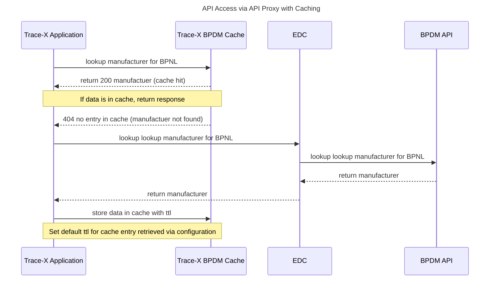
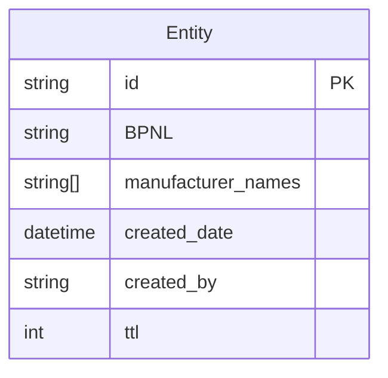
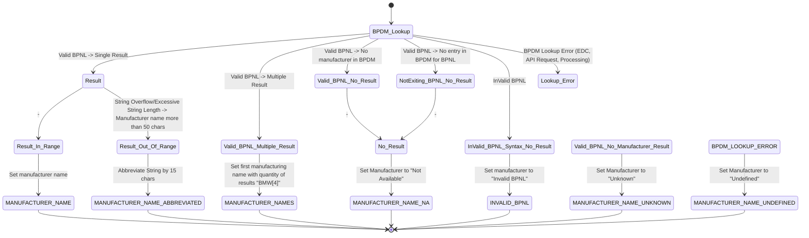

# \[Concept\] \[#ID#\] Summary

| Key           | Value   |
|---------------|---------|
| Author        | MK      |
| Creation date | 30.01.2025 |
| Ticket Id     | TRACEX-357 |
| State         | WIP |

# Table of Contents
1. [Overview](#overview)
5. [NFR](#nfr)
6. [Out of scope](#out-of-scope)
7. [Assumptions](#assumptions)
8. [Concept](#concept)
9. [Glossary](#glossary)
10. [References](#references)
11. [Additional Details](#additional-details)

# Overview
BPDM Lookup handling in UI and regarding Updates of BPDM information

# NFR

* Cache: Performant Cache eviction at runtime within less than 10secs
* Cache: Performant cache configuration of ttl at runtime within less than 1 sec
* Cache: 500 BPNL / manufacturer entries in total
* Cache: up to 40.000  lookups requests per day
* BPDM Lookup: up to 50 lookups per day

# Out of scope

# Assumptions

* *!* Manufactuer name is **NOT** persisted in Trace-X database - the information is retrieved via lookup to get always the latest state of the manufacturer name.
* Basis implementation for BPDM lookup is implemented and working.
* UC1-UC7 is already implemented without using a cache solution.

# Concept

Group 1: BPDM Lookup

| ID  | Name                         | Actor | Description                                                      |
|-----|------------------------------|-------|------------------------------------------------------------------|
| UC1 | Initiate BPDM Lookup         | System| The system initiates a lookup in BPDM via EDC communication.     |
| UC2 | Handle BPDM Lookup Errors    | System| The system handles error states during the BPDM lookup.          |

Group 2: EDC Communication

| ID   | Name                         | Actor | Description                                                      |
|------|------------------------------|-------|------------------------------------------------------------------|
| UC4  | Initiate EDC Flow            | System| The system starts the communication flow with EDC.               |
| UC5  | Perform EDC Discovery        | System| The system performs EDC discovery.                               |

Group 3: Trace-X Update Policy

| ID   | Name                         | Actor | Description                                                                |
|------|------------------------------|-------|----------------------------------------------------------------------------|
| UC6  | Receive Trace-X Asset Update | System| The system receives manufacturer name for BPNL lookup by BPDM via the EDC. |
| UC7  | Update BPDM Information      | System| The system updates BPDM information according in the asset.                |

Group 4: Error and Success Scenarios

| ID   | Name                               | Actor | Description                                                                 |
|------|------------------------------------|-------|-----------------------------------------------------------------------------|
| UC8  | Successful BPDM Lookup with No Result | System| The system sets the manufacturer name to "NA" if the BPDM lookup yields no result. |
| UC9  | Valid BPNL with No BPDM Result     | System| The system labels the manufacturer name as "Unknown" if a valid BPNL yields no results. |
| UC10 | BPDM Lookup Error with Valid BPNL  | System| The system labels the manufacturer name as "Undefined" in case of an error. |

Group 5: Disable Feature for Open Source Contribution

| ID   | Name                       | Actor     | Description                                                      |
|------|----------------------------|-----------|------------------------------------------------------------------|
| UC11 | Disable BPDM functionality | Developer | The developer disables the BPDM feature for upstream open source Tractus-X

Group 6: Cache handling

| ID   | Name                      | Actor | Description                                                      |
|------|---------------------------|-------|------------------------------------------------------------------|
| UC12 | Cache eviction            | Admin | The admin wipes the cache in case of an error or other reasong (testing purpose)
| UC13 | ttl configuration cchange | Admin | The admin changes the default value for ttl to a new value

## Group 1  - UC 1

### API Access via API Proxy with Caching

### Cache Data model

### Entity Table Schema

| Column Name          | Data Type       | Description                                          | Constraints                  | Index |
|----------------------|----------------|------------------------------------------------------|------------------------------|-------|
| `id`                 | `VARCHAR(255)`  | Unique identifier for the entity.                    | Primary Key, Not Null        | ✅     |
| `BPNL`               | `VARCHAR(255)`  | Business Partner Number (Legal).                     | Not Null. to_upper_case      | ✅     |
| `manufacturer_names` | `TEXT[]`       | List of manufacturer names.                          | Not Null,to_upper_case       |       |
| `created_date`       | `TIMESTAMP`     | Timestamp when the entity was created.               | Not Null, Default: NOW() UTC |       |
| `created_by`         | `VARCHAR(255)`  | Actor who created the entity. (system or user role)  | Not Null                     |       |
| `modified_by`        | `VARCHAR(255)`  | Actor who modifies the entity. (system or user role) | Not Null                     |       |
| `ttl`                | `INTEGER`       | Time to live in seconds before expiration.           | Not Null, Must be > 0        |       |

### Error Cases

| **Error Case**                                  | **Error Code** | **Status UI** | **Handling**                                     |
|------------------------------------------------|--------------|---------------|--------------------------------------------------|
| EDC not reachable                              | 500          | "undefined"   | Log error in system log, initate retry procedure |
| BPDM not reachable                             | 500          | "undefined"   | Log error in system log, initate retry procedure |
| EDC contract negotiation rejected              | NA           | "undefined"   | Log error in system log, initate retry procedure |
| Cache access failure                           | NA           | NA            | Lookup BPDM service directly                     |

### Retry procedure

Frameworks: Resilience4j (Spring Retry)
* Configuration of global retry mechanism in HELM Charts

| Parameter                                | Value                                             | Description                                              |
|------------------------------------------|---------------------------------------------------|----------------------------------------------------------|
| **maxAttempts**                          | `3`                                               | Maximum of 3 retries                                     |
| **waitDuration**                         | `Duration.ofMillis(500)`                          | Initial wait time of 500ms                               |
| **retryExceptions**                      | `RuntimeException.class`                          | Retries only on `RuntimeException`                       |
| **intervalFunction**                     | `IntervalFunction.ofExponentialBackoff(500, 2.0)` | Exponential backoff starting at 500ms with a factor of 2.0 |
| **CircuitBreaker.failureRateThreshold**  | `10% requests on cache or on BPDM failed`         |                                             |  |
| **CircuitBreaker.slowCallRateThreshold** | `30% requests too slow `                          |                                                        |  |
| **CircuitBreaker.waitDurationInOpenState**                      | `60 secs`                                         |                                                     |  |
| **CircuitBreaker.slidingWindowSize**                      | `50 requests'                                     |                                                          |  |

## Group 4

### BPDM Lookup procedure

###  Status Naming

| ID | Technical Status                | Status  UI                  | Description                                                                         |
|----|---------------------------------|-----------------------------|-------------------------------------------------------------------------------------|
| 1  | `MANUFACTURER_NAME`             | **"<manufacturer_name>"**   | Happy path set manufactuer name                                                     |
| 2  | `INVALID_BPNL`                  | **"Invalid BPNL"**          | Invalid BPNL does not match the BPNL specification                                  |
| 3  | `MANUFACTURER_NAME_NA`          | **"Not Available"**         | No match found in BPDM lookup → Manufacturer is labeled as "Not Available."         |
| 4  | `MANUFACTURER_NAME_UNKNOWN`     | **"Unknown"**               | Valid BPNL, but no BPDM result → Manufacturer is labeled as "Unknown Manufacturer." |
| 5  | `MANUFACTURER_NAME_UNDEFINED`   | **"Undefined"**             | BPDM lookup error → Manufacturer is labeled as "Manufacturer Undefined."            |
| 6  | `MANUFACTURER_NAMES`            | **"<manufacturer_name>[\d000]"** | BPDM lookup returns more than single result                                         |
| 6  | `MANUFACTURER_NAME_ABBREVIATED` | **"<manufacturer_name...>"** | Abbreviates manufacturer name by 15 chars                                           |

## Group 5 - UC11

Functionality is disabled via feature toggles.
On upstream the feature toggle is disabled.

**Implementation of a Feature Toggle Framework for Trace-X**

To enhance the flexibility and configurability of Trace-X,
an appropriate feature toggle framework should be evaluated and introduced.
The selected framework must support multiple configurations beyond just the open-source approach,
ensuring adaptability for different deployment models, including customer-specific and upstream variants.

Frameworks such as https://flagd.dev and https://openfeature.dev provide robust feature flag management capabilities
that can be leveraged to achieve this goal.
These frameworks offer dynamic feature control, gradual rollouts, and environment-based configurations, making them well-suited for a product like Trace-X, which requires differentiated feature sets across multiple configurations.

By implementing a feature toggle solution, Trace-X can achieve:

* Seamless feature management across different environments (customer-specific, upstream, internal testing).
* Improved deployment flexibility, allowing controlled feature rollouts and progressive experimentation.
* Enhanced maintainability, ensuring that new capabilities can be introduced without impacting production stability.
* The introduction of a scalable feature flag framework will contribute to a more adaptive, configurable, and future-proof architecture for Trace-X, aligning with both enterprise and open-source requirements.

## Group 6

### BPDM Cache management

#### UC12
* Endpoint Cache eviction
    * Public api endpoint for BPDM cache eviction for role admin
        * API endpoint POST /bpdm/evict-cache (200 success,4xx,500)

#### UC13
* Endpoint Set Cache ttl
    * Entry is stored with a ttl (default : 24h)
    * API endpoint PUT /bpdm/config-cache {ttl:timeinMills} (200 success,4xx,500)

# Glossary

| Abbreviation | Name | Description                      |
|--------------|------|----------------------------------|
| BPDM         | Business Partner Data Management     | BPDM (Business Partner Data Management) in Catena-X ensures the standardized and reliable exchange of business partner master data within the ecosystem. |
|              |      |                                  |

# References

# Additional Details
Given the dynamic nature of ongoing development, there might be variations between the conceptualization and the current implementation. For the latest status, refer to the documentation.
