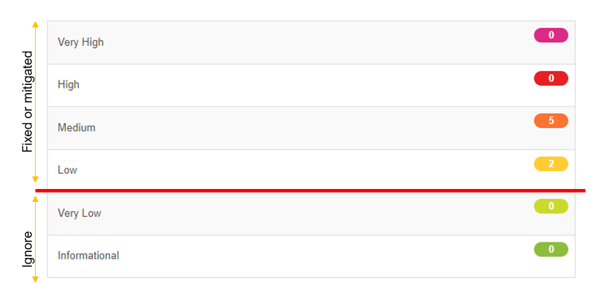

= Development concepts

== Build, test, deploy

TraceX is built using Maven and utilizes all the standard concepts of it.
Test execution is part of the build process and a minimum test coverage of 80% is enforced.

The project setup contains a multi-module Maven build.
Commonly used classes (like the TraceX data model) should be extracted into a separate submodule and reused across the project.
However, this is not a "one-size-fits-all" solution.
New submodules should be created with care and require a review by the team.

The Maven build alone only leads up to the JAR artifact of TraceX.
Do create Docker images, the Docker build feature is used.
This copies all resources into a builder image, builds the software and creates a final Docker image at the end that can then be deployed.

Although the Docker image can be deployed in various ways, the standard solution are the provided Helm charts, which describe the required components as well.

== Code generation

There are two methods of code generation in TraceX:

=== Lombok

The Lombok library is heavily used to generate boilerplate code (like Constructors, Getters, Setters, Builders...).
This way, code can be written faster and this boilerplate code is excluded from test coverage, which keeps the test base lean.

=== Swagger / OpenAPI

The API uses OpenAPI annotations to describe the endpoints with all necessary information.
The annotations are then used to automatically generate the OpenAPI specification file, which can be viewed in the Swagger UI that is deployed with the application.

The generated OpenAPI specification file is automatically compared to a fixed, stored version of it to avoid unwanted changes of the API.

== Migration

There currently is no data migration mechanism for TraceX.
In case the model of the persisted data (Jobs) changes, data is dropped and Jobs will need to be recreated.

== Configurability

TraceX utilizes the configuration mechanism provided by Spring Boot.
Configuration properties can be defined in the file `+src/main/resources/application.yml+`

For local testing purposes, there is an additional configuration file called `+application-local.yml+`.
Values can be overriden there to support the local dev environment.

Other profiles should be avoided.
Instead, the configuration can be overwritten using Spring's external configuration mechanism (see https://docs.spring.io/spring-boot/docs/2.1.9.RELEASE/reference/html/boot-features-external-config.html).
The operator must have total control over the configuration of TraceX.

== Java Style Guide

We generally follow the link:https://google.github.io/styleguide/javaguide.html[Google Java Style Guide].

== API Guide

We generally follow the https://swagger.io/specification/

== Unit and Functional Testing

=== General Unit testing

- Code coverage >= 80%
- Writing methods which provide a response to be better testable (avoid void if feasible).
- Naming of unit tests are as follows:

    test_{method_under_test}_{scenario_description}() { ... }

- Use given/when/then pattern for unit test structuring.
E.g:

    @Test
    void test_isQualityNotificationOffer_returns_true() {
        //GIVEN
        //WHEN
        //THEN
    }

=== Integration Testing

Each public api should have at least two integration tests (positive / negative).

== Clean Code

We follow the rules and behaviour of: https://clean-code-developer.com/.

== Secure Coding standards

As there is no other guideline of C-X, we fix any Vulnerabilities, Exposures, Flaw detected by one of our SAST, DAST, Pentesting tools which is higher than "Very Low".

== TRACE-X Technical class responsibilities

=== Controllers

- Have only one dependency to a facade or a service or a validator annotation
- Have no own logic
- Including the swagger documentation annotations
- For each controller exists and Integration Test class
- Returns a ResponseEntity<T>

=== DTO (Data Transfer Object)

- Should be a public version of the domain object
- It is a result of the transformation which will be done in the facade
- Is not necessary if the domain object can be fully public
- Is not allowed to be implemented in a repository or a DAO

=== Facade

* Responsible for transforming data objects (private) to data transfer objects (public)
** Not necessary if the domain object is fully public
* Should have multiple service classes injected
* Returns a public object → Data Transfer Object
* Can be implemented in a controller

=== Service

* Responsible for retrieving data from storage
** Only if facade is not used will take care of transforming data objects (private) to data transfer objects (public)
* Performs business logic
* Can be a http client
* Returns a jpaEntity → Domain Object
* Can be implemented in a controller

=== DAO (Data Access Object)

* Please follow the common standard: https://www.oracle.com/java/technologies/data-access-object.html
* Will be used when we need to write custom queries which cannot be added in the repository
* Returns a jpaEntity → Domain Object
* Is not allowed to be implemented in a controller

=== Repository

* The standard interface which extends JpaEntity
* Returns a jpaEntity → Domain Object
* Is not allowed to be implemented in a controller

=== Domain Object (Entity Object?)

* Is a JPA Entitiy which could be considered as public
* Includes relations to other JPA Entities
* Is well annotated to describe all aspects of the database model
* Contains validation methods

=== Config Object

* Should have the suffix Config at the end of the class
* Including beans which are automatically created by app startup

=== Constructing objects

* Using builder pattern
** Currently we are using the constructor to create objects in our application.
Main reason is probably to provide immutable objects.
** As the handling with big loaded constructors is not easy and error prune, I would recommend using the builder pattern to have a clear understanding about what we creating at the point of implementation.
* Using lombok for annotation processing
