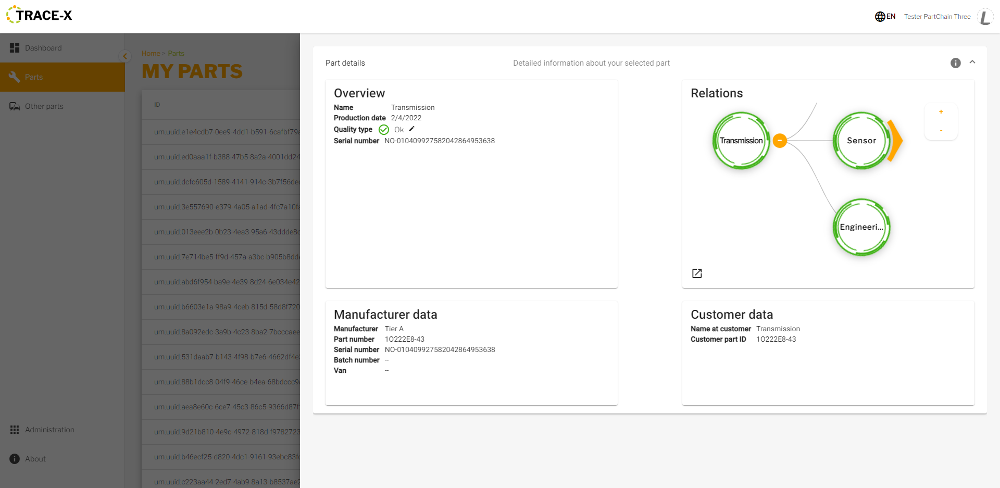
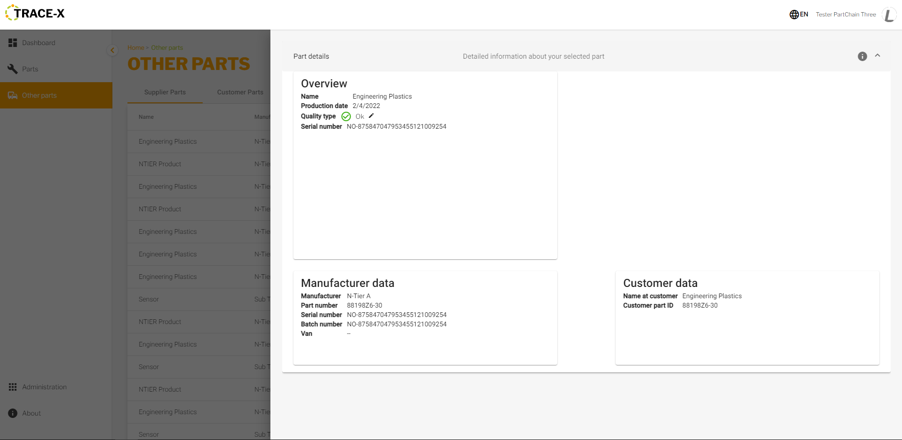

= Users Manual

== General information

Accessing the application is done by the URL provided by the hosting company.
You can have three roles for the users:

* User
* Supervisor
* Admin

To login use the credentials provided by the hosting company.

== Navigation
Navigation is done based on the left-sided menu.
It can be expanded and collapsed for better overview.

image::../../images/arc42/user-guide/navigation-overview.PNG[]

=== Dashboard
Provides a fast overview about the manufactured parts and batches as well as the supplied with parts. Gives an overview in numbers on what is happening in the supply chain.

=== Parts
Navigates to the own manufactured parts and batches list view.

=== Other parts
Navigates to the supplied with parts and batches list view.

=== Administration
Only applicable for the admin user role. Possibility to check the network status based on logfiles and will provide access to configuration possibilities for the application.

=== Logout
Use the Icon in upper right corner to open User details and sign out button.

=== Language
image:../../images/arc42/user-guide/language-icon.png[] Change language. +
Supported languages:

* English
* German
* Polish

== Parts
List view of the own manufactured parts and batches.
Gives detailed information on the assets registered in the Digital Twin Registry of Catena-X for the company. This includes data based on the aspect models of Use Case Traceability: SerialPartTypization, AssemblyPartRelationship, Batch.

=== Part details
Clicking on an item in the list opens "Part details" view.
More detailed information on the asset is listed as well as a part tree that visually shows the parts relations.

==== Overview
General production information. Information on the quality status of the part/batch.

==== Relations
Part tree based on AssemblyPartRelationship aspect model.

image:../../images/arc42/user-guide/open-new-tab.png[] Open part tree in new tab to zoom, scroll and focus.

==== Manufacturer data
Detailed information on the IDs for the manufactured part/batch.

==== Customer data
Information about the identifiers at the customer for the respective part/batch.

== Other parts
List view of the supplied with parts and batches (Supplier parts).
Gives detailed information on the assets registered in the Digital Twin Registry of Catena-X for the supplier companies. This includes data that is ingested based on the aspect model AssemblyPartRelationship of the child parts for Use Case Traceability aspect models: SerialPartTypization, Batch.

=== Supplier part details
Clicking on an item in the list opens "Part details" view.
More detailed information on the asset is listed.

==== Overview
General production information. Information on the quality status of the supplier part/batch.

==== Manufacturer data
Detailed information on the IDs for the supplier part/batch.

==== Customer data
Information about the identifiers at the customer (in this case own company) for the respective part/batch.
