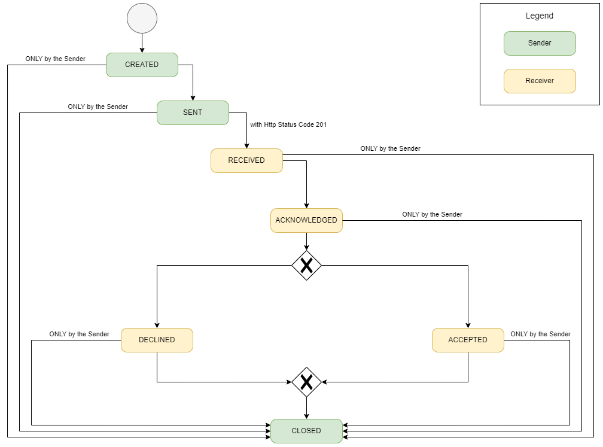

= Users Manual

== General information

Accessing the application is done by the URL provided by the hosting company.
You can have three roles for the users:

* User
* Supervisor
* Admin

To login use the credentials provided by the hosting company.

== Navigation
Navigation is done based on the left-sided menu.
It can be expanded and collapsed for better overview.

image::../../images/arc42/user-guide/navigation-overview.PNG[]

=== Dashboard
Provides a fast overview about the manufactured parts and batches as well as the supplied with parts. Gives an overview in numbers on what is happening in the supply chain.

=== Parts
Navigates to the own manufactured parts and batches list view.

=== Other parts
Navigates to the supplied with parts and batches list view.

=== Quality investigation
Navigates to the inbox and outgoing notifications.

=== Administration
Only applicable for the admin user role. Possibility to check the network status based on logfiles and will provide access to configuration possibilities for the application.

=== Logout
Use the Icon in upper right corner to open User details and sign out button.

=== Language
image:../../images/arc42/user-guide/language-icon.png[] Change language. +
Supported languages:

* English
* German
* Polish

== Parts
List view of the own manufactured parts and batches.
Gives detailed information on the assets registered in the Digital Twin Registry of Catena-X for the company. This includes data based on the aspect models of Use Case Traceability: SerialPartTypization, AssemblyPartRelationship, Batch.

image::../../images/arc42/user-guide/parts-list-detailed-view.PNG[]

=== Part details
Clicking on an item in the list opens "Part details" view.
More detailed information on the asset is listed as well as a part tree that visually shows the parts relations.

==== Overview
General production information. Information on the quality status of the part/batch.

==== Relations
Part tree based on AssemblyPartRelationship aspect model.

image:../../images/arc42/user-guide/open-new-tab.png[] Open part tree in new tab to zoom, scroll and focus.

==== Manufacturer data
Detailed information on the IDs for the manufactured part/batch.

==== Customer data
Information about the identifiers at the customer for the respective part/batch.

==== Investigation for components
Select one or multiple child components/parts/batches that are build into your part. Selection will enable you to create a quality investigation (notification) to your supplier. The quality investigation will be added to a queue (queued & requested inbox) and not directly be send to the supplier.

Once the quality investigation is created you will get a pop-up and can directly navigate to the inbox for further action.

== Other parts
List view of the supplied with parts and batches (Supplier parts).
Gives detailed information on the assets registered in the Digital Twin Registry of Catena-X for the supplier companies. This includes data that is ingested based on the aspect model AssemblyPartRelationship of the child parts for Use Case Traceability aspect models: SerialPartTypization, Batch.

image::../../images/arc42/user-guide/supplier-parts-list-detailed-view.PNG[]

=== Supplier part details
Clicking on an item in the list opens "Part details" view.
More detailed information on the asset is listed.

==== Overview
General production information. Information on the quality status of the supplier part/batch.

==== Manufacturer data
Detailed information on the IDs for the supplier part/batch.

==== Customer data
Information about the identifiers at the customer (in this case own company) for the respective part/batch.

=== Supplier parts select / Quality Investigation
Select one or multiple child components/parts/batches that are build into your part. Selection will enable you to create a quality investigation (notification) to your supplier. The quality investigation will be added to a queue (queued & requested inbox) and not directly be send to the supplier.

Once the quality investigation is created you will get a pop-up and can directly navigate to the inbox for further action.

== Quality investigation
Inbox for received quality investigations and "Queued & Requested" inbox for outgoing draft as well as already sent notifications.

image:../../images/arc42/user-guide/notification-drafts.png[] Received notifications.

Notifications in the context of quality investigations received by a customer. Those notifications specify a defect or request to investigate on a specific part / batch on your side and give feedback to the customer.

image:../../images/arc42/user-guide/notification-send.png[] Queued & Requested notifications.

Notifications in the context of quality investigations that are in queued/draft status or already requested/sent to the supplier. Those notifications specify a defect or request to investigate on a specific part / batch on your suppliers side and give feedback back to you.

* Queued status: Quality investigation is created but not yet released.
* Requested status: Quality investigation is sent to the supplier.

=== Quality investigation status
Following status for a quality investigation (notification) are possible.

|===
|Status |Description

|Queued
|A quality investigation that was created by a user but not yet send to the receiver.

|Requested
|Created quality investigation that is already sent to the receiver.

|Cancelled
|Created quality investigation that is not yet send to the receiver and got cancelled on sender side before doing so. It is no longer valid / necessary.

|Received
|Received notification from a sender which needs to be investigated.

|Acknowledged
|The receiver acknowledged to work on the received inquiry.

|Accepted
|The receiver accepted the inquiry. Issue on part/batch detected.

|Declined
|The receiver declined the inquiry. No issue on part/batch detected.

|Closed
|The sender closed the quality investigation and no further handling with it is possible.
|===

=== Quality investigation status flow
Notifications always have a status. The transition from one status to a subsequent status is described in the below state model.

The Sender can change the status to closed from any status. The receiver can never change the status to closed.

The legend in the below state diagram describes who can set the status. One exception to this rule: the transition from status SENT to status RECEIVED is done automatically once the sender receives the Http status code 201.

