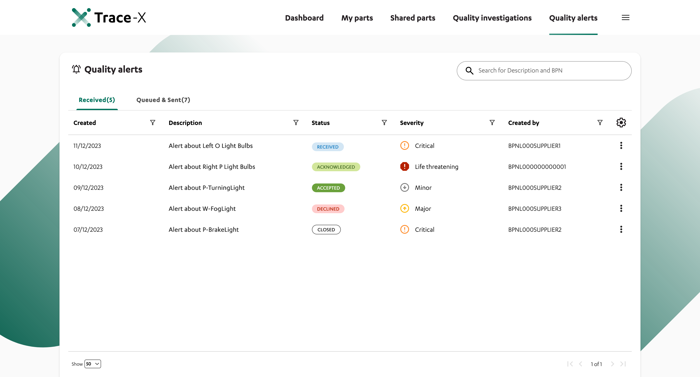

= Users Manual

== Notice

This work is licensed under the [Apache-2.0](https://www.apache.org/licenses/LICENSE-2.0).

* SPDX-License-Identifier: Apache-2.0
* Licence Path: https://creativecommons.org/licenses/by/4.0/legalcode
* Copyright (c) 2021,2022,2023 Contributors to the Eclipse Foundation
* Copyright (c) 2022, 2023 ZF Friedrichshafen AG
* Copyright (c) 2022 ISTOS GmbH
* Copyright (c) 2022, 2023 Bayerische Motoren Werke Aktiengesellschaft (BMW AG)
* Copyright (c) 2022,2023 BOSCH AG

* Source URL: https://github.com/eclipse-tractusx/traceability-foss

== General information

Accessing the application is done by the URL provided by the hosting company.
A list of user or technical roles can be found below:

=== Trace-X app roles

Available roles: https://portal.int.demo.catena-x.net/appusermanagement/3bbc88ae-5f0d-45cb-ab3e-8c7602ff58b4

image::https://raw.githubusercontent.com/eclipse-tractusx/traceability-foss/main/docs/src/images/user-manual/app_roles.png[]

Assignment of roles: https://portal.int.demo.catena-x.net/documentation/?path=docs%2F03.+User+Management%2F02.+Modify+User+Account%2F03.+User+Permissions.md

image::https://raw.githubusercontent.com/eclipse-tractusx/traceability-foss/main/docs/src/images/user-manual/assign_app_roles.png[]

=== Catena-X portal roles

Role details: https://portal.int.demo.catena-x.net/role-details

image::https://raw.githubusercontent.com/eclipse-tractusx/traceability-foss/main/docs/src/images/user-manual/cx_portal_roles.png[]

User accounts: https://portal.int.demo.catena-x.net/documentation/?path=docs%2F03.+User+Management%2F01.+User+Account

=== Technical users

Documentation Portal: https://portal.int.demo.catena-x.net/documentation/?path=docs%2F03.+User+Management%2F01.+User+Account

To login use the credentials provided by the hosting company.

 The application is configured with a technical user, which holds the required IRS roles:
- Creating a policy in IRS -> admin_irs
- Requesting jobs in IRS -> view_irs

 For usage of an EDC it is necessary to provide another technical user. Required roles:
 - Identity Wallet Management Role

== Navigation

Navigation is done based on the top menu.

=== Dashboard

Provides a fast overview about the amount of manufactured and supplied / customer (other) parts and batches, as well as the amount of open investigations and alerts.
Lists the five newest quality investigations and alerts to get an overview of the current state.

=== Parts

Navigates to the own manufactured parts and batches list view.

=== Other parts

Navigates to the supplier and customer parts and batches list view.

=== Quality investigation

Navigates to the inbox and outgoing investigations.

=== Quality alert

Navigates to the inbox and outgoing alerts.

=== Administration

Only applicable for the admin user role.
Possibility to check the network status based on logfiles and will provide access to configuration possibilities for the application.

=== Logout

Use the Icon in upper right corner to open User details and sign out button.

=== Language

image:https://raw.githubusercontent.com/eclipse-tractusx/traceability-foss/main/docs/src/images/arc42/user-guide/language-icon.png[] Change language. +
Supported languages:

* English
* German

== Parts

List view of the own manufactured (asBuilt) or planned (asPlanned) parts and batches.
By default, both tables are displayed.
You can adjust the View of tables by activating/deactivating the tables.

=== Parts Table

A Table View split into the different BOM Lifecycle phases (AsBuilt / AsPlanned) of a part.

Between the views, there is a slider to adjust the view to make either the left or the right table more visible.
Alternatively, you can use the view toggle to adjust the visibility of the tables.

Both tables can be sorted, filtered and searched.
The global search bar at the top returns part results from both Tables.

You can sort the table by clicking on the table header. On the first click, the table is sorted in ascending order, on the second click the table is sorted in descending order. If the table is already sorted and you hold shift while clicking on another table header. The table is sorted primarily by the already given column but is then ordered secondly by the specified column. You can sort by as many columns as you desire.

=== AsBuilt Lifecycle Parts

List view of own Parts with AsBuilt Lifecycle.
Gives detailed information on the assets registered in the Digital Twin Registry of Catena-X for the company.
This includes data based on the aspect models of Use Case Traceability: Asbuilt, SerialPart, Batch.
Parts that are in a quality alert are highlighted yellow.

=== AsPlanned Lifecycle Parts

List view of own Parts with AsPlanned Lifecycle.
Gives detailed information on the assets registered in the Digital Twin Registry of Catena-X for the company.
This includes data based on the aspect models of Use Case Traceability: AsPlanned, SerialPart, Batch.
Parts that are in a quality alert are highlighted yellow.

=== Parts selection -> Create Quality alert

Select one or multiple child components/parts/batches that are build into your part.
Selection will enable you to create a quality alert (notification) to your customers.
The quality alert will be added to a queue (queued & requested inbox) and not directly sent to the customers.

Once the quality alert is created you will get a pop-up and can directly navigate to the inbox for further action.

=== Parts table column settings

On the right upper site of a table there is a settings icon in which you can set the table columns to a desired view.
With a click on it a dialog opens where you can change the settings of the corresponding table:

image::https://raw.githubusercontent.com/eclipse-tractusx/traceability-foss/main/docs/src/images/arc42/user-guide/table-settings-dialog.png[]

Hide/show table columns by clicking on the checkbox or the column name.
It is possible to hide/show all columns by clicking on the "All"- checkbox.

The reset icon resets the table columns to its default view.

Reorder the table columns by selecting a list item (click on the right of the column name).
By selecting the column, you can reorder it with the up and down arrow icons to move it in the front or back of other columns.

Apply your changes by clicking on the "Save" - button.
If you want to discard your changes, simply press you "ESC" - button, click anywhere else except in the dialog or close it explicitely with the close icon on the upper right of the dialog.

The settings will be stored in the local storage of the browser and will be persisted until they get deleted.

=== Part details

Clicking on an item in the list opens "Part details" view.
More detailed information on the asset is listed as well as a part tree that visually shows the parts relations.

==== Overview

General production information.
Information on the quality status of the part/batch.

==== Relations

Part tree based on SingleLevelBomAsBuilt aspect model.
Dependent on the semantic data model of the part the borders are in a different color.
A green border indicates that the part is a SerialPart.
A yellow border indicates that the part is a piece of a batch.

It is possible to adjust the view of the relationships by dragging the mouse to the desired view.
Zooming in/out can be done with the corresponding control buttons.

image:https://raw.githubusercontent.com/eclipse-tractusx/traceability-foss/main/docs/src/images/arc42/user-guide/open-new-tab.png[] Open part tree in new tab to zoom, scroll and focus in a larger view.
A minimap on the bottom right provides an overview of the current position on the part tree.

==== Manufacturer data

Detailed information on the IDs for the manufactured part/batch.

==== Customer data

Information about the identifiers at the customer for the respective part/batch.

== Shared parts

List view of the supplied/delivered parts and batches (Supplier parts / Customer parts).
Gives detailed information on the assets registered in the Digital Twin Registry of Catena-X. This includes data based on the aspect models of Use Case Traceability: SerialPart, Batch.

=== Shared parts Table

A Table View split into the different BOM Lifecycle phases (AsBuilt / AsPlanned) of a part.

Between the views, there is a slider to adjust the view to make either the left or the right table more visible.
Alternatively, you can use the view toggle to adjust the visibility of the tables.

Additionally, it's possible to switch between tabs above each of the table views to display either supplier or customer parts

=== Supplier parts

List view of supplied parts and batches.
Supplier parts that are in a quality investigation are highlighted yellow.

==== Supplier parts select / Quality Investigation

Select one or multiple supplier parts.
Selection will enable you to create a quality investigation (notification) to your supplier.
The quality investigation will be added to a queue (queued & requested inbox) and not directly be sent to the supplier.

Once the quality investigation is created you will get a pop-up and can directly navigate to the inbox for further action.

=== Supplier part details

Clicking on an item in the list opens "Part details" view.
More detailed information on the asset is listed.

==== Overview

General production information.
Information on the quality status of the supplier part/batch.

==== Manufacturer data

Detailed information on the IDs for the supplier part/batch.

==== Customer data

Information about the identifiers at the customer (in this case own company) for the respective part/batch.

=== Customer Parts

List view of customer parts and batches.
Customer Parts that are in a quality alert are highlighted yellow.

=== Customer part details

Clicking on an item in the list opens "Part details" view.
More detailed information on the asset is listed.

==== Overview

General production information.
Information on the quality status of the supplier part/batch.

==== Manufacturer data

Detailed information on the IDs for the supplier part/batch.

==== Customer data

Information about the identifiers at the customer for the respective part/batch.

== Quality investigation

In the “Quality investigation”-tab all received quality investigations are shown as well as “Queued & Requested” quality investigations which included outgoing drafted and already sent notifications.

image:https://raw.githubusercontent.com/eclipse-tractusx/traceability-foss/main/docs/src/images/arc42/user-guide/notification-drafts.png[] Received investigations.

Received investigations by a customer specify that the given customer has found a defect or has a request for you to investigate on a specific part/ batch on your side and waits for your feedback.

image:https://raw.githubusercontent.com/eclipse-tractusx/traceability-foss/main/docs/src/images/arc42/user-guide/notification-send.png[] Queued & Requested investigations.

Queued & Requested investigations on the other hand are investigations that were requested by your company and that are sent to the supplier after you detected a defect, or you have a request on a specific part/ batch. The given supplier is now informed that you expect feedback on the request.
Queued investigations are investigations that were created by a user in your company but are not yet sent to the supplier until a supervisor approves them.
Requested investigations are investigations that were approved by a supervisor in your company and consequently been sent to the supplier.

=== Quality investigation context action

Clicking on the three dots menu on the right side of a quality investigation entry opens the quality investigation context menu. In the context menu, users can open the detailed of the given quality investigation. Supervisor can additionally update the status of the given quality investigation. Only possible status update actions will be shown in the menu.
After selecting to update the status of the quality investigation, a dialog will open in which the details of the status update are shown. The status is then updated after completing all steps in the dialog. A pop-up will notify you, it the update was successful. Reverting status updates is not intended.

You can sort the table by clicking on the table header. On the first click, the table is sorted in ascending order, on the second click the table is sorted in descending order. If the table is already sorted and you hold shift while clicking on another table header. The table is sorted primarily by the already given column but is then ordered secondly by the specified column. You can sort by as many columns as you desire.
Next to each column header is a filter icon. If you click on that icon, a filter option menu will appear by which you can filter the table.
You can select which columns are displayed by clicking on the settings icon on the top right corner of the table.
In search bar, you can search for specific quality investigations by entering the given description or BPN (business partner number).

image::../../images/arc42/user-guide/tx-qualityinvestigation-accept.png[Quality Investigation Dialog]

A pop-up will notify you if the status transition was successful.

=== Quality investigation Detail view

On the quality investigation detail page, you get a better overview of one specific quality investigation. There you can also see all affected parts from you and your suppliers, as well as the message history. In the message history, all description and reasons for status updates are displayed, so you can better understand the process of the given quality investigation.
Supervisors can also carry out status updates here.

There are eight statuses for quality investigations (see table below). Of these four are open statuses. This includes 'RECEIVED', 'ACKNOWLEDGED', 'ACCEPTED' and 'DECLINED'.

==== Overview

General information about the notification.

==== Affected Parts

Listed parts that are assigned to the selected alert.

==== Supplier parts

Detailed information for child parts assigned to a notification

==== Message History

Displays all state transitions including the reason/description of the transition that were done on the notification to get an overview of the correspondence between sender and receiver.

==== Quality investigation action

All possible state transitions are displayed in form of buttons (upper right corner).
There the desired action can be selected to open a modal in which the details to the status change can be provided and completed.

=== Quality investigation status

Following status for a quality investigation (notification) are possible:

|===
|Status |Description

|Queued
|A quality investigation that was created by a user but not yet sent to the receiver.

|Requested
|Created quality investigation that is already sent to the receiver.

|Cancelled
|Created quality investigation that is not yet sent to the receiver and got cancelled on sender side before doing so. It is no longer valid / necessary.

|Received
|Received notification from a sender which needs to be investigated.

|Acknowledged
|The receiver acknowledged to work on the received inquiry.

|Accepted
|The receiver accepted the inquiry. Issue on part/batch detected.

|Declined
|The receiver declined the inquiry. No issue on part/batch detected.

|Closed
|The sender closed the quality investigation and no further handling with it is possible.
|===

=== Quality investigation status flow

Notifications always have a status.
The transition from one status to a subsequent status is described in the below state model.

The Sender can change the status to closed from any status.
The receiver can never change the status to closed.

The legend in the below state diagram describes who can set the status.
One exception to this rule: the transition from status SENT to status RECEIVED is done automatically once the sender receives the Http status code 201.

image::https://raw.githubusercontent.com/eclipse-tractusx/traceability-foss/main/docs/src/images/arc42/user-guide/notificationstatemodel.png[Notification state model]

== Quality alert
In the “Quality alert”-tab all received quality alerts as well as “Queued & Requested Quality Alerts” which included outgoing drafted and already sent notifications.

image:https://raw.githubusercontent.com/eclipse-tractusx/traceability-foss/main/docs/src/images/arc42/user-guide/notification-drafts.png[] Received alerts.

Received quality alerts by a customer specify that the given customer has found a defect or has a request for you to investigate on a specific part/ batch on your side and waits for your feedback.

image:https://raw.githubusercontent.com/eclipse-tractusx/traceability-foss/main/docs/src/images/arc42/user-guide/notification-send.png[] Queued & Requested alerts.

Queued & Requested quality alerts on the other hand are quality alerts that were requested by your company and that are sent to the supplier after you detected a defect, or you have a request on a specific part/ batch. The given supplier is now informed that you expect feedback on the request.
Queued quality alerts are quality alerts that were created by a user in your company but are not yet sent to the supplier until a supervisor approves them.
Requested quality alerts are quality alerts that were approved by a supervisor in your company and consequently been sent to the supplier.

=== Quality alert context action

Clicking on the three dots menu on the right side of a quality alert entry opens the quality alert context menu. In the context menu, users can open the detailed of the given quality alert. Supervisor can additionally update the status of the given quality alert. Only possible status update actions will be shown in the menu.
After selecting to update the status of the quality alert, a dialog will open in which the details of the status update are shown. The status is then updated after completing all steps in the dialog. A pop-up will notify you, it the update was successful. Reverting status updates is not intended.

You can sort the table by clicking on the table header. On the first click, the table is sorted in ascending order, on the second click the table is sorted in descending order. If the table is already sorted and you hold shift while clicking on another table header. The table is sorted primarily by the already given column but is then ordered secondly by the specified column. You can sort by as many columns as you desire.
Next to each column header is a filter icon. If you click on that icon, a filter option menu will appear by which you can filter the table.
You can select which columns are displayed by clicking on the settings icon on the top right corner of the table.
In search bar, you can search for specific Quality alerts by entering the given description or BPN (business partner number).

A pop-up will notify you if the status transition was successful.

=== Quality alert Detail view

On the quality alert detail page, you get a better overview of one specific quality alert. There you can also see all affected parts from you and your suppliers, as well as the message history. In the message history, all description and reasons for status updates are displayed, so you can better understand the process of the given quality alert.
Supervisors can also carry out status updates here.

There are eight statuses for quality alerts (see table below). Of these four are open statuses. This includes 'RECEIVED', 'ACKNOWLEDGED', 'ACCEPTED' and 'DECLINED'.

==== Overview

General information about the notification.

==== Affected parts

Listed parts that are assigned to the selected alert.

==== Supplier parts

Detailed information for child parts assigned to a notification

==== Message History

Displays all state transitions including the reason/description of the transition that were done on the notification to get an overview of the correspondence between sender and receiver.

==== Quality investigation action

All possible state transitions are displayed in form of buttons (upper right corner).
There the desired action can be selected to open a modal in which the details to the status change can be provided and completed.

=== Quality alert status

Following status for a quality alert (notification) are possible:

|===
|Status |Description

|Queued
|A quality alert that was created by a user but not yet sent to the receiver.

|Requested
|Created quality alert that is already sent to the receiver.

|Cancelled
|Created quality alert that is not yet sent to the receiver and got cancelled on sender side before doing so. It is no longer valid / necessary.

|Received
|Received notification from a sender which needs to be aware of.

|Acknowledged
|The receiver acknowledged to work on the received inquiry.

|Accepted
|The receiver accepted the inquiry. Issue on part/batch is known.

|Declined
|The receiver declined the inquiry. No issue on part/batch is known.

|Closed
|The sender closed the quality alert and no further handling with it is possible.
|===

=== Quality alert status flow

Notifications always have a status.
The transition from one status to a subsequent status is described in the below state model.

The Sender can change the status to closed from any status.
The receiver can never change the status to closed.

The legend in the below state diagram describes who can set the status.
One exception to this rule: the transition from status SENT to status RECEIVED is done automatically once the sender receives the Http status code 201.

image::https://raw.githubusercontent.com/eclipse-tractusx/traceability-foss/main/docs/src/images/arc42/user-guide/notificationstatemodel.png[Notification state model]
