#  Trance-FOSS - User Guide

 

Table of contents
---

- [Introduction](#introduction)
    - [Scope and purpose](#scope-and-purpose)
- [Getting started](#getting-started)
    - [Accessing the app](#Accessing-the-app)
        - [Login](#Login)
        - [Sign-out](#sign-out)
    - [Navigation](#navigation)
        - [Header](#header)
        - [Main navigation](#left-side-menu)
- [Features](#features)
    - [Dashboard (Home)](#dashboard)
    - [Find part](#find-parts)
    - [View Parts Details](#view-parts-details)
    - [Raise Quality Alert](#raise-quality-alert)  
    - [Add parts to a Queued Quality Alert](#add-parts-to-a-queued-quality-alert)
    - [Distribute quality alerts to customers](#distribute-quality-alerts-to-customers)
    - [Request quality investigation](#request-quality-investigation)
    - [Send Quality Investigation to supplier](#send-quality-investigation-to-supplier)
    - [Raise quality alert from quality investigation](#raise-quality-alert-from-quality-investigation)
    - [Raise quality investigation from quality investigation](#raise-quality-investigation-from-quality-investigation)
    - [Access control](#access-control)
    
 

---
---

 

# Introduction

 

## **Scope and purpose**
Trace-FOSS is a traceability supply chain app built for existing supply chain ecosystems to transform into a digitally connected world. Trace-FOSS spans across companies and creates a collaborative network that is both fast and secure in its processes. It has a state-of-the-art user interface that is easy to understand and ready for use.

As a Trace-FOSS user, you can access all information concerning parts and components on an individual level. You can track the record of individual parts, raise quality alerts on your parts and distribute them to your customers, and receive quality alerts from supplier parts that may affect your parts. It is also possible to request investigations of suppliers' parts and receive investigations requests from customers, thus creating a connected supply chain, and providing transparency within your network.

 
 

[Back to top](#)

 
 

[-- End of 'Introduction' section --]: # 

# Getting started

 

## **Accessing the app**

[Trace-FOSS](#) can be accessed via the internet. The recommended browser is Google Chrome. You can log in with your Catena-X (MFA) account.

 

### **Login** 

1. Open Trace-FOSS via the URL: # (recommended browser Google Chrome).
1. Enter the username and password. If the login data is correct, the dashboard of the Trace-FOSS UI opens. If the information is incorrect, an error message will be displayed.
1. After your first log-in you are shown a Welcome message and a short introduction to the Trace-FOSS system and you will be able to start using the application.

 

### **Sign out**

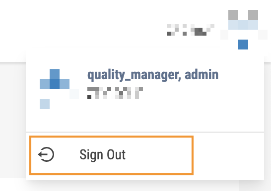

1. On the header, click on the user avatar
1. On the menu click on "Sign-out"
1. You have signed out of Trace-FOSS

 
 

[Back to top](#)

 
 

[-- End of 'Getting started' section --]: # 

# Navigation

Trace-FOSS navigation is based on a header and a left-side menu.

 

## **Header**

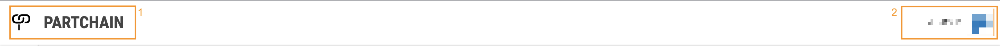

1 - On the left side of the header, there is the Trace-FOSS logo which redirects the user to the Dashboard (Home) area. 

2 - On the right side of the header, there is the name and avatar of the logged-in user. When clicked, it is possible to see the avatar, the role of the user, the name of the user, and the option to Sign-out.

 

## **Left-side menu**

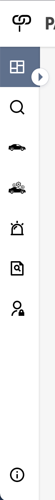
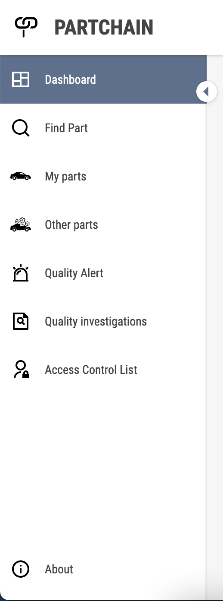

On the left side menu, it is possible to navigate the Trace-FOSS application by choosing each of the following options/features:

- Dashboard
- Find parts
- My Parts
- Supplier / Customer parts
- Quality alerts
- Quality investigations
- Access control
- About

 
 

[Back to top](#)

 
 

[-- End of 'Navigation' section --]: # 

# Features

## Dashboard

The Trace-FOSS dashboard is the main entrance of the application. It provides an overview of the company's parts: 
1. Total of company's parts; 
1. Total of parts with quality alerts/investigations;
1. Latest received quality alerts/investigations; 
1. Percentage of each quality alert type;  
1. Evolution of quality alerts over time; 
1. Number of parts per country registered in Trace-FOSS (withing network)

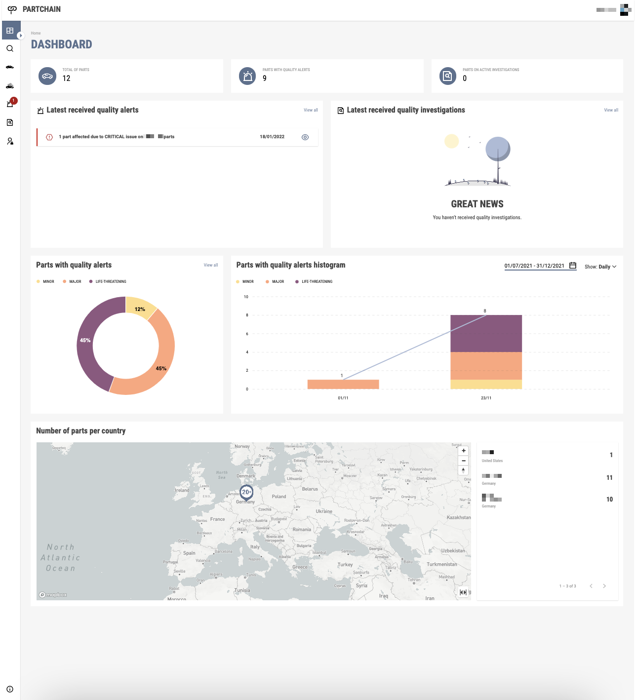

 
 

[Back to top](#)

 
 

## Find parts

Manually enter or paste a part serial number in the search area. 

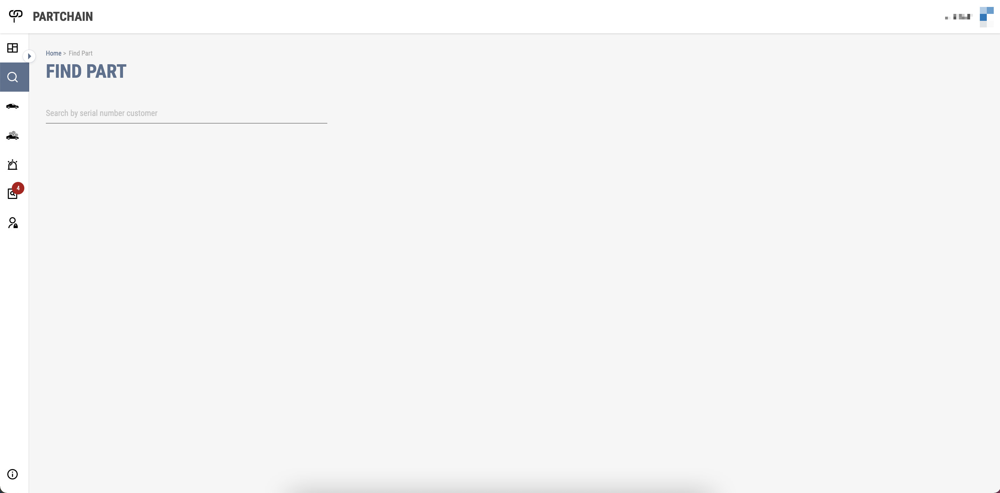

 

Trace-FOSS will automatically search the part and present the results found

 

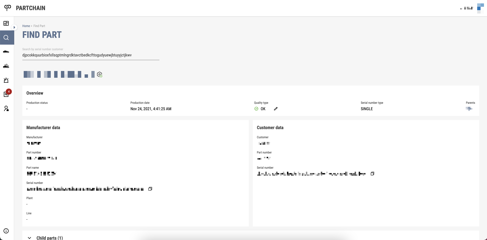

 
 

[Back to top](#)

 
 

## View Parts details

To view a part's details, click on the part which details you want to view.

 

Doing so will open a sidebar with a summary of the details.

 

Clicking on "See full details" on the sidebar, will link to the parts full details page

 
 

[Back to top](#)

 
 

## Raise Quality Alert

On the My Parts page, select the part(s) and click on the "Change quality type" button

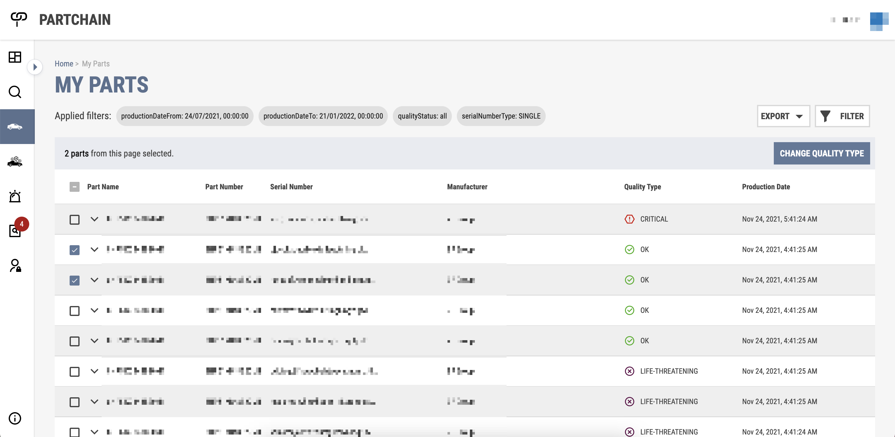

 

Choose the quality type for the part (Minor Issue, Major issue, Critical issue or Life-Threatening issue) and enter a description

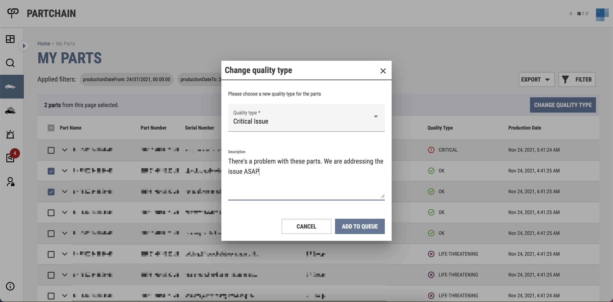

 

By clicking on "Add to Queue" the quality type change will be added to the list of Queued Quality Alerts that are pending distribution to customers. Only after being distributed to customers will the Quality type of the part effectively change.

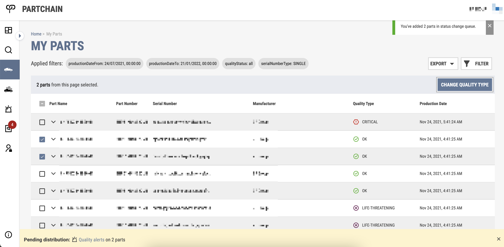

 

To go to the Queued Quality Alerts list, click on the link in the yellow banner at the bottom of the screen or navigate through the left-side navigation.

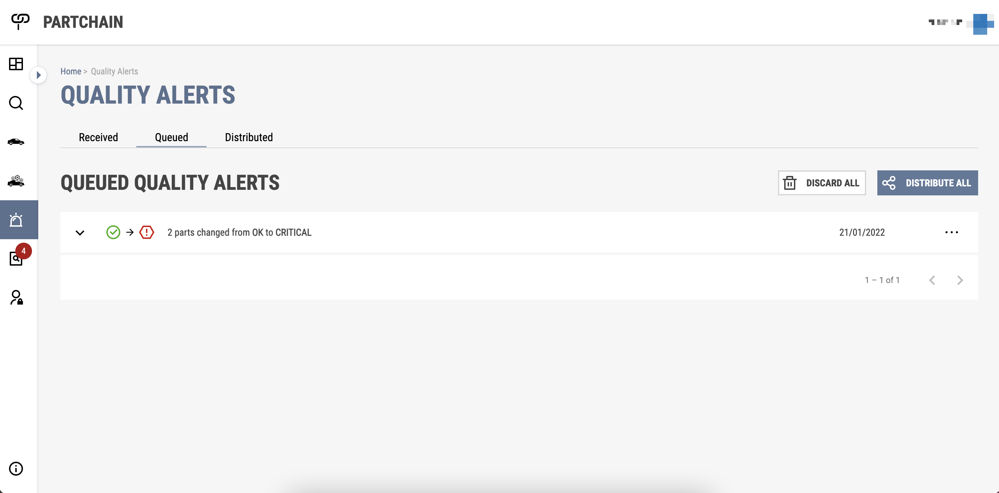

 
 

[Back to top](#)

 
 

## Add parts to a Queued Quality Alert

After raising a Quality Alert, it is still possible to edit it, **before** distributing it to customers, on the Queued Quality Alert list

 

On the options of the Quality Alert, click on "view details" 

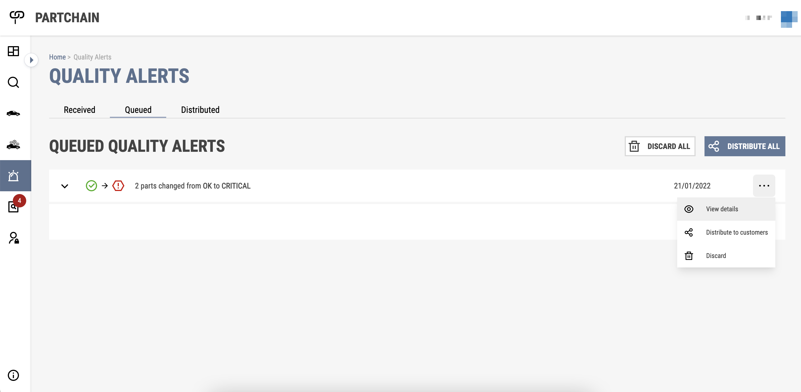

 

To **add parts** to the queued Quality Alert, click the "+ Add Parts" button 

 

Enter or paste the serial number of the part to add to the Quality alert, click "Add part" and, when all the parts are added, click "Save". 

 
 

[Back to top](#)

 
 

## Distribute Quality Alerts to customers

There are multiple ways of distributing Quality alerts, depending on the quantity, and which page the user is in. 

On the Queued Quality Alerts list, it is possible to distribute all the Quality Alerts at once, using the "Distribute All" button on the top right of the list.

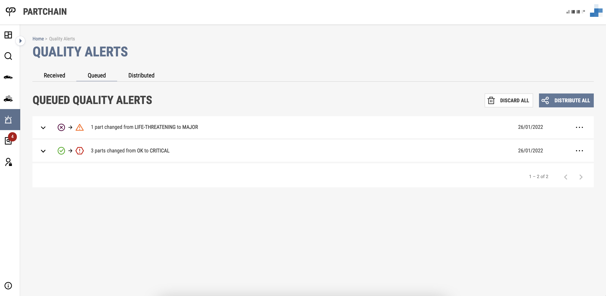

 

Distribute the Quality Alerts individually, there are 2 ways of doing so. On the Queued Quality Alerts list, it is possible to distribute a Quality Alert by opening its options menu and clicking on "Distribute to customers"

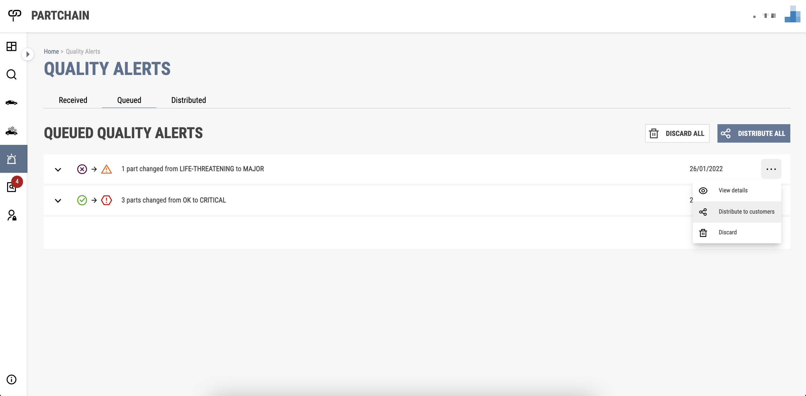

 

On the Quality Alert details page, it is possible to distribute a Quality Alert by clicking on the "Distribute to customers" button on the top right corner of the page.

 

Once the Quality Alert is distributed, all the customers (within the network) whose parts will be affected, will receive a Quality Alert. On the customer side, it will be shown in the Dashboard, on the Left-side navigation and the Quality Alerts page on the "Received" list

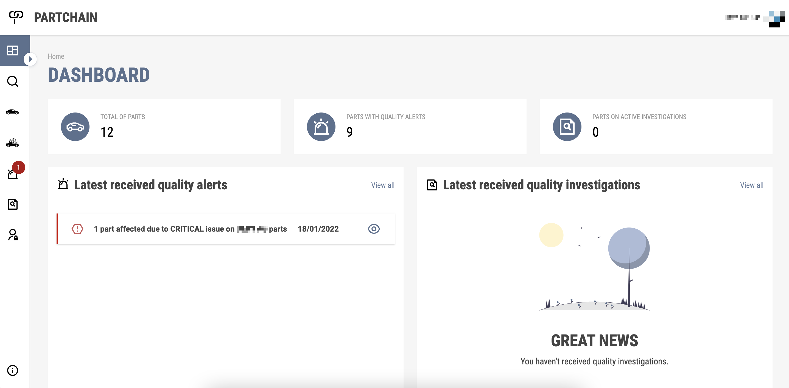
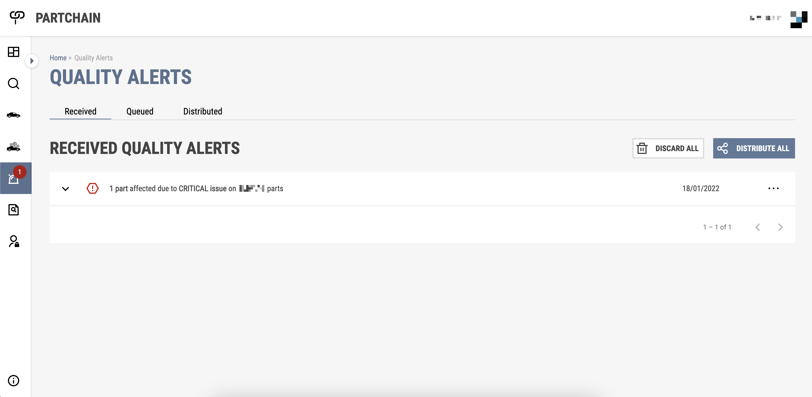

 

On the owner side, it will be shown on the Quality Alerts page on the "Distributed" list and no more changes are allowed.

 
 

[Back to top](#)

 
 

## Request Quality Investigation

On the Other Parts page, on the Supplier parts tab, select the part(s) and click on the "Request Quality investigation" button

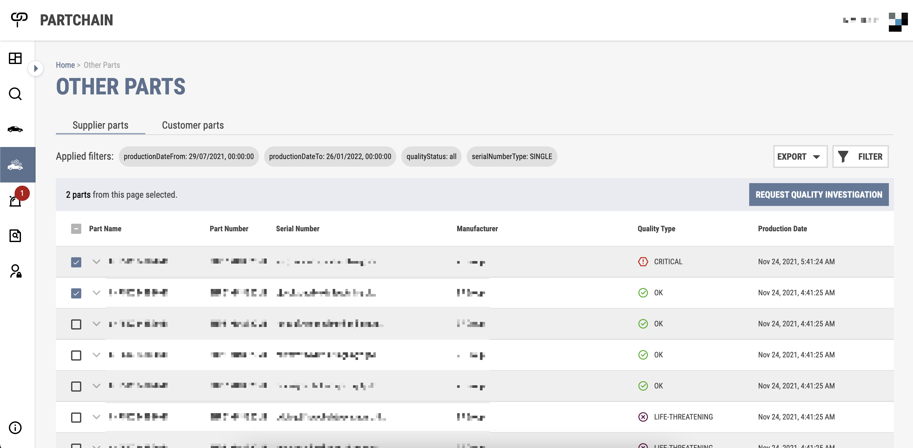

 

Enter a description and click "Add to Queue"

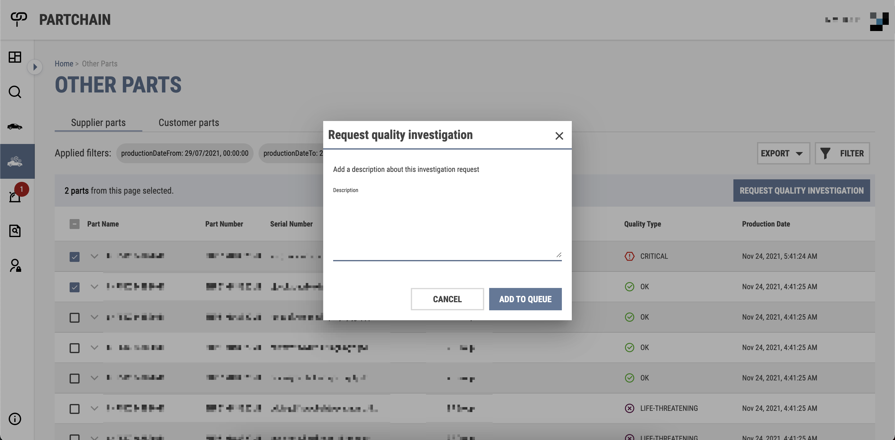

 

By clicking on "Add to Queue" the quality type change will be added to the list of Queued Quality Investigation that pending distribution to suppliers. Only after being distributed to suppliers will the Quality investigation request be effectively sent.

 

To go to the Queued Quality Alerts list, click on the link in the yellow banner at the bottom of the screen or navigate through the left-side navigation.

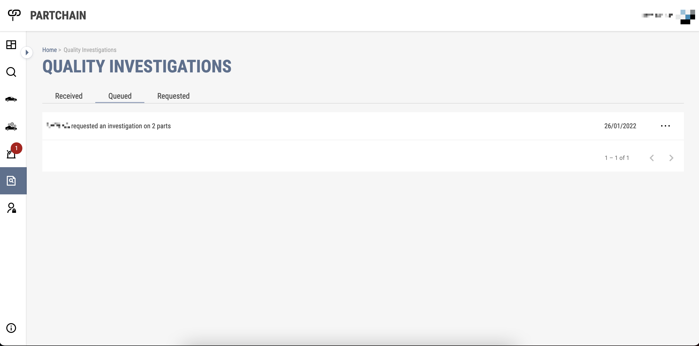

 
 

[Back to top](#)

 
 

## Send Quality Investigation to supplier

Send the Quality Investigation to the suppliers, there are 2 ways of doing so. On the Queued Quality Investigation list, it is possible to distribute a Quality Investigation by opening its options menu and clicking on "Distribute to customers"

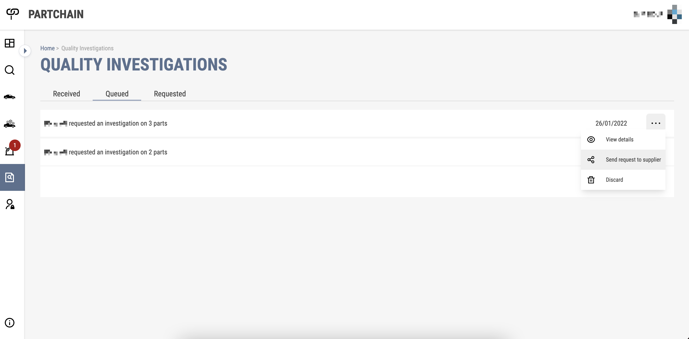

 

On the Quality Investigation details page, it is possible to send the Quality Investigation by clicking on the "Send a request to supplier" button on the top right corner of the page.

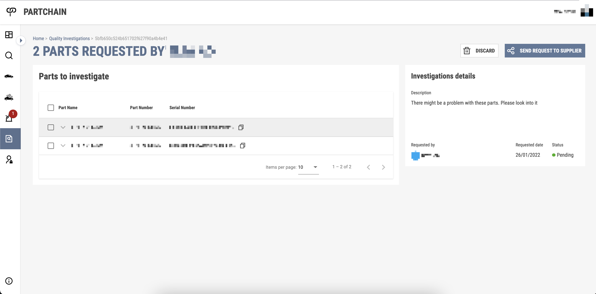

 

Once the Quality Investigation request is sent, the suppliers (within the network) whose parts are in the investigation, will receive a Quality Investigation request. On the supplier side, it will be shown in the Dashboard, on the Left-side navigation and the Quality Investigation page on the "Received" list.

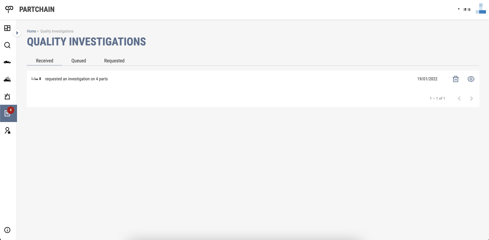

 

On the requester side, it will be shown on the Quality Investigations page on the "Requested" list and no more changes are allowed.

 
 

[Back to top](#)

 
 

## Raise quality alert from the quality investigation

To raise a Quality Alert from a Quality Investigation, on the Investigation details page, select the part(s) and click on the "Change quality type" button

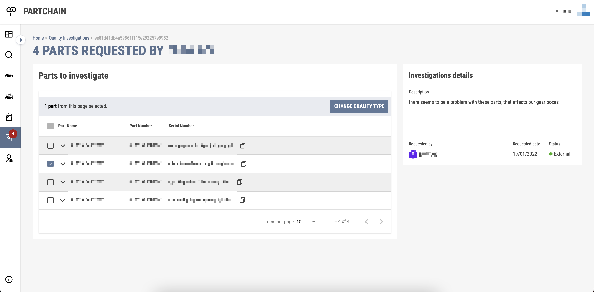

 

Choose the quality type for the part (Minor Issue, Major issue, Critical issue or Life-Threatening issue) and enter a description

 

By clicking on "Add to Queue" the quality type change will be added to the list of Queued Quality Alerts that are pending distribution to customers. Only after being distributed to customers will the Quality type of the part effectively change.

To distribute it, follow the steps in the section [Distribute quality alerts to customers](#distribute-quality-alerts-to-customers)

 
 

[Back to top](#)

 
 

## Raise quality investigation from the quality investigation

To raise a Quality Investigation from a Quality Investigation, on the Investigation details page, view your part's child parts by clicking on the arrow next to thePart Name,  select the child part(s) and click on the "Request Quality Investigation" button.

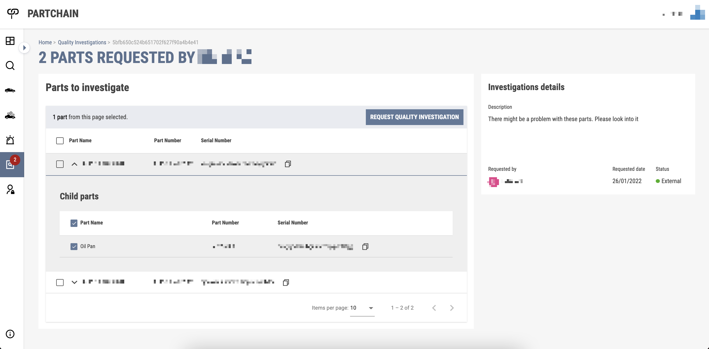 

 

Enter a description and click "Add to Queue"

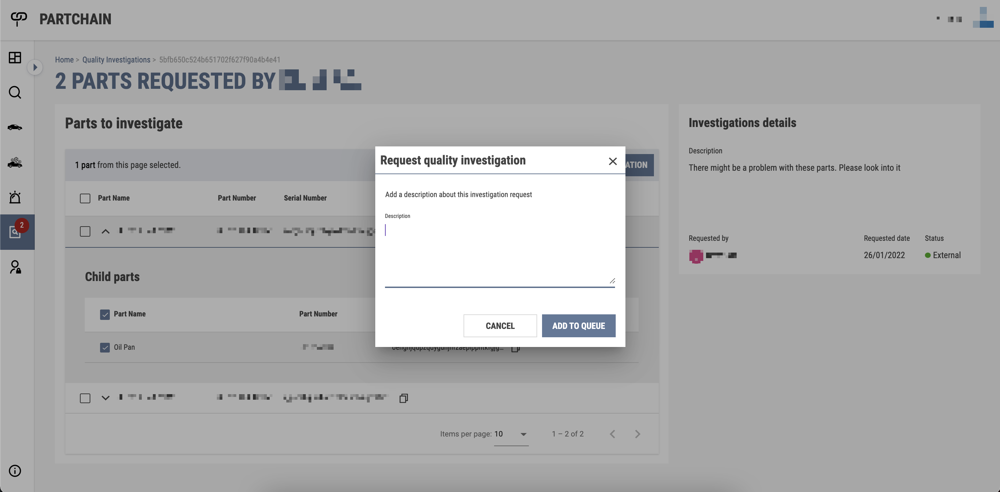

 

By clicking on "Add to Queue" the quality type change will be added to the list of Queued Quality Investigation that pending distribution to suppliers. Only after being distributed to suppliers will the Quality investigation request be effectively sent.

 

To send it to the suppliers, follow the steps in the section [Send Quality Investigation to supplier](#send-quality-investigation-to-supplier)

 
 

[Back to top](#)

 
 

## Access control

On the Access Control page, it is possible to manage your network, regarding which companies you'll be sharing your information with. You can request access to a company, manage pending requests from companies, see the active connections and remove the access to those companies.

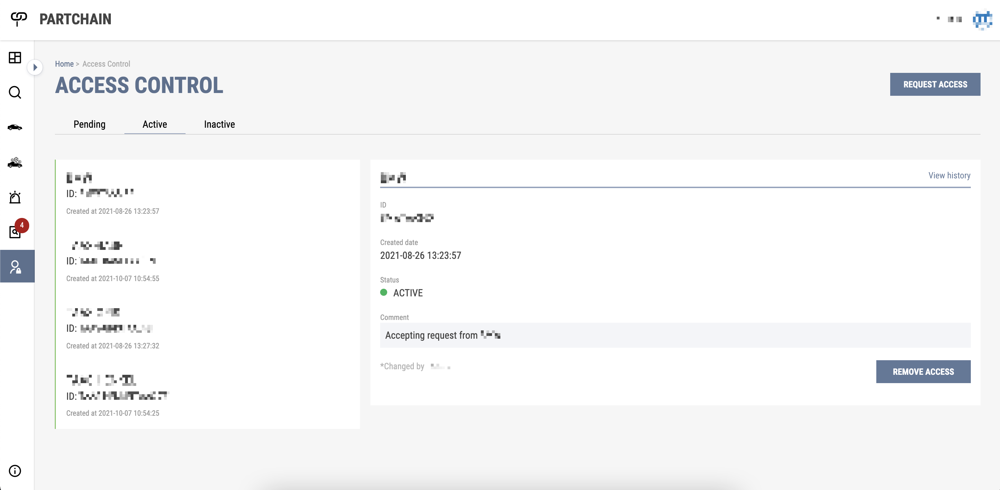

[Back to top](#)
