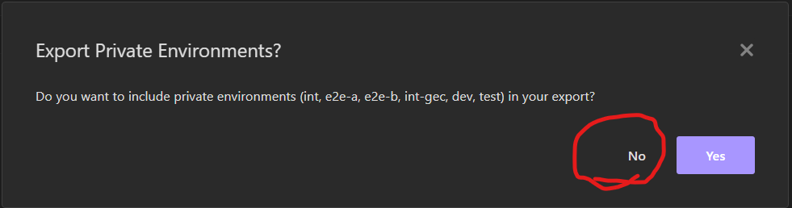

# Insomnia Collection

1) Open Insomnia
2) Click on Application -> Preferences -> Data
3) Import from file
4) Choose tracex.json file
5) On the top left you will see "dev"
6) Click on it and choose Manage Environments
7) Fill in all sensitive data for desired environments
8) Then you can simply request the api (auth will be automatically done by insomnia)
   

## How to update the collection

1) Open Insomnia
2) Click on Application -> Preferences -> Data
3) Export Trace-X collection
4) Choose insomnia v4 file format
5) Name it tracex.json
6) !!!!!!!!! Click NO on Export Private Environment prompt !!!!!!
   
